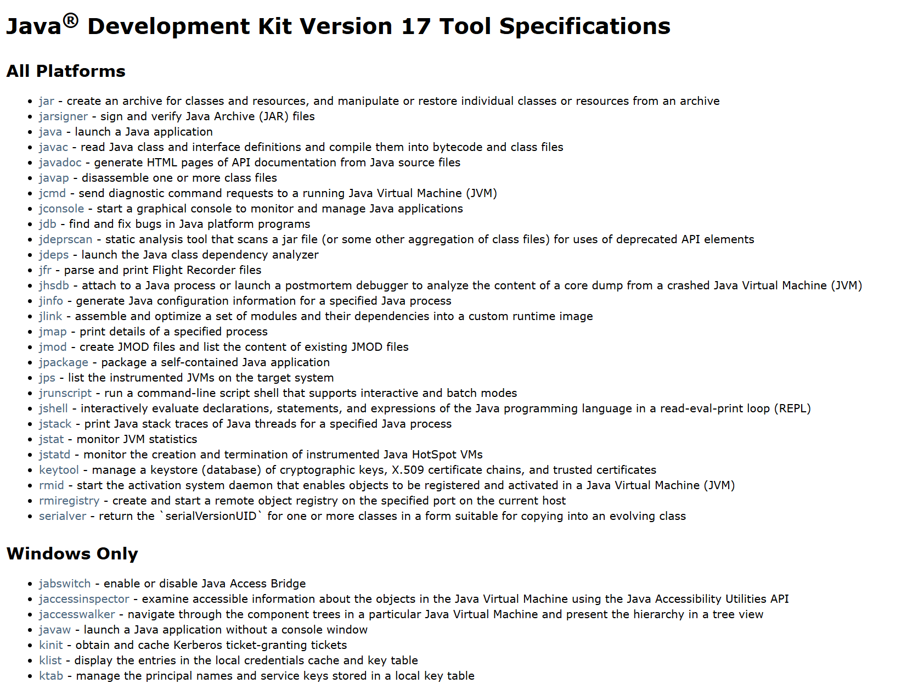
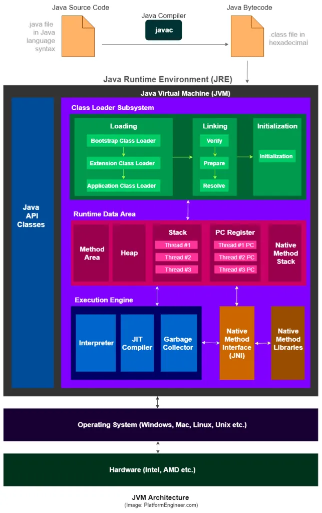

최초 작성 날짜: 2025년 7월 7일

# 0. 자바의 실행 과정

자바 코드의 실행 과정을 간단히 요약하면 아래와 같은 과정을 거칩니다. 이 과정을 온전히 이해하기 위해 JDK와 JRE 그리고 JVM같은 용어들에 대해 알아보겠습니다.

```java
Java Source File (.java)
      ↓ [javac: Compiler JDK]
Bytecode File (.class)
      ↓ [Class Loader JVM]
Method Area (JVM 메모리)
      ↓
Execution Engine (Interpreter + JIT Compiler JVM)
      ↓
Native Machine Code 실행 (CPU)
```

# 1. JDK (Java Development Kit)

`JDK`는 Java 애플리케이션을 개발, 컴파일, 디버깅, 실행하기 위한 환경과 도구를 제공합니다. 


흔히, 위의 사진처럼 JDK는 `JRE`와 `Development Tools`를 포함하고 있는 그림을 많이 보셨을겁니다. 그리고 지금도 많은 곳에서 JDK가 JRE를 포함하고 있다고 설명하는 경우가 많습니다. **그러나, 버전에 따라서는 틀릴 수도 있는 설명입니다.**  `Java8` 까지는 맞는 구조라고 할 수 있으며, 위의 그림도 Java 8 버전에 대한 Oracle 공식 문서에서 가져왔습니다.

## 1.1 JRE

아래에서 설명하겠습니다.

## 1.2 Development Tools



JDK 17 버전 기준으로 굉장히 많은 Tool에 대한 Spec이 존재합니다. 다만 이중에서는 Java, Javac 그리고 jlink만 언급하겠습니다.

- `javac:`  Java로 작성된 클래스 및 인터페이스 정의를 읽고 바이트코드를 포함하는 .class 파일 형태로 컴파일한다
- `java`:  Java 애플리케이션을 시작합니다.
- `jlink`: 여러 모듈과 모듈의 종속성을 사용자 정의 런타임 이미지로 조립하고 최적화합니다.

# 2. JRE (Java Runtime Environment)

JDK의 하위 집합으로 `JVM`을 비롯해서 Java 애플리케이션을 실행하는 데 필요한 도구를 포함하고 **있었습니다.** 그러나 현재는 더 이상 배포되지 않습니다. 과거에는 개발 도구는 필요 없고, 자바로 만든 애플리케이션을 실행하기만 하면 되는 일반 사용자들은 `JRE`만 설치하면 Java 애플리케이션을 실행할 수 있었습니다. 덕분에 거대한 JDK를 모두 설치할 필요가 없었습니다. 그러나, 아래와 같은 이유로 인해 더 이상 별도로 JRE를 별도로 배포하지 않습니다.

## 2.1 JRE를 더 이상 배포하지 않는 이유

JRE는 `rt.jar`라는 자바의 모든 라이브러리를 통째로 포함하는 거대한 패키지였습니다. 하지만 대부분의 애플리케이션은 일부만 필요로 했습니다. 거기에 **Java 9**부터는 `JPMS`(Java Platform Module System) 가 도입되었습니다.  따라서 JDK 역시도 여러 모듈로 분리했습니다. 그리고 JDK에 포함 된 `jlink`라는 도구를 이용하여 이전의 JRE와 같은 실행 환경을 만들고자 했습니다. 

jlink는 개발자가 코드로 작성한 애플리케이션 Module과 그 앱에 필요한 JDK의 Module만 골라내고, 여기에 JVM을 포함시켜 일종의 **Custom Runtime Environment**를 생성합니다. 이것이 과거의 JRE를 대체하게 됩니다. 그리고 rt.jar는 사라졌습니다.

# 3. JVM (Java Virtual Machine)

javac에 의해 컴파일된 자바 바이트코드(.class 파일)을 현재 실행하는 운영체제에 맞는 기계어로 번역하고 실행하는 역할을 합니다. 이 JVM 덕분에 자바는 **Write Once, Run Anywhere!**의 특징을 가지게 됩니다. 그리고 자연스럽게도 JVM 자체는 운영체제에 종속적이 되므로, 운영체제마다 호환되는 JVM이 별도로 존재합니다.

JVM Spec에 따르면 JVM은 스택 기반의 **인터프리터**입니다. 저장을 위한 별도의 레지스터가 없으며, 기본적으로 스택을 이용해 중간값들을 담아두고 가장 마지막에 실행된 명령어와 독립적으로 프로그램을 구성하는 opcode를 하나씩 순서대로 처리하는 ‘while loop 안의 switch 구조’ 를 이루고 있습니다.



JVM은 크게 Class Loaders, Run-Time Data Areas, Execution Engine 등 복잡하고 중요한 요소로 이루어져 있습니다. 이처럼 자바 파일의 실행 과정을 제대로 이해하기 위해서는 JVM에 대한 깊이 있는 학습이 필수적입니다.

다음에 조금 더 자세하게 **JVM의 내부 구조**를 알아보겠습니다. 그리고 처음에 간단히 살펴봤던 자바의 실행 과정이 실제로는 어떻게 이루어지는지 마찬가지로 더 자세하게 알아보겠습니다.