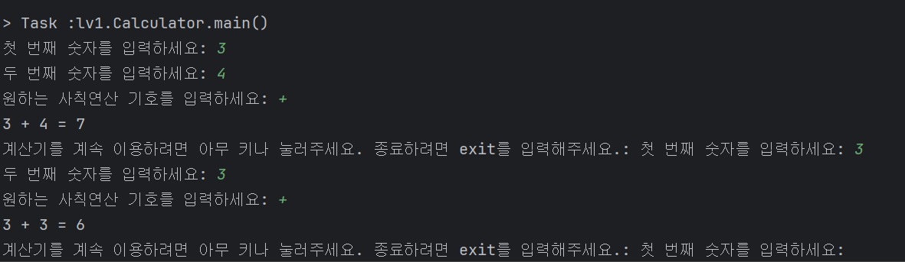
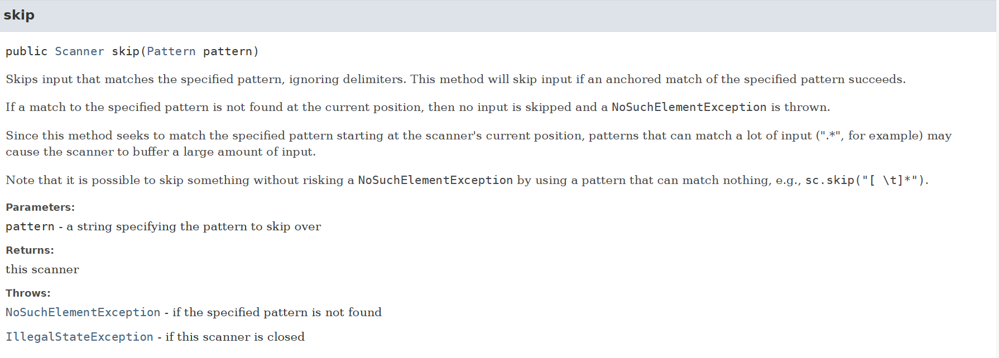

현재 참여하고 있는 부트캠프에서는 `Java`를 학습하고 있습니다. 그리고 첫 과제로 Java를 이용하여 계산기를 만드는 프로젝트를 하고 있습니다. Level 별로 요구사항이 나누어져 있으며, 기능적인 요구 사항과 기술적인 요구 사항 모두 상위 레벨로 추가가 되는 형태입니다.  
오늘은 과제의 Level 1 단계를 개발하면서 고민했었던 내용들에 대해 글을 작성해보려고 합니다.

# 과제 내용

## 학습 목표

**<계산기 1단계까지>**

- [ ]  JVM 환경을 설치하고, JDK 버전 설정을 통해 프로젝트를 생성할 수 있는가?
- [ ]  변수 선언 및 데이터 타입을 적절히 지정 및 변환할 수 있는가?
- [ ]  표준 입출력 사용법을 이해하고, 연산자를 활용해 연산할 수 있는가?
- [ ]  조건문(if, else if, else)을 사용하여 흐름 제어가 가능한가?
- [ ]  반복문(for, while)을 활용하여 반복 작업을 수행할 수 있는가?

## 필수 기능 가이드

```
💡Lv 1.
계산기는 2개의 숫자를 받을 수 있고 사칙연산 될 문자를 받을 수 있다.
계산기는 exit을 입력할 때까지 계속해서 값을 받고 연산 결과를 반환한다.
```

**Lv 1. 클래스 없이 기본적인 연산을 수행할 수 있는 계산기 만들기**

- [ ]  **양의 정수(0 포함)를 입력받기**
    - [ ]  Scanner를 사용하여 양의 정수 2개(0 포함)를 전달 받을 수 있습니다.
    - [ ]  양의 정수는 각각 하나씩 전달 받습니다.
    - [ ]  양의 정수는 적합한 타입으로 선언한 변수에 저장합니다.
- [ ]  **사칙연산 기호(➕,➖,✖️,➗)를 입력받기**
    - [ ]  Scanner를 사용하여 사칙연산 기호를 전달 받을 수 있습니다.
    - [ ]  사칙연산 기호를 적합한 타입으로 선언한 변수에 저장합니다. (`charAt(0)`)
- [ ]  **위에서 입력받은 양의 정수 2개와 사칙연산 기호를 사용하여 연산을 진행한 후 결과값을 출력하기**
    - [ ]  키워드 : `if` `switch`
    - [ ]  사칙연산 기호에 맞는 연산자를 사용하여 연산을 진행합니다.
    - [ ]  입력받은 연산 기호를 구분하기 위해 제어문을 사용합니다. (예를 들면 if, switch)
    - [ ]  연산 오류가 발생할 경우 해당 오류에 대한 내용을 정제하여 출력합니다.
        - [ ]  ex) “나눗셈 연산에서 분모(두번째 정수)에 0이 입력될 수 없습니다.“
- [ ]  **반복문을 사용하되, 반복의 종료를 알려주는 “exit” 문자열을 입력하기 전까지 무한으로 계산을 진행할 수 있도록 소스 코드를 수정하기**
    - [ ]  키워드 : 무한으로 반복, 수정하기 (처음부터 무한 반복하는 것이 아니라, 위 스텝별로 진행하며 수정)
    - [ ]  반복문을 사용합니다. (예를 들어, for, while…)

# 고민한 부분

## 과제 가이드를 읽고..

프로젝트 설계와 관련해서 일단, 어느 정도로 어떻게 구현을 해야하는지 조금 확인이 필요했습니다. 일단 필수 기능에서 제시하고 있는 부분은 구현해야 하는 요구 사항이라고 생각해서 그대로 구현하는 것이 먼저 할 일이라고 생각했습니다. 

- **입력 방식**: 콘솔을 이용하더라도 사실 숫자, 연산자, 숫자의 순서로 입력을 받거나, 아니면 양식을 가이드로 보여주고 한 줄 통째로 연산을 원하는 식을 입력받거나, 정말 많은 방식이 있을 수 있습니다. 저는 일단 **과제**인 만큼 가이드를 존중하여 ‘숫자 2개를 먼저 입력 → 연산자 입력’의 순서를 따르기로 생각했습니다.
- **예외 처리**: “0으로 나누기”를 시도하는 경우처럼 오류가 발생한 내용에 대해 출력을 하라는 요구 사항이 있었습니다. 그래서 일단은 `Exception`이 발생했을 때 프로그램이 바로 종료되지 않도록 미리 인지할 수 있는 문제는 예외 처리를 직접 해주는 것이 간단한 방법이라고 생각했습니다. 여기서는 `try-catch`를 이용하여 `exception`을 핸들링하지 않고 간단히 if와 콘솔 출력으로 처리했습니다.
- **반복 기능 구현:** 마지막 요구 사항에 “프로그램이 ‘exit’ 을 입력받기 전까지는 무한으로 계산을 진행”하도록 기능을 추가해야 했습니다. “처음부터 무한 반복하는 것이 아니라, 위 스텝별로 진행하며 수정”이라는 말을 저는 스텝별로 진행하며 마지막에 추가하라는 의미로 받아들였기 때문에, 문제의 요구사항을 순서대로 주신 이유가 있다고 생각하고 맨 마지막에 해당 기능을 추가했습니다.

## next(), nextInt() 그리고 nextLine()

### 1. 문제 상황

“exit”라는 종료 여부 메시지를 입력 받기 위해 사용자로부터 입력 받는 부분을 마지막에 추가해야 했습니다. 

```java
...
Scanner sc = new Scanner(System.in) {
	while(true) {
	... 중략 ...
	   System.out.print("\n계산기를 계속 이용하려면 아무 키나 눌러주세요. 종료하려면 exit를 입력해주세요.: ");
	   String cmd = sc.nextLine();
	
	   if (cmd.equals("exit")) {
	       System.out.println("계산기가 종료됩니다.");
	       break;
	   }
   }
}
```

따라서 위와 같이 코드를 작성했습니다. 그런데 새로 입력을 받는 게 아니라, 마치 입력을 받은 것처럼 계산기가 종료되지 않고 다시 계산이 시작했습니다.



위의 출력을 보면 3+4 = 7 이라는 결과를 받았습니다. 의도대로라면 “~ 종료하려면 exit를 입력해주세요.” 뒤에 입력을 받아야 했습니다. 그런데 바로 “첫 번째 숫자를 입력하세요:  “가 출력되고 있었습니다. 여기에 숫자와 연산자를 차례대로 입력하면 계속 계산은 됩니다. 그러나 **종료 의사를 묻는 입력에 대해 입력할 수가 없고 알아서 넘어가 버려서, 종료를 할 수가 없는 상태**에 빠졌습니다.

### 2. 원인 분석

원인은 새로 작성한 코드가 아니라 **이전에 작성한 코드**였습니다. 바로 이전에 숫자와 연산자 입력을 받을 때 사용했던 코드인데요. 

짧게 이전에 작성한 코드가 영향을 미친 배경을 설명하자면 현재 작성되어 있는 코드는 숫자를 입력받는 부분과 연산자를 입력받는 부분을 별도의 메소드로 분리하지 않았습니다. **level 1의 조건이 클래스를 사용하지 않는 것이 조건**이기 때문에 메소드를 분리하려면 `static`으로 메소드를 분리해야 했습니다. 

저는 1단계에서 개발하고 있는 클래스에 대한 정의는 Level2 에 있는 요구사항처럼 `Calculator`클래스를 만들면서 `App` 클래스는 어떤 역할을 하고 객체로 만들건지, 혹은 `static`으로 만들건지를 동시에 결정하려고 했습니다. **그래서 지금은** `main` **메소드에 절차적으로 실행되도록 모든 코드가 작성되어 있었습니다.**

```java
System.out.print("첫 번째 숫자를 입력하세요: ");
int first = sc.nextInt();

System.out.print("두 번째 숫자를 입력하세요: ");
int second = sc.nextInt();

System.out.print("원하는 사칙연산 기호를 입력하세요: ");
char operator = sc.next().charAt(0);

System.out.print(first + " " + operator + " " + second + " = ");

switch (operator) {
    case '+':
        System.out.print(first + second);
        break;
    case '-':
        System.out.print(first - second);
        break;
  case '*':
        System.out.print(first * second);
        break;
    case '/':
        if (second == 0) {
            System.out.println("0으로 나눌 수 없습니다.");
        } else {
            System.out.print(first / second);
        }
        break;
    default:
        System.out.println("오류가 발생했습니다.");
}
```

위의 코드는 중략되었던 부분인데, 숫자와 연산자를 입력받는 부분에서 `nextInt()`와 `next()`를 사용하고 있는 것을 확인할 수 있습니다. 그리고 새로 추가한 부분에서는 `nextLine()`을 사용했습니다. 사실 평소에 `nextLine()`만 주로 사용을 했고, `nextInt()`와 어떤 차이가 존재했다는 사실만 기억이 났습니다.

그래서 일단 Scanner클래스의 3가지 메소드에 대해 알아봐야겠다는 생각을 했습니다. 

| 메서드 (Method) | 읽는 단위 (Reading Unit) | 반환 타입 (Return Type) | 구분자(Delimiter) 처리 |
| --- | --- | --- | --- |
| **`next()`** | 다음 **토큰(Token)** **하나** | `String` | 토큰을 읽은 후, 구분자는 스트림에 **그대로 남겨둡니다.** |
| **`nextInt()`** | 다음 **토큰 하나**를 `int` 타입으로 읽기 | `int` | 토큰을 `int`로 변환 후, 구분자는 스트림에 **그대로 남겨둡니다.** |
| **`nextLine()`** | 현재 위치부터 **다음 줄바꿈 문자(`\n`)까지** | `String` | 줄바꿈 문자까지 모두 읽고, 그 위치로 이동합니다. (**`\n`은 소비하지만, 반환값에는 포함하지 않습니다.**) |

읽는 단위에서 **토큰**이라는 말을 사용하고 있는데 토큰은 **다음 구분자를 만나기 전까지의 내용**을 가리키는 단위라고 생각하면 됩니다. 예를 들면, 구분자가 `!`고 seonrize! 라고 입력이 들어오면 토큰은 seonrize가 됩니다. `Scanner`의 default 구분자는 기본적으로  [`Character.isWhitespace()`](https://docs.oracle.com/en/java/javase/17/docs/api/java.base/java/lang/Character.html#isWhitespace(int)) 에 의해 판별되는 것과 동일하며 [`useDelimiter()`](https://docs.oracle.com/en/java/javase/17/docs/api/java.base/java/util/Scanner.html#useDelimiter(java.lang.Pattern))를 통해 임의로 구성할 수 있다고 공식 문서에 나와 있습니다.

앞의 2개의 메서드와 `nextLine()`는 동작 방식에서 차이가 있습니다.  코드와 주석을 참고해주시면 감사하겠습니다.

```java
package exam250711;

import java.util.Scanner;

public class ScannerTest4 {

    public static void main(String[] args) {
        // 스캐너에 "10\n20\nHello\n" 데이터가 들어있다고 가정
        Scanner sc = new Scanner("10\n20\nHello\n");

        // 1) nextInt() 호출
        // "10"을 읽고, 커서는 "10" 바로 뒤('\n' 앞)에 위치함.
        // 버퍼 상태: "\n20\nHello\n"
        int a = sc.nextInt();

        // 2) 두 번째 nextInt() 호출
        // 시작하기 전, 앞에 있는 구분자('\n')를 스킵함.
        // 그 다음 "20"을 읽고, 커서는 "20" 바로 뒤('\n' 앞)에 위치함.
        // 버퍼 상태: "\nHello\n"
        int b = sc.nextInt();

        // 3) nextLine() 호출
        // 현재 커서 위치부터 다음 줄바꿈 문자('\n')까지 읽음.
        // 내용은 없으므로 빈 문자열("")을 반환하고, 줄바꿈 문자('\n')를 소비(제거)함.
        // 버퍼 상태: "Hello\n"
        String line = sc.nextLine();

        System.out.printf("a=%d, b=%d, line=\"%s\"\n", a, b, line); // line은 "" (빈 문자열)
        sc.close();
    }

}

```

`nextInt()`는 사용자가 숫자를 입력한 뒤 Enter를 누르면, 숫자만 토큰으로 가져가고 Enter에 의해 생기는 **개행은 입력 스트림에 그대로 남겨둡니다.**  그리고 다음에 또 다시 호출이 되면 구분자가 있는지 확인하고, 구분자가 있으면 **스킵**합니다. 그래서 `nextInt()`만 계속 쓴다면 제가 겪은 문제가 발생하지 않습니다.

반면에 `nextLine()`은 “현재 커서부터 개행문자(‘\n’ 또는 “\r\n”) 까지” 읽어서 **개행문자 직전까지 반환**하고, **행 자체도 소비**(**버퍼에서 제거**)해서 커서를 다음 라인의 시작으로 옮깁니다. 

따라서 `next()`나 `nextInt()`를 사용한 다음에 `nextLine()`이 사용되면, `nextLine()`은 개행문자까지 읽기 때문에 스트림에 남아있던 개행문자를 보고, 빈 문자열을 반환하고 개행문자를 소비하며 끝납니다. 그래서 제가 작성한 코드에서는 사용자가 “exit”를 입력할 차례에 이전에 남았던 개행문자가 소비되며 끝났기 때문에 `While` 로 생긴 loop에 따라 바로 처음으로 돌아갔던 것이었습니다. 

### 3. 해결 과정

저는 저에게 익숙했던 3번 방법이 바로 떠올랐지만, 해결 방법은 생각보다 여러 가지가 있습니다. 

1. **`Scanner.skip()`을 사용하여 명시적으로 개행을 스킵한다고 알려줄 수 있습니다.**

```java
package exam250711;

import java.util.Scanner;

public class ScannerTest {

    public static void main(String[] args) {

        Scanner sc = new Scanner(System.in);

        System.out.print("숫자를 입력하세요: ");
        int num = sc.nextInt();
        System.out.println("num = " + num);

        // 남은 개행을 매개변수로 스킵
        sc.skip("\n");

        System.out.print("문자열을 입력하세요: ");
        String line = sc.nextLine();
        System.out.println("line = " + line);

    }
}
```

Scanner에서 제공하는 `skip()` 을 사용하면 설정된 구분자는 무시하고, 매개변수로 들어오는 `String`과 `Pattern`(엄밀히 말하면 **정규표현식**)과 일치하는 문자열을 버퍼에서 찾아서 해당 패턴 뒤로 커서를 옮겨버립니다. 따라서 `nextInt()` 뒤에 `skip(”\n”)`과 같은 방식으로 작성한 뒤에, 그 다음에 `nextLine()`이 오면 줄바꿈이 이미 건너뛰어져 있기 때문에 버퍼에 남은 입력이 없어서 문제를 해결할 수 있는 것이죠.



다만 패턴에 사용되는 정규식의 복잡도와 불러오는 버퍼의 크기에 따라서 성능적으로 손해가 있을 수도 있습니다. 그 이유를 자세히 설명하자면 조금 복잡해집니다. 관심이 있으신 분은 `JavaSE` 공식 문서에 있는 [`skip()`](https://docs.oracle.com/en/java/javase/17/docs/api/java.base/java/util/Scanner.html#skip(java.util.regex.Pattern)) 에 대해 찾아보시면 될 것 같습니다. 

1. **`nextLine()` 한 줄 추가해주기**

확장성에는 어려움이 있을 수 있지만, 사용자로부터 입력을 받는 부분이 많지 않을 경우에는 가장 간단한 방법일 수도 있습니다. 남은 줄바꿈을 처리하기 위해 nextLine()을 한 줄 먼저 추가하여 줄바꿈만 입력받고 처리하도록 하면 됩니다.

```java
package exam250711;

import java.util.Scanner;

public class ScannerTest {

    public static void main(String[] args) {

        Scanner sc = new Scanner(System.in);

        System.out.print("숫자를 입력하세요: ");
        int num = sc.nextInt();
        System.out.println("num = " + num);

        // 남은 줄바꿈을 구분자로 사용한 뒤 빈 문자열을 리턴하게 된다.
        sc.nextLine();
        
        System.out.print("문자열을 입력하세요: ");
        String line = sc.nextLine();
        System.out.println("line = " + line);

    }
}

```

1. **nextLine()으로 통일해서 사용하기**

모든 입력에 대한 처리를 `nextLine()`으로 통일합니다. 대신 `nextLine()`의 리턴 타입은 `String`이므로 입력받은 내용에 대해서는 개발자가 개별적으로 입력에 대해 파싱 및 형 변환을 해줘야 합니다.

하지만, 일단 토큰 단위로 읽는 메소드와 줄바꿈 문자를 기준으로 하는 메소드를 섞어서 쓰지 않는 것만으로도, 제가 겪었던 문제를 **개발자가 사전에 신경을 쓰지 않아도 되니까 보다 안전성을 확보**할 수 있습니다.

```java
package exam250711;

import java.util.Scanner;

public class ScannerTest {

    public static void main(String[] args) {

        Scanner sc = new Scanner(System.in);

        System.out.print("숫자를 입력하세요: ");
        // nextLine()으로 입력 받은 후에 용도에 따라 타입 변환하여 사용
        int num = Integer.parseInt(sc.nextLine()); 
        System.out.println("num = " + num);

        System.out.print("문자열을 입력하세요: ");
        String line = sc.nextLine();
        System.out.println("line = " + line);

    }
}

```

제가 이 방법이 가장 먼저 떠오른 이유도 비슷합니다. Java를 통해 알고리즘 문제를 풀때면 I/O에 대한 처리가 필요한 경우가 있습니다. 저는 주로 빠른 성능을 위해 `BufferedReader` 를 사용하고 `StringTokenizer`로 필요한 만큼 토큰으로 나눠 사용하는 것을 선호합니다.

근데 가끔 간단하게 처리를 할 때면 `Scanner`를 사용하기도 하는데, 저는 `nextLine()`으로만 입력받는 것을 선호했습니다. 필요한 타입에 맞춰 메소드를 다르게 해서 입력을 받기 보다는, **모든 입력을 통일된 방법**으로 받은 후에 **필요한 타입으로 변환**하는 것이 더 안전하다고 생각했기 때문입니다. 

마지막으로 3가지 방법을 표로 정리하면 다음과 같습니다.

| 방법 | 장점 | 단점 |
| --- | --- | --- |
| `skip("\\n")` 사용 | 코드 한 줄로 간단 | 정규식 복잡도, 성능 오버헤드 가능성 |
| `nextLine()` 추가 호출 | 구현 간단 | I/O 처리 통일성 떨어짐 |
| `nextLine()` 통일 사용 | 일관성, 안전성 높음 | 매번 파싱 필요, 코드 다소 장황 |

**선택한 방법과 이유**

저는 Level 2를 진행하면서 요구사항에 맞게 클래스를 도입하고, `App`과 `Calculator`클래스의 역할 구분 그리고 자연스럽게 메소드들까지 리팩토링을 할 생각이었습니다. 

따라서 Level 1 과제에서는 **2번 방법**을 선택했습니다. 그래서 `nextLine()`을 한 줄 추가해주었습니다. 그리고 Level 2에서는 3번 방법을 사용하여 I/O 처리를 통일했습니다. 이것은 Level 2 회고에서 다뤄보도록 하겠습니다. 최종적으로 완성된 Lv1의 코드는 아래와 같습니다.

```java
package lv1;

import java.util.Scanner;

public class Calculator {

    public static void main(String[] args) {

        try (Scanner sc = new Scanner(System.in)) {
            while (true) {
                System.out.print("첫 번째 숫자를 입력하세요: ");
                int first = sc.nextInt();

                System.out.print("두 번째 숫자를 입력하세요: ");
                int second = sc.nextInt();

                System.out.print("원하는 사칙연산 기호를 입력하세요: ");
                char operator = sc.next().charAt(0);

                System.out.print(first + " " + operator + " " + second + " = ");

                switch (operator) {
                    case '+':
                        System.out.print(first + second);
                        break;
                    case '-':
                        System.out.print(first - second);
                        break;
                    case '*':
                        System.out.print(first * second);
                        break;
                    case '/':
                        if (second == 0) {
                            System.out.println("0으로 나눌 수 없습니다.");
                        } else {
                            System.out.print(first / second);
                        }
                        break;
                    default:
                        System.out.println("오류가 발생했습니다.");
                }

                System.out.print("\n계산기를 계속 이용하려면 아무 키나 눌러주세요. 종료하려면 exit를 입력해주세요.: ");
                sc.nextLine();
                String cmd = sc.nextLine();

                if (cmd.equals("exit")) {
                    System.out.println("계산기가 종료됩니다.");
                    break;
                }
            }
        }

    }
}

```

# 느낀점 및 다음 계획

사실 과제를 분석하고 설계할 때 조금 헷갈렸던 것이 있습니다. 유스 케이스 형식으로 타이트하고 섬세하게 주어진 상태의 요구사항이 아니고, 그렇다고 기술적인 도전을 위해 기술적인 목표가 주어지고 자기주도적으로 딥 다이브하여 과제를 완성해야 하는 형태도 아니라고 생각했습니다. 

아마 과제를 출제하신 출제자께서도,  참여 인원들의 모두 다른 기술적 수준도 고려해야 하고 또 계산기라는 어떻게 보면 한 없이 간단할 수도 있고 또 어떻게 보면 한 없이 어려울 수 있는 과제에 대해 도메인과 교육적인 목적을 모두 고려를 해야 되니… 고민이 많으셨을 것 같습니다. 

## 잘한 점

개인적으로 고민이 많았지만, 어떤 상황이든 **주어진 사항을 최대한 만든 사람의 의도에 맞게 해석하고 요구사항을 최대한 지키는 것도** 필요하다고 생각하면서 개발했습니다. 그래서 과제를 통해 익혔으면 하는 내용들을 적어주신 것들을 많이 참조하며, 최대한 출제하신 분의 의도를 생각해보며 개발했습니다. 

그럼에도 불구하고 Level 1은 과제 자체가 다소 간단한 편이었습니다. 그래서 Level 1 과정에서는 기술적으로 크게 고민할 부분이 없을 것 이라고 예상했는데, 오랜만에 Java를 통한 I/O를 다루다 보니 고민한 지점이 1개가 생겼습니다. 

## 아쉬운 점

항상 긴장을 늦추지 말고, 자신감은 가지되 겸손한 마음으로 개발을 해야하는 것 같습니다. 자주 사용하거나 익숙한 메서드들이라도 항상 **동작 원리와 리턴 타입**, **매개변수 타입은 신경을 써서 인지하고 올바르게 사용하는 것이 중요하겠습니다.**

## 다음 계획

**다음에 다룰 Level 2에서는 훨씬 많은 고민 지점과 해결 과정이 있었습니다.** 사실 이런 고민한 지점에 대한 회고를 쓰다 보면, 문제 해결 과정에서와 마찬가지로 어디 까지 고민을 해야 하고 또 어느 내용까지 글에 담는 것이 좋을지 항상 고민이 됩니다. 개발을 하며 정보를 찾아볼 때도 어디까지 나아가고 여기서 또 다른 방법은 없을까?, 맞는 방향일까? 항상 고민이 되는 것처럼 말이죠. 

첫 프로젝트의 첫 회고인만큼 다른 이야기도 조금 많이 들어있었습니다. 다음 Level 2 회고에서는 조금 더 담백하지만 더 알찬 내용으로 작성할 수 있도록 노력해보겠습니다.  


**참고**

- [Oracle Java SE 17 & JDK 17 - Class Scanner](https://docs.oracle.com/en/java/javase/17/docs/api/java.base/java/util/Scanner.html#nextLine())
- [Oracle Java SE 17 & JDK 17 - Class Character](https://docs.oracle.com/en/java/javase/17/docs/api/java.base/java/lang/Character.html#isWhitespace(int))
- Google Gemini