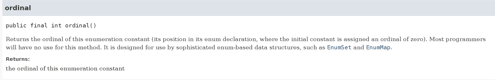

드디어 계산기 개발 프로젝트의 마지막 단계인 **Level 3** 를 구현하면서 고민했던 부분을 알아보겠습니다. 이번에는 설계에 대한 고민이 많았습니다. 그래서 시간을 많이 소모했지만, 완벽한 답을 얻었다기보다는 지금의 프로젝트 구현 목표에 부합하도록 설계하기 위해 노력했습니다.

---

# 과제 내용

## 학습목표

**<계산기 3단계까지>**

- [ ]  인터페이스 또는 상속을 활용하여 코드의 재사용성을 높일 수 있는가?
- [ ]  제네릭을 활용하여 재사용 가능 클래스를 설계할 수 있는가?
- [ ]  람다식을 활용한 함수형 인터페이스를 구현할 수 있는가?
- [ ]  스트림 API를 활용하여 데이터를 필터링, 변환할 수 있는가?
- [ ]  예외 처리(try-catch-finally)를 통해 오류를 적절히 처리할 수 있는가?

## 필수 기능 가이드

<aside>
💡

양의 정수만 받을 수 있었지만, 이제부터는 실수도 받을 수 있게 수정한다.
결과가 저장되어 있는 컬렉션을 조회하는 기능을 만든다. 
그 때 특정 값보다 큰 결과 값을 출력할 수 있도록 한다.

</aside>

- [ ]  **현재 사칙연산 계산기는 (➕,➖,✖️,➗) 이렇게 총 4가지 연산 타입으로 구성되어 있습니다.**
    - [ ]  Enum 타입을 활용하여 연산자 타입에 대한 정보를 관리하고 이를 사칙연산 계산기 ArithmeticCalculator 클래스에 활용 해봅니다.
- [ ]  **실수, 즉 double 타입의 값을 전달 받아도 연산이 수행하도록 만들기**
    - [ ]  키워드 : `제네릭`
        - [ ]  단순히, 기존의 Int 타입을 double 타입으로 바꾸는 게 아닌 점에 주의하세요!
    - [ ]  지금까지는 ArithmeticCalculator, 즉 사칙연산 계산기는 양의 정수(0 포함)를 매개변수로 전달받아 연산을 수행
    - [ ]  피연산자를 여러 타입으로 받을 수 있도록 기능을 확장
        - [ ]  ArithmeticCalculator 클래스의 연산 메서드(`calculate`)
    - [ ]  위 요구사항을 만족할 수 있도록 ArithmeticCalculator 클래스를 수정합니다. (제네릭)
        - [ ]  추가적으로 수정이 필요한 다른 클래스나 메서드가 있다면 같이 수정 해주세요.
- [ ]  **저장된 연산 결과들 중 Scanner로 입력받은 값보다 큰 결과값 들을 출력**
    - [ ]  ArithmeticCalculator 클래스에 위 요구사항을 만족하는 조회 메서드를 구현합니다.
    - [ ]  단, 해당 메서드를 구현할 때 Lambda & Stream을 활용하여 구현합니다.
        - [ ]  Java 강의에서 람다 & 스트림을 학습 및 복습 하시고 적용 해보세요!
    - [ ]  추가) 람다 & 스트림 학습을 위해 여러 가지 조회 조건들을 추가하여 구현 해보시면 학습에 많은 도움이 되실 수 있습니다.

# 고민한 내용

## 1. Enum에 비즈니스 로직을 포함해야 하는가?

- **문제 원인:** 초기 설계에서는 `Calculator` 클래스 내부의 `calculate` 메서드에서 `switch` 문을 사용해 입력 받은 연산자(`char`)에 따라 분기하여 계산 로직을 처리했습니다. 그런데 Level 3의 요구사항에서 4가지 연산자를 `Enum` 을 이용하여 관리하고 `Calculator` 클래스에서 활용하도록 요구했습니다.
    
    `Enum` 을 이용하면 확장할 때 `switch`를 수정하는 게 아니고, `enum`만 수정하면 되므로 유지보수 측면에서도 더 편하다고 생각했습니다.
    
    그래서 `Enum`을 통해 연산자에 대해 정의하던 도중에, 연산자 자체는 `Enum`으로 정의하더라도 연산자마다의 계산 로직을 `Enum`에 같이 정의할지, 아니면 상수 역할만 하고 연산 로직은 `Calculator`에 놔둘지 고민이 되었습니다.
    
    비즈니스 로직을 `Enum`에 두면 `Enum`을 단순 상수 데이터 저장소가 아닌 **행위를 포함하는 역할**로 정의하고 활용한다고 생각했습니다. 또 한편으로는, `Enum`의 책임이 너무 많아지는 것 아닌가?라는 생각과 `Enum`이 로직을 가져가면 `Calculator`의 역할은 무엇인가? 라는 생각이 들었습니다.
    
    ```java
    Calculator.java
    
    public int calculate(int first, int second, char operator) {
          int result = 0;
          switch (operator) {
    
              case '+':
                  result = first + second;
                  break;
              case '-':
                  result = first - second;
                  break;
              case '*':
                  result = first * second;
                  break;
              case '/':
                  if (second == 0) {
                      throw new ArithmeticException();
                  }
                  result = first / second;
                  break;
          }
          results.offer(result);
          return result;
      }
    ```
    
- **해결 방향**: 결국에는 **상태와 상태와 관련된 행위를 하나의 공간에서 처리하는 것이 맞다**는 생각이 들었습니다. 왜냐하면 `Enum`도 **결국은 클래스**이고 객체지향 프로그래밍에서의 클래스는 `Field`와 `Method`를 함께 가지는 객체로 활용하는 것이 본질이기 때문입니다. `Enum`으로 정의한 `OperatorType` 은 각 연산자의 **심볼**과 **역할을** 정의하고, `Calculator`는 `OperatorType`을 활용한 계산 행위를 담당한다고 정의했습니다.
    
    따라서, `OperatorType` 이 연산 기호(`char`) 뿐만 아니라, **실제 계산 로직(행위)까지 직접 갖도록** 구현했습니다. 이로써 `enum`은 단순한 상수가 아닌, 자신의 데이터를 스스로 처리하는 객체가 되었습니다. `Calculator`는 이제 어떤 연산인지 묻지 않고 `OperatorType`의 `operate`메소드를 호출하여 연산을 위임하도록 했습니다.
    
    이 때, 본래는 enum 객체의 로직을 각각 작성할 때 enum에 추상메소드를 정의하거나 인터페이스를 직접 정의 한 뒤에 구현하여 사용해야 했는데, `Java 8`에서 도입된 **함수형 인터페이스**를 활용하여 간단하게 작성할 수 있습니다. 
    
    ```java
    BiFunction<T, U, R> // 2개의 매개변수를 받아 1개의 값을 반환합니다.
    ```
    
    지금 상황에서 필요한 2개의 입력을 받아서 1개의 값을 리턴하는 것은 `BiFunction<T, U, R>`이라는 인터페이스로 작성되어 있습니다. 그리고 `BiFunction<T, U, R>` 은  `apply()`를 메소드 이름으로 사용합니다. 따라서 저는 인터페이스를 별도로 정의하지 않고 JDK에서 제공하는 `BiFunction`을 사용했습니다. 
    
    ```java
    // ArithmeticCalculator.java
    
    @Override
    public <T extends Number> Number calculate(T first, T second, OperatorType operatorType) {
    
        double result = operatorType.operate(first, second);
    
        results.offer(result);
        return result;
    }
    ```
    
    ```java
    // OperatorType.java
    
    public enum OperatorType {
        PLUS('+', (first, second) -> first + second),
        MINUS('-', (first, second) -> first - second),
        MULTIPLY('*', (first, second) -> first * second),
        DIVIDE('/', (first, second) -> {
            if (second == 0) {
                throw new ArithmeticException("0으로 나눌 수 없습니다.");
            }
            return first / second;
        });
    
        private final char symbol;
        private final BiFunction<Double, Double, Double> operation;
    
        OperatorType(char symbol, BiFunction<Double, Double, Double> operation) {
            this.symbol = symbol;
            this.operation = operation;
        }
        
        // ... 중략...
        
            /**
         * operator 유형별로 BiFunction 함수형 인터페이스의 메소드인 apply에 람다로 정의한 연산을 수행하도록 합니다.
         *
         * @param first  사용자가 입력한 숫자
         * @param second 사용자가 입력한 숫자
         * @return 연산 결과
         */
        public double operate(Number first, Number second) {
            return operation.apply(first.doubleValue(), second.doubleValue());
        }
    }
    ```
    
    Java에서는 거의 처음 사용해보는 형태의 코드라서 코드 실행  흐름을 정리해보았습니다. 
    
    ### 코드 실행 흐름
    
    `calculate(10, 5, OperatorType.PLUS)`를 호출하는 상황을 가정하겠습니다.
    
    **1단계: `ArithmeticCalculator`의 `calculate` 메서드 호출**
    
    1. `calculate` 메서드가 `first=10`, `second=5`, `operatorType=OperatorType.PLUS`라는 세 인자를 받으며 실행을 시작합니다.
    2. 메서드 내부에서 `operatorType.operate(first, second)`가 호출됩니다.
    3. 이것은 실제로는 `OperatorType.PLUS.operate(10, 5)`를 호출하는 것과 같습니다. **계산 작업을 `OperatorType`에게 위임**합니다.
    
    **2단계: `OperatorType`의 `operate` 메서드 호출**
    
    1. [`OperatorType.PLUS`](http://OperatorType.PLUS) 객체의 `operate` 메서드가 실행됩니다. 이 메서드는 모든 enum 상수가 공유하는 공통 메서드입니다. 
    2. 메서드 내부의 코드인 `operation.apply(...)`를 실행할 준비를 합니다.
    3. 여기서 `operation` 필드는 바로 앞에서 `OperatorType.PLUS`가 생성될 때 저장해 둔 **람다 객체 `(first, second) -> first + second`** 입니다.
    4. 결과적으로 `operation.apply(10.0, 5.0)`가 호출됩니다. **실제 연산을 람다 객체에게 다시 위임**합니다.
    
    **3단계: `BiFunction`의 `apply` 메서드 실행 (람다 로직 실행)**
    
    1. `apply` 메서드가 호출되면서, `PLUS` 상수가 품고 있던 **람다 로직 `first + second`가 드디어 실행**됩니다.
    2. `10.0 + 5.0` 연산이 수행되고 결과인 `15.0`이 반환됩니다.
    
    **4단계: 결과 반환**
    
    1. 람다의 실행 결과 `15.0`은 `operate` 메서드로 돌아옵니다.
    2. `operate` 메서드는 이 값을 다시 `calculate` 메서드로 반환합니다.
    3. `calculate` 메서드는 최종 결과 `15.0`을 `results` 컬렉션에 저장하고, 호출한 곳으로 반환하며 모든 흐름이 끝납니다.
    
    그리고 2-1 과정에서 때 런타임에 `OperatorType.PLUS` 객체가 생성될 때 람다 `(first, second) -> first + second`는 내부적으로 익명 클래스로 변환되는 것이 아니라, `invokedynamic`을 통해 바이트코드 수준에서 최적화된 람다 인스턴스로 처리됩니다. 이는 `Java 8`부터 도입된 방식이며, 성능 및 구조적 측면에서 기존의 익명 내부 클래스와 차이가 있다고 합니다. 이 주제는 차후에 더 깊게 학습하여 한 번 다뤄보겠습니다. **참고**에 제가 학습한 링크는 남겨두었습니다.
    

## **2. Generic의 필요성과 다양한 숫자 타입(정수, 실수) 처리 설계**

- **문제 상황**: Level 3 요구사항에 `int` 뿐만 아니라 `double`도 연산이 가능하도록 개발해야 한다는 조건이 있습니다. 사실 `int`끼리의 연산, `double`끼리의 연산만 처리한다면 `generic`을 도입한 취지와 아주 잘 맞는 요구사항이라고 생각했습니다.
    
    그런데 **5+2.5** 와 같이 **정수형과 실수형을 섞어서 계산하거나**, **처음에는 정수끼리만 계산하다가 나중에 실수끼리 계산하면 저장을 위한 콜렉션도 제어하면서 사용해야 하나? 어떻게 해야하지?** 이렇게 점점 복잡한 설계를 필요로 하게 되었습니다. 여기에 학습을 위해 **Generic** 은 반드시 사용해야 했습니다.
    
    **'순수 제네릭' 설계 시도 (`Calculator<T>`)**: `T calculate(T, T)`처럼 타입의 순수성을 지키는 설계를 먼저 고려했습니다. 하지만 이 방식은 `5(int) / 2(int)`의 결과가 `2.5(double)`가 될 수 없고, `4(int) + 5.5(double)`처럼 타입이 다른 연산을 처리할 수 없는 명확한 한계가 있었습니다.
    
    그리고, 이미 `Integer`끼리의 연산 결과가 저장되도록 콜렉션이 생겼다면,  나중에`double`끼리의 연산 결과를 저장할 수는 없습니다.
    

- **해결 방향**:
    
    ```java
    // ArithmeticCalculator.java
    
    public <T extends Number> Number calculate(T first, T second, OperatorType operatorType) {
    
    	  double result = operatorType.operate(first, second);
        results.offer(result);
        return result;
    }
    
    ```
    
    `calculate` 메서드를 `<T extends Number> Number calculate(T, T, ...)`로 정의했습니다. 이를 통해 **메서드 외부**에서는 제네릭을 활용하여 어떤 숫자 타입이든 유연하게 입력받도록 했습니다.
    
    **메서드 내부**에서는 모든 입력을 `double` 이라는 일관된 표준 타입으로 변환하여 연산의 정확성과 결과의 일관성을 보장했습니다. 이렇게 하면 타입은 비록 double로 일원화되지만, 정수형과 실수형의 혼합 연산을 수행할 수 있게 되었습니다.
    
    다만 이렇게 하면서 **추가적인 의문점**이 생겼습니다.
    
    1. 어차피 내부에서 `double`로 바꿔서 연산을 수행할거면 **굳이 제네릭을 사용하는 의미가 있는가?**
    2. 어차피 `double`로 형 변환을 할거면 차라리 `BigDecimal`을 사용하는 게 낫지 않나?
    
    의문점에 대한 답은 아래와 같이 생각했습니다.
    
    ### 어차피 내부에서 double로 바꿔서 연산을 수행할거면 **굳이 제네릭을 사용하는 의미가 있는가?**
    
    이 코드에서 제네릭의 역할을 **타입에 대해 외부에 노출하는 명시적 이점과 타입에 대한 편의성**으로 생각했습니다. `<T extends Number>` 를 통해, `Calculator`를 호출하는 쪽에서는 `int`든 `double`이든 형변환 없이 편리하게 값을 전달할 수 있습니다. 
    그러니까, 이 메서드를 사용하는 개발자(호출자)에게 "이 메서드는 **어떤 숫자 타입이든** 받을 수 있습니다"라는 **의도를 전달**합니다. 따라서 개발자는 타입을 신경쓰지 않고, **변환 없이 그대로 전달할 수 있습니다.** 
    
    제가 `calculate`()를 개발했기 때문에 내부에서 `double` 변환하는 과정에 대한 것을 알고 있어서 제네릭이 의미가 없지 않냐는 고민을 했습니다. 하지만, **호출해서 사용하는 역할을 개발하는 개발자가 따로 있다면 타입에 대한 고민을 덜어줄 수 있다**고 생각했습니다.
    
    ### double로 형 변환을 할거면 차라리 BigDecimal을 사용하는 게 낫지 않나?
    
    | 구분 | double | BigDecimal |
    | --- | --- | --- |
    | 정밀도 | 빠르지만, 미세한 오차 발생 가능 | 매우 정확함 (오차 없음) |
    | 사용법 | 기본 연산자(+, -, *, /) 사용 가능 | 메서드 호출 (.add(), .subtract()) 필요 |
    | 성능 | 빠름 (하드웨어 지원) | 상대적으로 느림 (객체 연산) |
    | 메모리 | 적게 사용 | 더 많이 사용 (객체) |
    | 주요 용도 | 일반적인 과학 계산, 그래픽 등 | 금융, 회계, 세금 등 정확한 수치가 필수적인 분야 |
    
    정밀도 측면에서는 bigDecimal을 사용하는 것이 무조건 좋습니다. 그러나 지금은 프로젝트를 하는 이유가 제네릭, 스트림, 인터페이스, `enum`을 활용한 객체 지향 설계 등 핵심 개념을 익히는 것이 더 중요하다고 생각했습니다. 
    
    특히 `BigDecimal`을 사용하면 **함수형 인터페이스와 람다를 이용하여** `OperatorType`과 `operate()`를 구현할 때 `BigDecimal`에서 제공하는 메서드를 사용해야 했습니다. 이러면 람다를 사용하는데도 불구하고 코드의 직관성이 조금 떨어진다고 생각했습니다. 
    
    ```java
    // 기존
    (b1, b2) -> b1 + b2
    
    // BigDecimal
    (b1, b2) -> b1.add(b2)
    ```
    
    과제와 상관없이 실제 연산의 사용되는 숫자의 유형에 따라 다음과 같이 정리했습니다.
    
    - `int`는 `int`끼리, `double`은 `double`끼리만 계산한다면 ?
        
        → 순수 제네릭 설계 (`Calculator<T>`)
        
    - `int`와 `double`을 섞어서 계산해야 하고, 높은 정밀도가 필요한 것은 아니라면?
        
        -> 제네릭 메서드 + `double` 변환 (현재 선택한 방식)
        
    - `int`와 `double`을 섞어서 계산해야 하고, 오차는 절대 용납할 수 없다면?
        
        -> `BigDecimal`로 타입을 통일하여 개발
        
    
    대신 제가 double로 변환하여 모든 연산을 수행하고 반환하는 만큼, 정수와 실수에 대한 표현이 전부 소수점이 포함되어 사용자가 혼란스러울 수 있습니다. 따라서 **소수점 여부에 따라 프린트하는 함수를 별도로 작성**하여 사용자가 불편함이 없도록 개발했습니다.
    
    ```java
    	
    // App.java
    private static String printFormatNumber(double number) {
      if (number % 1 == 0) {
          return String.valueOf((long) number);
      }
      return String.valueOf(number);
    }
    ```
    

## **3. Enum 에서 제공하는 ordinal() 사용 여부**

- **문제 상황**: 저장된 연산 결과 중 기준값보다 크거나 작은 숫자들을 보여주는 기능을 추가하기 위해 콘솔에서 새로운 메뉴를 추가해야 했고, 저는 해당 기능을 `Menu`라는 `Enum`으로 관리하고 있었으므로 `Menu`클래스에 상수를 추가해야 했습니다.
    
    이 때 “종료하기”와 “첫번째 결과 삭제하기”보다 먼저 표시가 되어야 했기에 **중간**에 추가가 되어야 했습니다. 그래서 중간에 추가한 후 사용자가 입력하는 숫자에 대한 값인 `command` 를 하나씩 수정했습니다. 그런데 `Menu` 의 항목이 늘어날 때마다 **메뉴 번호를 수동으로 수정하는 것은 번거롭다**는 생각이 들었습니다. 
    
    그래서, `enum` 에서 제공하는 `ordinal()` 을 사용하여 자동으로 부여되는 위치의 인덱스를 사용하기로 하고, 수정했습니다. 다만 명시적으로 숫자를 지정하여 사용하는 것이 아니기 때문에, 자동 변경으로 인한 사이드이펙트 또한 존재할 수 있다고 생각했습니다.
    
    
    
    실제로 Oracle에서 제공하는 Java API 공식 문서에도 대부분의 프로그래머는 사용할 일이 없는 메소드라고 명시되어 있습니다.
    
    ```java
    // 이전 Menu.java
    
    public enum Menu {
    
        CALCULATE(1, "계산하기"),
        VIEW(2, "이전 연산 결과 조회하기"),
        REMOVE_FIRST(3, "가장 먼저 저장된 연산 결과 삭제하기"),
        EXIT(4, "종료하기"),
        ;
    
        private final int command;
        private final String description;
    
        Menu(int command, String description) {
            this.command = command;
            this.description = description;
        }
      
    	    // ... 중략 ...
        
         /**
         * 사용자로부터 입력받은 번호에 해당하는 메뉴를 반환합니다.
         *
         * @param command
         * @return
         */
        public static Optional<Menu> getMenu(int command) {
            return Arrays.stream(Menu.values())
                    .filter(cur -> cur.command == command)
                    .findFirst();
        }
    ```
    
    ```java
    // 수정한 Menu.java
    
    public enum Menu {
    
        CALCULATE("계산하기"),
        VIEW("이전 연산 결과 조회하기"),
        VIEW_WITH_VALUE("이전 연산 결과 중 입력 값보다 큰 결과만 조회하기"),
        REMOVE_FIRST("가장 먼저 저장된 연산 결과 삭제하기"),
        EXIT("종료하기"),
        ;
    
        private final String description;
    
        Menu(String description) {
            this.description = description;
        }
        
    		    // ... 중략 ...
    		
    		/**
    		* 사용자로부터 입력받은 번호에 해당하는 메뉴를 반환합니다.
    		*
    		* @param command
    		* @return
    		*/
    		public static Optional<Menu> getMenu(int command) {
    		  return Arrays.stream(Menu.values())
    		          .filter(cur -> cur.ordinal() + 1 == command)
    		          .findFirst();
    		}
    ```
    
- `enum`의 `ordinal()` 메서드를 사용하면 번호를 동적으로 자동으로 부여하여 편리하지만, `ordinal()`은 선언 순서에 의존하기 때문에 협업 시 다른 개발자가 순서를 바꾸면 오작동을 유발할 수도 있다고 생각했습니다.
    
    **예시**
    
    **상황 1: 최초의 정상적인 코드**
    
    처음 작성한 `Menu` 코드는 다음과 같았다고 가정해 봅시다. 사용자는 '5번'을 누르면 프로그램이 종료됩니다.
    
    ```java
    public enum Menu {
        CALCULATE("..."),      // ordinal: 0, 메뉴 번호: 1
        VIEW("..."),           // ordinal: 1, 메뉴 번호: 2
        VIEW_WITH_VALUE("..."),// ordinal: 2, 메뉴 번호: 3
        REMOVE_FIRST("..."),   // ordinal: 3, 메뉴 번호: 4
        EXIT("종료하기");        // ordinal: 4, 메뉴 번호: 5
    }
    ```
    
    **정상 동작:**
    
    1. 사용자가 메뉴에서 `5. 종료하기`를 봅니다.
    2. 사용자가 `5`를 입력합니다.
    3. `Menu.getMenu(5)`가 호출됩니다.
    4. `ordinal() + 1 == 5`인 `EXIT`가 정상적으로 찾아지고, 프로그램이 종료됩니다.
    
    ---
    
    **상황 2: 개발자의 '의도적인' 순서 변경**
    
    '전체 기록 삭제' 기능을 추가하기로 했습니다. `EXIT`가 항상 마지막에 오는 것이 좋다고 생각하여, `REMOVE_FIRST`와 `EXIT` 사이에 새로운 메뉴를 추가했습니다.
    
    ```java
    // 순서가 변경된 Menu.java
    public enum Menu {
        CALCULATE("..."),      // ordinal: 0, 메뉴 번호: 1
        VIEW("..."),           // ordinal: 1, 메뉴 번호: 2
        VIEW_WITH_VALUE("..."),// ordinal: 2, 메뉴 번호: 3
        REMOVE_FIRST("..."),   // ordinal: 3, 메뉴 번호: 4
        CLEAR_ALL("전체 기록 삭제"), // << 새로 추가됨, ordinal: 4, 메뉴 번호: 5
        EXIT("종료하기");        // << 순서가 밀림, ordinal: 5, 메뉴 번호: 6
    }
    ```
    
    **상황 3: 버그 발생**
    
    1. **사용자 관점**
        - **사용자의 행동**: 이전에 프로그램을 종료할 때 항상 `5`번을 눌렀던 사용자가, 메뉴를 자세히 보지 않고 습관적으로 `5`를 입력합니다.
        - **코드의 동작**:
            1. `Menu.getMenu(5)`가 호출됩니다.
            2. 코드는 `ordinal() + 1 == 5`인 enum 상수를 찾습니다.
            3. 변경된 코드에서는 `EXIT`가 아닌 **`CLEAR_ALL`*의 `ordinal`이 `4`이므로, `CLEAR_ALL`이 찾아집니다.
        - **결과**: **사용자는 종료를 원했지만, 실제로는 모든 기록이 삭제되었습니다.**
    2. **외부 연동**
        - **상황**: 이 계산기를 테스트하는 자동화 스크립트가 있고, 이 스크립트는 테스트 종료 시 `5`라는 숫자를 프로그램에 보내도록 하드코딩되어 있습니다.
        - **코드의 동작**: 시나리오 A와 동일하게, `5`는 `CLEAR_ALL`로 해석됩니다.
        - **결과**: **테스트 스크립트는 매번 테스트 종료 시 모든 데이터를 삭제**하게 되고, 개발자는 왜 테스트 데이터가 계속 사라지는지 원인을 찾기 위해 별도로 확인하는 과정을 거쳐야 합니다.
- **해결 과정**: 두 방식의 트레이드오프를 분석했습니다. 혼자 개발을 하고 모든 것을 기억한다면, 예시와 같은 상황이 발생하지 않을 수 있습니다. 그러나 사용자 관점도 고려해야 하고, 협업을 하게 되고 테스트 등 외부와 연동하게 되면 개발자가 생각한 상황 외에 다른 상황이 발생할 수도 있습니다.
    
    **현재 프로젝트에서는 부작용 발생 가능성은 낮다고 생각하나, 위험성에 대해 학습하였고 연습을 위해 다시 명시적인 방식으로 코드를 복구했습니다.**
    

## 4. App 클래스를 static 기반으로 만들지, 인스턴스화를 고려할지

- **문제 상황:** 프로그램의 기능이 많아짐에 따라, `static`으로 사용했던 `App`클래스를 인스턴스화 하는 게 더 나은지에 대해 고민했습니다. `App`클래스를 콘솔 UI를 책임지는 클래스로 정의 후 `static`으로 사용한 이유가 몇 가지 있었습니다.
    1. 유틸리티 함수 위주로 구성되어 있기 때문에 개발할 때 편하다.
    2. 상태를 갖지 않는 상황에서는 사용에 문제가 없다.
    3. 상태가 없을 뿐더러 콘솔 인터페이스 중심의 기능을 제공하므로 static이 적합하다고 생각도 든다.
    
    그러나 객체지향 설계 및 상태 분리, 확장성, 테스트 등을 고려하면 인스턴스 기반으로 전환하는 게  유리하지 않을까? 라는 생각이 들었습니다.
    
- **해결 방향:** 현재는 App.class가 상태를 가지지 않으므로 기능상으로 필수는 아니었으나, 객체지향 설계를 학습하고, 확장성을 고려하여 인스턴스 기반으로 전환했습니다.
    
    ```java
    // App.java
    
    public class App {
    
        private final ArithmeticCalculator calculator;
        private final Scanner sc;
    
        public App(ArithmeticCalculator calculator, Scanner sc) {
            this.calculator = calculator;
            this.sc = sc;
        }
        
        // ... 중략 ...
        
        public void run() {
            boolean isRunning = true;
    
            while (isRunning) {
                showAllMenu();
    
                Menu selectedMenu;
                try {
                    int cmd = Integer.parseInt(sc.nextLine().trim());
                    selectedMenu = Menu.findMenu(cmd);
                } catch (NumberFormatException e) {
                    logError("원하는 메뉴의 번호를 입력하세요.");
                    continue;
                } catch (IllegalArgumentException e) {
                    logError(e.getMessage());
                    continue;
                }
    
                switch (selectedMenu) {
                    case CALCULATE:
                        handleCalculation(sc, calculator);
                        break;
                    case VIEW:
                        showPrevResults(calculator.getResults());
                        break;
                    case VIEW_WITH_VALUE:
                        showPrevResultsWithValues(sc, calculator);
                        break;
                    case REMOVE_FIRST:
                        handleRemove(calculator);
                        break;
                    case EXIT:
                        log("계산기가 종료됩니다.");
                        isRunning = false;
                        break;
                }
            }
    
        }
    }
    ```
    
    ```java
    // Main.java
    
    package lv3;
    
    import java.util.Scanner;
    
    public class Main {
    
        public static void main(String[] args) {
    
            ArithmeticCalculator calculator = new ArithmeticCalculator();
            Scanner sc = new Scanner(System.in);
    
            App app = new App(calculator, sc);
            app.run();
            
            sc.close();
        }
    }
    ```
    
    - `Calculator`, `Scanner` 등 의존성을 생성합니다.
    - `Main.java`라는 실행을 위한 클래스를 새로 만들고, `new App(calculator, scanner).run()`과 같이 `App` 객체를 생성하고, `run` 메서드를 호출하여 애플리케이션을 시작하도록 구성했습니다.
    - `handleCalculation` 등 모든 메서드는 `static`을 제거하고 **인스턴스 메서드**로 변경합니다.
    - 특히, 차후에 Caclulator 가 확장하여 다른 클래스가 생기거나, UI를 콘솔이 아닌 다른 것으로 대체하는 경우 App의 의존성만 변경하면 되기 때문에 편리합니다. 그리고 마찬가지 이유로 테스트도 편리하게 됩니다.

## **5. Calculator 인터페이스 분리의 필요성과 시점**

- **문제 상황**: 구현체가 `ArithmeticCalculator` 하나뿐인데, 굳이 `Calculator` 인터페이스를 미리 분리해야 하는지 의문이 있었습니다. 특히, 차후에 어떤 계산기의 기능을 하는 `Calculator`를 추가하여 `calculate`()라는 메서드는 공통으로 가질 수 밖에 해도 별도의 리턴 타입과 매개변수 등 모든 것이 변할 수 있다고 생각했기 때문입니다.
    
    그래서 지금 당장 인터페이스를 분리하기보다는, 나중에 `ScientificCalculator`처럼 **새로운 종류의 계산기가 실제로 필요해지는 시점**에 두 클래스의 공통점을 뽑아 인터페이스를 추출하는 것이 더 현실적이고 정확한 리팩토링이라는 결론을 내렸습니다.
    
- **해결 방향**: 다만, 인터페이스를 미리 정의하는 것이 나중에 작성할 `Calculator`에 대한 **가이드 역할**을 할 수도 있다는 생각을 했습니다. 꼭 `ScientificCalculator`처럼 아예 용도가 추가되거나 설계가 달라질 계산기만을 고려하는 게 아니라, 같은 콘솔 기반의 사칙연산 계산기를 개발하는 경우도 있을 수 있고 이 기능은 필요하다고 미리 정의하는 역할을 한다는 것을 인지했습니다.
    
    따라서 필수적인 `calculate()`를 가지도록 `Calculator`인터페이스를 구현하고 `ArithmetiCalculator` 클래스는 `Calculator` 인터페이스를 구현하도록 리팩토링 했습니다. 물론 차후에, 인터페이스를 구현하는 다른 클래스를 만들 때 설계 변경에 대한 고민이 생긴다면, 그 때 다시 수정을 해야할 것입니다.
    
    ```java
    // Calculator.java
    
    package lv3;
    
    public interface Calculator {
        <T extends Number> Number calculate(T first, T second, OperatorType operatorType);
    }
    
    ```
    

## 6. Enum 상수에 대한 접근 방법과 성능

- **문제 상황**: `OperatorType.findSymbol` 나 `Menu.findMenu(int)`메서드는 호출될 때마다 `stream()`을 통해 `enum`의 모든 상수를 순회(`O(n)`)하고 있습니다. 따라서 조회가 빈번하거나, `Enum`값이 많아질수록 비효율적일 수 있다고 생각했습니다.
    
    어쩌면 매핑이 되어 있어 바로 접근할 수 있는 것이 장점 중 하나여서 상수를 사용하는 건데 사용자 입력에 대한 처리는 검색이 또 필요하니 그 장점을 살리지 못한다는 생각도 들었습니다.
    
- **해결 방향**: `static` 타입의 `Map` Collection을 이용하여 미리 `O(1)`에 접근할 수 있는 `char` 기호를 키로, `OperatorType` 과 `Menu` 상수를 값으로 하는 `Map`을 클래스 로딩 시점에 생성하도록 개발할 수 있습니다. 이렇게 하면 **Enum 상수를 찾는 조회하는 역할의 메서드**는 `Map.get()`을 통해 `O(1)`의 시간 복잡도로 매우 빠르게 수행할 수 있습니다.
    
    현재 프로젝트는 숫자가 매우 작기에 필수적인 변경은 아니고, **스트림을 연습해야 하는 목적**이 있어 코드를 수정하지는 않았습니다. 다만 성능을 위해 다른 방법을 고려했고 여기 회고에 기록했습니다.
    
    ```java
    
    // OperatorType을 예시로 만든 static Map 코드
    private static final Map<Character, OperatorType> OPERATOR_MAP = 
        Arrays.stream(values()).collect(Collectors.toMap(op -> op.symbol, op -> op));
    
    public static OperatorType findSymbol(char command) {
        return LOOKUP.get(command); // O(1)
    }
    
    // 기존 코드
    public static OperatorType findSymbol(char command) {
        return Arrays.stream(values())
                .filter(op -> op.symbol == command) // O(N)
                .findFirst()
                .orElseThrow(() -> new IllegalArgumentException("+, -, *, / 중 하나의 기호만 입력해야 합니다."));
    }
    ```
    

---

# **느낀점 및 다음 계획**

Level 3에서는 설계에 대한 고민이 많았습니다. 특히 **1. Enum에 비즈니스 로직을 포함해야 하는가?** 와 **2. Generic의 필요성과 다양한 숫자 타입(정수, 실수) 처리 설계**에 대해 고민하면서 Java의 기본적인 학습과 객체지향 설계에 대해 계속 고민해볼 수 있었습니다.

그리고 기술적인 고민 뿐만 아니라 `App.class`의 콘솔을 통해 사용자가 결국 상호작용하는 만큼 중복되는 코드들을 메서드화 하고, **사용자가 불편함이 없도록** 콘솔의 메시지를 이해할 수 있도록 별도의 메서드들을 만들어서 노력했습니다.

아쉬운 점은, **테스트 코드**에 대한 것을 다루지 못했다는 것입니다. 프로젝트의 규모가 작을 때부터 연습을 하고 싶었는데 과제 제출이 끝나도 테스트 코드에 대해 연습을 이어서 해보려고 합니다.

과제를 통해 모던 자바에서 제공하는 여러 문법과 객체지향 설계에 대해 고민해볼 수 있어서 좋았습니다.

**참고**

- [Dev.java - Learn Java: Enums](https://dev.java/learn/classes-objects/enums/)
- [Dev.java - Learn Java: Generics](https://dev.java/learn/generics/intro/)
- [Oracle Java SE 17 & JDK 17 - Class Enum](https://docs.oracle.com/en/java/javase/17/docs/api/java.base/java/lang/Enum.html)
- [Oracle java SE 17 & JDK 17 - Interface BiFunction](https://docs.oracle.com/javase/8/docs/api/java/util/function/BiFunction.html)
- [Baeldung - Guide to Java BiFunction](https://www.baeldung.com/java-bifunction-interface)
- [Baeldung -The Basics of Java Generics](https://www.baeldung.com/java-generics)
- [Enum 활용사례 3가지](https://jojoldu.tistory.com/137)
- [Java Enum 활용기](https://techblog.woowahan.com/2527/)
- [Enum 조회 성능 높여보기 - HashMap을 이용해서 빠르게](https://pjh3749.tistory.com/279)
- [Baeldung - An Introduction to Invoke Dynamic in the JVM](https://www.baeldung.com/java-invoke-dynamic)
- [invokedynamic의 내부 동작](https://blog.hexabrain.net/400)
- [이상민, 『자바의 신 VOL.1』, 로드북, 2023](https://www.yes24.com/product/goods/122886212)
- [이상민, 『자바의 신 VOL.2』, 로드북, 2023](https://www.yes24.com/product/goods/122886692)
- [라울-게이브리얼 우르마 외 2명, 『모던 자바 인 액션』, 한빛미디어, 2019](https://www.yes24.com/product/goods/77125987)
- Google Gemini