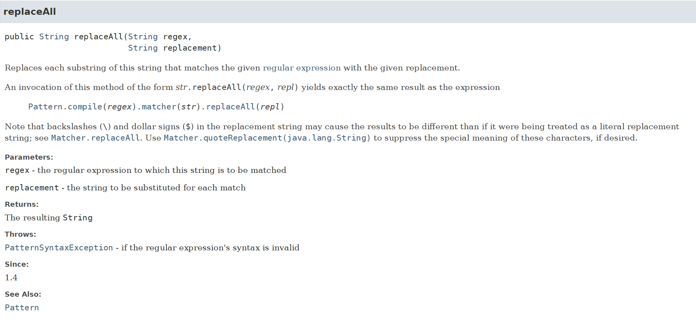

최근 프로그래머스 코딩테스트 연습 문제 [‘숫자 문자열과 영단어’](https://school.programmers.co.kr/learn/courses/30/lessons/81301)를 풀면서, `replace()`와 `replaceAll()` 메소드의 차이에 대해 호기심이 생겼습니다.

## 고민 이유

문제의 키 포인트는 문자열에 포함된 "one“,”eight“ 등 숫자를 나타내는 영어 단어를 실제 숫자로 바꾸는 것이었습니다. 처음 푼 방법은 주어진 문자열을 **선형탐색**하면서 숫자가 아닌 문자가 나오면 매칭되는 숫자가 나올 때까지 별도의 index 변수와 `while`을 이용해서 내부에서도 선형탐색을 하는 방법으로 풀었습니다. 

그런데 다른 분들의 코드를 보니 **`replace()`** 또는 `replaceAll()`을 활용하여 간단히 작성한 분들이 많았습니다. 근데 제 기억에는 `replace()`도 문자열 내에 존재하는 모든 대상을 바꿔줬던 것 같은데, 무슨 차이가 있는걸까? 라는 궁금증이 생겼습니다. 실제로 `replaceAll()`로 작성된 풀이를 **`replace()`로 바꿔도 통과**했습니다.

그래서 둘의 차이가 명확히 무엇인지, Java SE 17 기준의 공식 문서를 통해 정리해보았습니다.

---

## replace()



```java
String replace(char oldChar, char newChar)
String replace(CharSequence target, CharSequence replacement)

// replace
public String replace(CharSequence target, CharSequence replacement) {
    String trgtStr = target.toString();
    String replStr = replacement.toString();
    int thisLen = length();
    int trgtLen = trgtStr.length();
    int replLen = replStr.length();

    if (trgtLen > 0) {
        if (trgtLen == 1 && replLen == 1) {
            return replace(trgtStr.charAt(0), replStr.charAt(0));
        }

        boolean thisIsLatin1 = this.isLatin1();
        boolean trgtIsLatin1 = trgtStr.isLatin1();
        boolean replIsLatin1 = replStr.isLatin1();
        String ret = (thisIsLatin1 && trgtIsLatin1 && replIsLatin1)
                ? StringLatin1.replace(value, thisLen,
                                       trgtStr.value, trgtLen,
                                       replStr.value, replLen)
                : StringUTF16.replace(value, thisLen, thisIsLatin1,
                                      trgtStr.value, trgtLen, trgtIsLatin1,
                                      replStr.value, replLen, replIsLatin1);
        if (ret != null) {
            return ret;
        }
        return this;

    } else { // trgtLen == 0
        int resultLen;
        try {
            resultLen = Math.addExact(thisLen, Math.multiplyExact(
                    Math.addExact(thisLen, 1), replLen));
        } catch (ArithmeticException ignored) {
            throw new OutOfMemoryError("Required length exceeds implementation limit");
        }

        StringBuilder sb = new StringBuilder(resultLen);
        sb.append(replStr);
        for (int i = 0; i < thisLen; ++i) {
            sb.append(charAt(i)).append(replStr);
        }
        return sb.toString();
    }
}
```

- 2개의 오버로딩 형태가 존재하며, `char` 단위 / `CharSequence`단위에서 **모두 입력된 문자(열)을 그대로 대체** 가능합니다.
    - `CharSequence`String, StringBuffer, StringBuilder, CharBuffer 등이 `implement`하는 **Interface**
- 특수문자나 정규식이 아닌, **정확히 일치하는 문자열**만 찾아서 바꿉니다.
- `Java 8` 까지는 `String replace(CharSequence, CharSequence)` 도 내부 구현은 정규표현식이었으나, `Java 9` 부터는 정규표현식을 사용하지 않도록 최적화되었습니다.

```java
String replaceTest = "Hello new World";
System.out.println(replaceTest); // Hello new World
System.out.println(replaceTest.replace('l', 'L')); // HeLLo new WorLd

String replaceTestTwo = "Hello Hello new World";
System.out.println(replaceTestTwo); // Hello Hello new World
System.out.println(replaceTestTwo.replace("ll", "LL")); // HeLLo HeLLo new World
```

---

## replaceAll()


```java
// replaceAll

public String replaceAll(String regex, String replacement) {
    return Pattern.compile(regex).matcher(this).replaceAll(replacement);
}
```

- 첫 번째 인자를 **정규표현식**(regex)로 해석합니다 .
- 해당 **정규식에 매칭되는 모든 부분 문자열**을 교체하며, 내부적으로 `Pattern.compile(regex).matcher(this).replaceAll(replacement)` 형태로 동작합니다. 따라서, 호출시마다 `Pattern.compile()`을 실행하기 때문에 반복 호출하면 상대적으로 성능 저하가 클 수 있습니다.

```java
String replaceTestThree = "Hello Hello new World";
System.out.println(replaceTestThree); // Hello Hello new World
System.out.println(replaceTestThree.replace("[a-z]", "")); // Hello Hello new World
System.out.println(replaceTestThree.replaceAll("[a-z]", "")); // H H  W
```

- `replace()` 에 정규표현식을 사용하면 문자열로 받아들이기 때문에, 예시에서는  `[a-z]`라는 문자열이 없어 바뀌는 문자열 없이 매개변수가 그대로 리턴되었습니다.
- "**one**"과 같은 **일반 문자열은 '자기 자신'과 일치하는 가장 기본적인 정규표현식 패턴**입니다. 따라서 `replaceAll()`에 일반 문자열을 넣으면 `replace()`와 동일한 결과를 낸 것입니다.

---

## replaceFirst()


- `replaceAll()`과 동일하지만, **첫 번째 매칭된 부분만 바꿔줍니다** .
- 호기심의 원인과 다르게 `replace()`과  `replaceAll()`를 구분하는 용도가 아니라, 정규표현식을 이용하는 `replaceAll()` 과 `replaceFirst()` 이 2개의 메소드를 구분하기 위해 **All**과 **First**를 각 메소드의 끝에 붙인 것 같다는 생각이 들었습니다.

---

## 정리

| 메소드 | 첫 번째 인자 설명 | 동작 방식 | 대상 |
| --- | --- | --- | --- |
| `replace()` | **Literal 문자열** | 정확히 일치하는 모든 문자/문자열 교체 | 단순 대체 |
| `replaceAll()` | **정규표현식(regex)** | 정규식 매칭되는 모든 부분 교체 | 패턴 기반 |
| `replaceFirst()` | **정규표현식(regex)** | 첫 번째 매칭만 교체 | 패턴 기반 |

따라서, 단어 수준의 문자열 변환이라면 `replace()`로도 충분하다고 생각합니다. `replaceAll()`에 비해 정규표현식 컴파일·매칭 과정이 없기 때문에 성능도 일반적으로 더 우수합니다. 그러나, 정규표현식이 필요하다면 `replaceAll()`  또는 `replaceFirst()`를 사용하면 됩니다.

---

# 문제에 대한 적용

“숫자 문자열과 영단어” 문제에서는 `"one"`을 `"1"` 처럼 0~9까지의 숫자를 매핑하여 변환하는 과정이 필요했습니다. 따라서 아래 예시 코드처럼 미리 배열을 선언하여 반복문을 활용하거나, `replace()`는 **메소드 체이닝**을 지원하기 때문에 간단히 해결이 가능합니다.

```java
// 미리 배열을 선언한 뒤 반복문 활용
String[] words = {"zero", "one", "two", "three", "four", "five", "six", "seven", "eight", "nine"};

for (int i = 0; i < 10; i++) {
    s = s.replace(words[i], Integer.toString(i));
}

// 메소드 체이닝
String result = s.replace("zero","0")
                 .replace("one","1")
                 .replace("two","2")
                 // ... 이하 생략 ...
```

---

`replace()`와 `replaceAll()`의 차이에 대해 알아보았습니다. 위의 문제처럼 비교적 단순한 문자열을 변환하기 위한 것이라면 `replaceAll()`을 사용하지 않고 `replace()`를 사용해도 충분하다는 생각이 들었습니다. 대신 정규표현식이 유용한 순간에는 `replaceAll()` 혹은 `replaceFirst()`를 사용하면 될 것 같습니다.

**참고**

- [JavaSE 17 docs - Class String](https://docs.oracle.com/en/java/javase/17/docs/api/java.base/java/lang/String.html#replaceAll(java.lang.String,java.lang.String))
- [프로그래머스 - 숫자 문자열과 영단어](https://school.programmers.co.kr/learn/courses/30/lessons/81301)