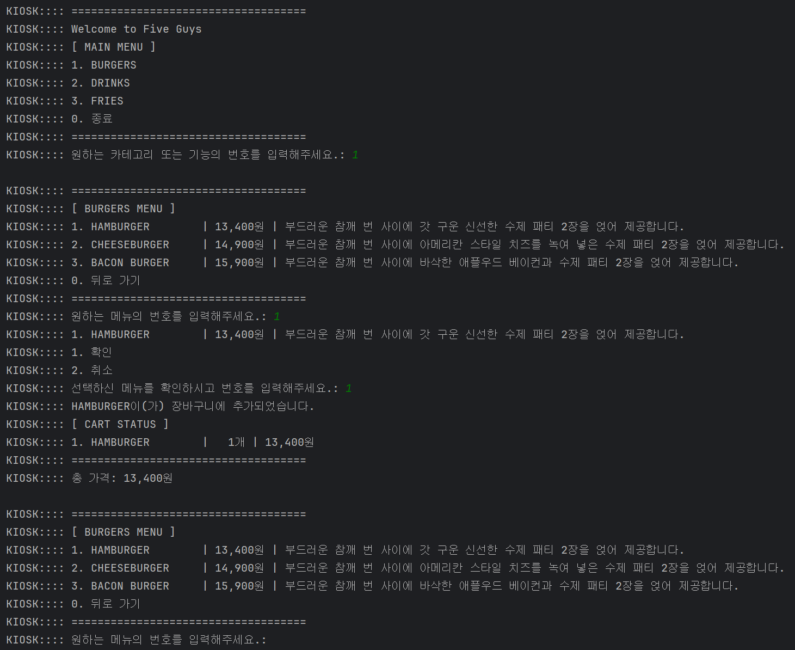

저번 [계산기 과제](https://seonrizee.github.io/blog/2025-07-15-ch2-calculator-lev3/)에 이어서 이번에는 키오스크를 Java를 이용하여 만드는 과제를 하고 있습니다. 이번에는 필수기능 Level 1 ~ Level 5, 도전기능 Level 1 ~ Level 2로 저번 과제보다 더 세분화되어 있습니다.

오늘은 필수 기능 Level 1~5 단계를 개발하면서 고민했었던 내용들에 대해 글을 작성해보려고 합니다.

# 과제 내용

### 클래스 정의

- `Main` : 시작 지점이 되는 클래스, `public static void main(String[] args)`
- `MenuItem`: 세부 메뉴 속성 가지는 클래스
    - 햄버거의 이름, 가격설명
        - 예시: ShackBurger, 6.9, 토마토, 양상추, 쉑소스가 토핑된 치즈버거
        - `new MenuItem("ShackBurger", 6.9, "토마토, 양상추, 쉑소스가 토핑된 치즈버거")`
- `Kiosk`: 프로그램 순서 및 흐름 제어를 담당하는 클래스
- `Menu`: MenuItem 클래스를 관리하는 클래스
    - 예시 : 버거 메뉴, 음료 메뉴 등 각 카테고리 내에 여러 `MenuItem`을 포함합니다.

## 필수 기능 가이드

### Lv 1. 기본적인 키오스크를 프로그래밍해보자

- [ ]  **요구사항이 가지는 의도**
    - [ ]  입력 처리와 간단한 흐름 제어를 복습합니다. (프로그래밍 검증**)**
    - [ ]  `Scanner` 활용법, 조건문, 반복문을 재확인하며 입력 데이터를 처리하는 방법 강화

---

- [ ]  **햄버거 메뉴 출력 및 선택하기**
    - [ ]  `Scanner`를 사용하여 여러 햄버거 메뉴를 출력합니다.
    - [ ]  제시된 메뉴 중 입력받은 숫자에 따라 다른 로직을 실행하는 코드를 작성합니다.
    - [ ]  반복문을 이용해서 특정 번호가 입력되면 프로그램을 종료합니다

### Lv 2. 객체 지향 설계를 적용해 햄버거 메뉴를 클래스로 관리하기

- [ ]  **요구사항이 가지는 의도**
    - [ ]  객체 지향 개념을 학습하고, 데이터를 구조적으로 관리하며 프로그램을 설계하는 방법을 익힙니다.
    - [ ]  햄버거 메뉴를 `MenuItem` 클래스와 `List`를 통해 관리합니다.

---

- [ ]  **`MenuItem` 클래스 생성하기**
    - [ ]  설명 : 개별 음식 항목을 관리하는 클래스입니다. 현재는 햄버거만 관리합니다.
    - [ ]  클래스는 `이름`, `가격`, `설명` 필드를 갖습니다.
- [ ]  `main` 함수에서 `MenuItem` 클래스를 활용하여 햄버거 메뉴를 출력합니다.
    - [ ]  `MenuItem` 객체 생성을 통해 `이름`, `가격`, `설명`을 세팅합니다.
        - [ ]  키워드: `new`
    - [ ]  `List`를 선언하여 여러 `MenuItem`을 추가합니다.
        - [ ]  `List<MenuItem> menuItems = new ArrayList<>();`
    - [ ]  반복문을 활용해 `menuItems`를 탐색하면서 하나씩 접근합니다.

### Lv 3. 객체 지향 설계를 적용해 순서 제어를 클래스로 관리하기

- [ ]  **요구사항이 가지는 의도**
    - [ ]  객체 지향 개념을 학습하고, 데이터를 구조적으로 관리하며 프로그램을 설계하는 방법을 익힙니다.
    - [ ]  `main` 함수에서 관리하던 전체 순서 제어를 `Kiosk` 클래스를 통해 관리합니다.
- [ ]  **`Kiosk` 클래스 생성하기**
    - [ ]  **설명**: 키오스크 프로그램의 메뉴를 관리하고 사용자 입력을 처리하는 클래스입니다.
    - [ ]  `MenuItem`을 관리하는 리스트가 필드로 존재합니다.
    - [ ]  `main` 함수에서 관리하던 입력과 반복문 로직은 이제 `start` 함수를 만들어 관리합니다.
    - [ ]  `List<MenuItem> menuItems` 는 `Kiosk` 클래스 생성자를 통해 값을 할당합니다.
        - [ ]  `Kiosk` 객체를 생성하고 사용하는 `main` 함수에서 객체를 생성할 때 값을 넘겨줍니다.
- [ ]  요구사항에 부합하는지 검토
    - [ ]  키오스크 프로그램을 시작하는 메서드가 구현되어야 합니다.
        - [ ]  콘솔에 햄버거 메뉴를 출력합니다.
        - [ ]  사용자의 입력을 받아 메뉴를 선택하거나 프로그램을 종료합니다.
        - [ ]  유효하지 않은 입력에 대해 오류 메시지를 출력합니다.
        - [ ]  `0`을 입력하면 프로그램이 ‘뒤로가기’되거나 ‘종료’됩니다.

### Lv 4. 객체 지향 설계를 적용해 음식 메뉴와 주문 내역을 클래스 기반으로 관리하기

- [ ]  **`Menu` 클래스 생성하기**
    - [ ]  설명 : MenuItem 클래스를 관리하는 클래스입니다. 
    예를 들어, 버거 메뉴, 음료 메뉴 등 각 카테고리 내에 여러 `MenuItem`을 포함합니다.
    - [ ]  `List<MenuItem>` 은 `Kiosk` 클래스가 관리하기에 적절하지 않으므로 Menu 클래스가 관리하도록 변경합니다.
    - [ ]  여러 버거들을 포함하는 상위 개념 ‘버거’ 같은 `카테고리 이름` 필드를 갖습니다.
    - [ ]  메뉴 카테고리 이름을 반환하는 메서드가 구현되어야 합니다.

### Lv 5. 캡슐화 적용하기

- [ ]  `MenuItem`, `Menu` 그리고 `Kiosk` 클래스의 필드에 직접 접근하지 못하도록 설정합니다.
- [ ]  Getter와 Setter 메서드를 사용해 데이터를 관리합니다.

# 고민한 내용

## 1. List\<Menu\> MenuList를 어디서 생성하고 어디서 주입해야할까?

- **고민 내용:** Level 4 단계를 진행하면서 `Kiosk`→ `Menu`→ `MenuItem`의 관계를 가지게 되었습니다. 이 때 여러 `Menu`를 가지는 `List<Menu>` 타입의 `MenuList`을 어느 클래스에서 관리하는 것이 더 바람직한 설계인지 고민이 되었습니다.
    
    `Kiosk` 클래스에서 `setupMenuList()` 등의 메서드를 만든 뒤에 메뉴를 초기화 할 수도 있고, 실행을 담당하는 클래스인 `Main`클래스에서 `MenuList`를 만든 뒤에 `Kiosk` 객체를 생성할 때 주입해주는 방법도 있었습니다.
    
- **해결 방향:** `Kiosk`의 생성자로 주입해주는 방식을 선택했습니다. 이렇게 하면 `Kiosk`는 메뉴 데이터가 어디서 어떻게 만들어지는지 신경 쓸 필요 없이, 메뉴를 보여주고 사용자와 소통하는 역할에만 집중할 수 있습니다.
    
    크게 생각하면, **키오스크와 메뉴 데이터를 분리**함으로써 현재 예시로 개발중인 “**Five Guys**”의 키오스크가 아니라 다른 메뉴, 다른 업종의 메뉴 데이터만 주입해주면 재활용할 수 있기 때문에 **범용성**이 더 높은 설계라는 생각이 들었습니다.
    
    또한, 나중에 메뉴 데이터를 연결하는 방법이 달라지더라도 해당 부분만 `Main`에서 수정하면 바꿀 수 있는 것도 장점이라고 생각합니다.
    
    ```java
    // Main.java
    
    public static void main(String[] args) {
    
        List<Menu> menuList = setupMenuList();
        Kiosk kiosk = new Kiosk(menuList); // 생성자에 인자로 주입
        kiosk.start();
    }
    
    private static List<Menu> setupMenuList() {
        Menu burgerMenu = new Menu("BURGERS", List.of(
                new MenuItem("HAMBURGER", 13400, "부드러운 참깨 번 사이에 갓 구운 신선한 수제 패티 2장을 얹어 제공합니다."),
                new MenuItem("CHEESEBURGER", 14900, "부드러운 참깨 번 사이에 아메리칸 스타일 치즈를 녹여 넣은 수제 패티 2장을 얹어 제공합니다."),
                new MenuItem("BACON BURGER", 15900, "부드러운 참깨 번 사이에 바삭한 애플우드 베이컨과 수제 패티 2장을 얹어 제공합니다.")
        ));
    
        Menu drinkMenu = new Menu("DRINKS", List.of(
                new MenuItem("SODA", 3900, "코카콜라 제품을 제공합니다."),
                new MenuItem("SPARKLING WATER", 2500, "탄산수"),
                new MenuItem("BUDWEISER", 6000, "버드와이저 맥주")
        ));
    
        Menu frieMenu = new Menu("FRIES", List.of(
                new MenuItem("FRIES LITTLE", 6900, "파이브가이즈 스타일 프라이즈 작은 사이즈"),
                new MenuItem("FRIES REGULAR", 8900, "파이브가이즈 스타일 프라이즈 중간 사이즈"),
                new MenuItem("FRIES LARGE", 10900, "파이브가이즈 스타일 프라이즈 큰 사이즈")
        ));
    
        return List.of(burgerMenu, drinkMenu, frieMenu);
    }
    ```
    

## 2. MenuItem을 목록에서 선택 후 머무르기 vs. 돌아가기

- **고민 내용:** 사용자가 상품 카테고리(예: Burgers)에 진입하여 상품을 하나 장바구니에 담았을 때, 바로 메인 메뉴로 돌아가게 할지, 아니면 현재 카테고리에 머무르게 할지 사용자 경험의 흐름을 결정해야 했습니다.
- **해결 방향:** 사용자가 같은 카테고리의 다른 상품을 연달아 담을 수 있도록, **현재 카테고리에 머무르는 것**이 더 나은 사용자 경험이라고 판단했습니다. 이를 위해 `showSubMenu` 같은 메서드 내부에 `while(true)` 루프를 사용했습니다.
    
    사용자가 '**뒤로 가기(0번)**'를 선택했을 때, `break` 대신 `return`을 사용하여 **현재 메뉴 화면의 임무를 완전히 종료하고 이전 화면으로 돌아간다는 의도**를 코드에 명확히 표현했습니다.
    
    ```java
    // Kiosk.java
    
    private void showSubMenu(Scanner sc, int selectedMenuIdx, Cart cart) {
    
            Menu selectedMenu = menuList.get(selectedMenuIdx - 1);
            List<MenuItem> menuItemList = selectedMenu.getMenuItems();
    
            while (true) {
                // ... 중략 ...
                
                printInfo("0. 뒤로 가기");
                printLine();
                printInput("원하는 메뉴의 번호를 입력해주세요.: ");
    
                int selectedItemIdx = getUserInput(sc, 0, menuItemList.size());
                if (selectedItemIdx == 0) {
                    printInfo("이전 화면으로 돌아갑니다.");
                    return;
                }
                
                // ... 중략 ...
            }
        }
    ```
    
    
    

## 3. List.copyOf, unmodifiableList, new ArrayList의 차이

- **고민 내용:** `Menu` 객체의 `getMenuItems()` 메서드가 내부의 `List`를 외부에 제공할 때, 원본 `List`를 그대로 반환하면 외부에서 리스트를 수정할 수 있어 **캡슐화**가 깨질 위험이 있다고 생각했습니다. 수정할 일이 없다면 상관이 없을 수도 있지만, 협업을 할 때는 어떤 개발자가 어떤 의도를 가지고 재사용할지 모르기 때문에 방어적 복사를 활용하는 것이 좋다고 생각했습니다.
- **해결 방향:** 데이터를 안전하게 제공하는 세 가지 방법의 차이를 이해하고, 상황에 맞는 방법을 선택하고자 했습니다.
    1. **`new ArrayList<>(list)`**: **수정 가능한** '**복사본**'을 반환. 외부에서 수정해도 원본은 안전.
    2. **`Collections.unmodifiableList(list)`**: **수정 불가능한 '읽기 전용 뷰(View)'**를 반환. 원본이 바뀌면 뷰도 함께 바뀜.
    3. **`List.copyOf(list)`**: **수정** **불가능한 '복사본(Snapshot)'**을 반환. 원본이 바뀌어도 영향 없음.
    
    저는 키오스크의 메뉴는 별도의 관리자가 별도의 메뉴를 통해 수정하지 않는 한, 키오스크가 실행 중인 상황에서는 '한번 정해진 메뉴는 바뀌지 않는다'고 생각했습니다. 즉, 키오스크의 메뉴를 바꾸기 위해서는 애초에 MenuList도 외부에서 주입해주었던 것 처럼 Kiosk 객체가 아니라 외부에서 변경이 이루어져야 한다고 생각했습니다. 따라서, 가장 강력한 불변성을 보장하기 위해 `List.copyOf()`를 최종 선택했습니다.
    
    ```java
    // 원본 리스트 생성
    List<String> original = new ArrayList<>(List.of("A"));
    
    // 3가지 방식
    List<String> mutableCopy = new ArrayList<>(original);
    List<String> view = Collections.unmodifiableList(original);
    List<String> unmodifiableCopy = List.copyOf(original);
    
    // 원본 수정
    original.add("B");
    
    System.out.println("수정 가능한 복사본: " + mutableCopy);          // 출력: [A]
    System.out.println("읽기 전용 뷰: " + view);                      // 출력: [A, B]
    System.out.println("수정 불가능한 복사본: " + unmodifiableCopy);   // 출력: [A]
    ```
    
    ```java
    // Menu.java
    
    public List<MenuItem> getMenuItems() {
        return List.copyOf(menuItems);
    }
    ```
    

## 4. **총액 계산 시점의 선택: 수량이 변할 때마다 vs 필요할 때 한 번에**

- **고민 내용**: 아이템을 추가/수정할 때마다 `calculateSumCartPrice()`를 호출하여 총액을 계산했습니다. 이 방식은 총액을 저장하는 별도의 필드(`private int sumPrice`)가 있다는 것을 암시하는데, 이 경우 수량이나 가격이 변하는 등 관련된 메소드의 로직이 수정된다면 전부 반영이 될 수 있도록 데이터 동기화에 신경 써주어야 합니다. 대신 미리 계산이 되어 있으므로, 필요할 때 바로 반환하여 빠르게 사용할 수 있습니다.
    
    대신 총액처럼 합계의 성격을 가지는 값이 필요할 때마다 합계를 새로 계산하는 방식도 있습니다. 이 방법은 데이터 동기화 과정과 여기서 발생할 수 있는 계산의 오류에 대해 걱정하지 않아도 됩니다. 그리고 합계를 구하는 메서드만 관리하면 되기 때문에 유지보수 하기에도 편리합니다. 다만, 장바구니의 아이템과 수량이 복잡해질수록 총액을 계산하는 데 성능이 많이 소모될 수도 있습니다.
    
- **해결 방향**: 키오스크의 경우 단일 사용자의 장바구니만 계산하면 되기 때문에 필요할 때 마다 계산을 하더라도 성능에 큰 무리가 될 거라고는 생각이 들지 않았습니다. 따라서, 합계를 계산하는 `getTotalPrice()` 메서드를 만들고 필요할 때만 호출하도록 코드를 작성하여 유지보수의 편의성과 계산의 정확성을 확보하도록 했습니다. 그리고 이 과정에서 스트림을 사용했습니다.
    
    ```java
    // Cart.java
    
    private final Map<String, CartItem> cartItems = new LinkedHashMap<>();
    
    public int getTotalPrice() {
        return cartItems.values()
                .stream()
                .mapToInt(CartItem::getSumItemPrice)
                .sum();
    
    }
    ```
    

---
# 느낀점 및 다음 계획

이미 계산기 과제를 하면서, `Java`혹은 객체지향이나 사용자 편의성에 대해 고민을 많이 했었습니다. 키오스크 과제는 계산기와 비슷한 면이 어느 정도 있기 때문에, 미리 고민해봤던 내용들이 있어서 새로 고민한 내용들이 많지는 않았습니다.

그러나, 장바구니 기능이 추가되는 도전 기능을 하면서 상당히 많은 고민을 했습니다. 특히, 객체지향 설계와 관련된 고민 뿐만 아니라, `Kiosk`클래스의 기능이 많아지면서 코드 레벨에서 재활용성과 복잡성을 낮추기 위한 고민도 많이 했습니다. 다음에는 도전 기능을 구현하면서 고민한 내용을 다시 기록해보겠습니다.