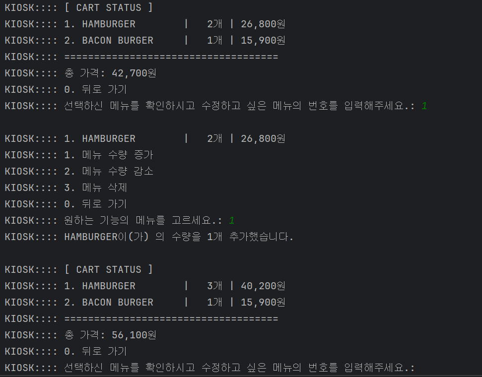

오늘은 키오스크 과제의 도전 과제 Level 1을 구현하면서 고민했던 주요 내용을 정리했습니다. 특히 코드 수준에서의 설계, 객체 간 책임 분리, 컬렉션 선택 등 객체지향적 접근을 중심으로 다루고자 합니다.

# **과제 내용**

## 도전 기능 Lv 1. 장바구니 및 구매하기 기능을 추가하기

- [ ]  **요구사항이 가지는 의도**
    - [ ]  **의도**: 클래스 간 연계를 통해 객체 지향 프로그래밍의 기본적인 설계를 익히고, 사용자 입력에 따른 프로그램 흐름 제어와 상태 관리를 학습
    - [ ]  **목표**
        - [ ]  클래스 간 역할 분리를 이해하고, 적절히 협력하는 객체를 설계
        - [ ]  프로그램 상태 변경 및 데이터 저장을 연습
        - [ ]  사용자 입력에 따른 예외 처리와 조건 분기를 연습

---

- [ ]  **장바구니 생성 및 관리 기능**
    - [ ]  사용자가 선택한 메뉴를 장바구니에 추가할 수 있는 기능을 제공합니다.
    - [ ]  장바구니는 메뉴명, 수량, 가격 정보를 저장하며, 항목을 동적으로 추가 및 조회할 수 있어야 합니다.
    - [ ]  사용자가 잘못된 선택을 했을 경우 예외를 처리합니다(예: 유효하지 않은 메뉴 번호 입력)
- [ ]  **장바구니 출력 및 금액 계산**
    - [ ]  사용자가 결제를 시도하기 전에, 장바구니에 담긴 모든 메뉴와 총 금액을 출력합니다.
    - [ ]  출력 예시
        - [ ]  각 메뉴의 이름, 가격, 수량
        - [ ]  총 금액 합계
- [ ]  **장바구니 담기 기능**
    - [ ]  메뉴를 클릭하면 장바구니에 추가할 지 물어보고, 입력값에 따라 “추가”, “취소” 처리합니다.
    - [ ]  장바구니에 담은 목록을 출력합니다.
- [ ]  **주문 기능**
    - [ ]  장바구니에 담긴 모든 항목을 출력합니다.
    - [ ]  합산하여 총 금액을 계산하고, “주문하기”를 누르면 장바구니를 초기화합니다.

# 고민한 내용

## 1. 장바구니에 적절한 콜렉션은? LinkedHashMap

- **고민 내용**: 도전 과제의 핵심은 장바구니를 구현하는 것이었습니다. 장바구니에 담긴 아이템들을 관리하기 위해 어떤 컬렉션을 사용해야 할지 고민했습니다.
    
    장바구니는 여러 `MenuItem`을 담을 수 있는데, 수량과 가격 정보도 포함해야 했습니다. 그리고 차후에 삭제까지 가능해야 했습니다. 또한, 장바구니인 만큼 카트에 담은 **순서를 보존**할 수 있으면 사용자가 사용하기 편리할 것이라고 생각했습니다.  따라서, 사용할 콜렉션은 **순차조회와, 추가, 삭제**에 대한 시간복잡도 고려가 필요했습니다.
    
    `ArrayList`가 가장 먼저 떠올랐지만, 상품을 삭제할 때마다 뒤의 모든 요소를 당겨야하기 때문에 최악의 경우 **리스트 전체를 탐색**해야 한다는 문제가 있었습니다. `Set`은 중복을 허용하지 않지만 순서를 보장하지 않았습니다.
    
- **해결 방향**: **성능**(O(1) 조회)과 **순서 보장**이라는 두 가지 요구사항을 모두 만족시키는 `LinkedHashMap<String, CartItem>`을 선택했습니다.
    1. **성능**: `Map`을 사용하면 `MenuItem` 객체의 이름을 K**ey**로 설정할 수 있습니다. 따라서 특정 아이템의 존재 여부를 바로 확인할 수 있습니다. 추가와 삭제도 마찬가지로 O(1) 의 시간복잡도를 가집니다.
    2. **순서 보장**: 일반 `HashMap`과 달리 `LinkedHashMap`은 **Key가 삽입된 순서를 기억**합니다. 덕분에 사용자가 장바구니를 조회할 때, 상품을 담은 순서대로 자연스럽게 보여줄 수 있습니다.
    
    다만, 해시값의 주인인 Key를 무엇으로 할지에 대해서는 고민을 많이 했습니다. 크게 방법은 3가지가 떠올랐습니다.
    
    1. **MenuItem의 이름(String) 을 사용하는 방법**
        
        쉽고 간편한 방법이지만, 상품명 자체를 Key로 사용하다보니 상품명이 바뀌면 유지보수에 조금 어려움이 있을 수 있습니다. 그리고 **상품 이름은 같으나 상품의 옵션만 다른 경우도 같은 이름의 상품을 만들 수 없기 때문에** 같은 이름으로는 사용할 수 없습니다.
        
        예를 들어, 감자 튀김이라는 사이드 메뉴의 이름은 같고, 사이즈만 small, meidum, large 이렇게 3개의 옵션이 있다고 하더라도 3개 모두 고유한 Key 역할을 할 수 있도록 3개의 다른 이름을 별도로 만들어 기억해둬야 합니다.
        
    2. **MenuItem 객체 자체를 사용하는 방법**
        
        객체 자체를 사용할 수도 있습니다. 대신 두 객체가 같은 key인지 확인할 수 있도록, equals()와 hashCode() 메서드를 재정의(Overriding)해야 합니다. 이름만 사용하는 경우보다는 옵션만 다른 경우도 조금은 편하게 처리할 수 있습니다.
        
    3. **MenuItem이 가지는 별도의 고유한 id값을 사용하는 방법**
        
        사실, 실무에서는 3번의 방법을 사용했을 것이라고 생각합니다. 짧은 기간이었지만, 실제로 일하는 동안 프로덕트를 구분하기 위해 사용하는 고유한 정보는 주로 **데이터베이스에서 PK로 관리되는 고유한 id 성격을 가진 값**을 사용하곤 합니다. 예를 들면, 버거류는 `bg-0001`, 사이드는 `sd-0001` 뭐 이런 식으로 간단히 만들 수 있겠죠. 
        
        가장 좋은 점은 무엇보다, 해당 상품의 **현실의 수정을 코드의 수정으로 이어지는 관계를 어느 정도분리**할 수 있다는 점입니다. 상품명이 변하더라도 코드는 변하지 않기 때문에 데이터베이스의 내용만 변경하면 되기 때문입니다.
        
    
    하지만 저는 이번 프로젝트에서 구체적인 DB까지는 고려하지 않으며, 예시로 3개 정도의 카테고리에 각각 3개 정도의 메뉴를 만들어서 기능들을 구현하고 있습니다. 따라서, 이번에는 프로젝트에서 DB활용이 없고, 간단한 메뉴 구조임을 고려하여 맞춰 `String`을 Key로 사용하는 **1번 방법**을 선택했습니다. `Enum`도 사용하지 않고 개발의 편의성에 조금 더 초점을 뒀습니다.
    

## 2. CartItem에 대한 책임은 누가 가져야 할까?

- **고민 내용**:장바구니에 담기는 `MenuItem`을 가지는 `CartItem`이라는 클래스를 만들었고, 이 `CartItem`을 담는 콜렉션을 가지는 `Cart`라는 클래스를 만들었습니다. 따라서, `CartItem`은 장바구니에 담겨 있는 `MenuItem` 객체와 수량 등을 가지도록 했습니다.
    
    이 때, `Kiosk`(UI)에서 사용자가 선택한 `MenuItem`을 장바구니에 담을 때, 두 가지 방법을 고민했습니다.
    
    1. `Kiosk`가 `CartItem`을 직접 만들어 `Cart`에 전달한다.
    2. `Kiosk`는 `MenuItem`만 `Cart`에 전달하고, `Cart`가 알아서 `CartItem`을 만들거나 수량을 늘린다.
- **해결 방향**: `CartItem`은 `Cart`의 내부 구현이라고 할 수 있습니다. `Kiosk`는 그저 상품을 추가해달라는 요청만 하고, 이미 담긴 상품인지 확인해서 수량을 늘리거나, 아니면 새로 추가하는 로직은 `Cart`가 책임지는 것이 맞다고 생각했습니다.
    
    `Kiosk`가 `Cart`에 추가하는 형식을 포함하게 되면, 차후에 `Cart`의 작동 방식이 바뀌면 `Kiosk`의 코드도 변경해야 하는 문제가 생깁니다. 따라서, `Kiosk`에서는 사용자의 입출력과 UI를 담당하는 책임에 맞게 사용자가 선택한 `MenuItem`을 전달만 하는 것으로 코드를 작성했습니다.
    
    ```java
    // Kiosk.java
    
    private void addItemToCart(MenuItem selectedItem) {
        console.printNewLine();
        console.printInfo(selectedItem.getName() + "을(를) 장바구니에 추가했습니다.");
        cart.addItem(selectedItem); // MenuItem 객체인 selectedItem을 넘겨준다.
        console.displayCartStatus(cart);
    }
    ```
    
    그리고 추가적으로, `Cart`에서 `MenuItem`에 대한 정보가 필요하면 정보를 얻기 위해 별도의 방법을 사용하지 않고 편리하게 객체를 통해 바로 접근하여 사용할 수 있도록 하는 것이 좋다고 생각했습니다. 따라서 `MenuItem`의 이름만 건네지 않고 `MenuItem`객체 자체를 인자로 넘겨주었습니다.
    

## 3. `increaseQuantity()` vs `updateQuantity(int amount)` 답은 둘 다?

- **고민 내용**: 현재 코드는 `increaseQuantity()`로 수량을 1씩만 늘릴 수 있습니다. 만약 "한 번에 5개 담기" 같은 기능이 필요하다면 어떻게 해야 할지, API 설계를 어떻게 하는 것이 사용자와 개발자 모두에게 효용이 높아질지 고민했습니다.
- **해결 방향**: 사실 둘 중에서 선택하는 것이 아니라 역할에 따라 두 종류의 메서드를 모두 제공하는 것이 좋다고 생각했습니다.
    1. **단순 증감**: `increaseQuantity()`, `decreaseQuantity()`는 가장 일반적인 사용 사례를 편리하게 지원합니다. 저는 1씩 변화하도록 했습니다.
    2. **수량 직접 지정**: `setQuantity(int amount)`나 `addQuantity(int amount)` 같은 메서드는 특정 수량을 직접 지정하거나 여러 개를 한 번에 추가하는 등 사용자의 요구에 더 유연하게 대응할 수 있습니다.
    
    다만, 현재 키오스크 프로젝트에서는 콘솔로 입출력을 담당하고 있습니다. 그리고 사용자가 기능에 대한 입력을 기능의 숫자를 입력하도록 하고 있기 때문에, **1. 수량 증가** 혹은 **2. 수량 감소**처럼 만들고  1씩 변화할 수 있도록 하는 것이 하는 것이 오히려 입력의 통일성을 갖춘다고 생각했습니다. 물론 더 복잡한 시스템을 설계한다면 요구사항을 고려하여 한 번에 수량을 관리할 수 있는 메서드도 고려해야 할 것입니다.
    
    ```java
    // CartItem.java
    
    public class CartItem {
    
        private final MenuItem item;
        private int quantity;
    
        public CartItem(MenuItem item) {
            this.item = item;
            this.quantity = 1; // 초기값을 1로 생성
        }
    
        public void increaseQuantity() { // 수량 1 증가
            this.quantity += 1;
        }
    
        public void decreaseQuantity() { // 수량 1 감소
            this.quantity -= 1;
        }
        
        ... 중략 ...
    ```
    

## 4. 장바구니의 내용을 업데이트하고 난 뒤 return은 필요할까?

- **고민 내용**: `Cart`의 `addItem()`, `removeItem()` 같은 메서드가 반환값을 가져야 하는지, 가진다면 어떤 타입이 좋을지 고민되었습니다. 어떤 방식으로든, `Kiosk`에서 사용자가 선택한 장바구니의 내용 수정이 올바르게 이뤄졌는지에 대한 결과를 사용자에게 알려주는 것이 당연히 사용자 입장에서 좋은 경험이라고 생각했습니다.
- **해결 방향**: 크게 2가지의 방법이 떠올랐습니다.
    1. `void` : 가장 간단하지만, 직접적으로 피드백을 주지는 않습니다. 원하는 방법이 일어나지 않으면 Exception으로 처리해야 합니다. 다만 엄밀히 하자면, 사용자의 행동으로 일어나는 결과가 일어날 수 있는 시나리오인지, 아니면 정말 예외인지도 따져봐야 합니다.
        
        ```java
        public class Cart {
            public void addItem(MenuItem menuItem) {
                // 아이템을 추가하는 로직...
            }
        }
        
        // 호출하는 쪽
        cart.addItem(burger); // 그냥 추가하라고 명령
        ```
        
    2. `boolean` : 성공 여부를 `true`, `false`로 반환하기 때문에 직관적이며, 리턴값에 따라 추가적인 행동을 결정하기가 용이합니다. 다만 그에 따른 조건문이 생깁니다.
        
        ```java
        public class Cart {
            public boolean removeItem(MenuItem menuItem) {
                if (/* 아이템이 존재해서 삭제에 성공하면 */) {
                    return true;
                }
                return false;
            }
        }
        
        // 호출하는 쪽
        boolean isSuccess = cart.removeItem(coke);
        if (isSuccess) {
            System.out.println("삭제되었습니다.");
        }
        ```
        
    
    저는 `boolean`을 반환하여 직접적으로 피드백을 주는 것이 더 나은 방식이라고 생각했습니다. 다만 여기서 추가적으로 직접적으로 리턴하는 것은 아니지만 다른 방법도 하나가 떠올랐습니다. 바로 **업데이트가 반영된 객체의 정보를 사용자에게 보여주는 것**입니다. ****
    
    FE와 BE가 나눠져서 개발을 할 때 API를 통해 BE의 데이터가 수정되면 FE로 수정이 반영된 데이터를 `JSON`으로 돌려주곤 합니다. 이렇게 하면 FE 입장에서는 별도의 API 요청 없이 수정된 내용을 토대로 다시 화면을 렌더링할 수 있기 때문입니다.
    
    사용자 입장에서는 ****성공 여부를 데이터를 통해 간접적으로 알 수 있습니다. 다만. 데이터가 많은 경우 **바뀌는 부분이 많다면** **사용자나 개발자 모두 변화를 확인하기에 편리**할 수 있습니다. 제가 개발하고 있는 장바구니는 총 3가지의 부분이 바뀌어야 했습니다.
    
    1. **수정한 MenuItem의 수량**
    2. **수정한 MenuItem의 가격 총합**
    3. **장바구니에 있는 모든 MenuItem의 가격 총합**
    
    따라서, 업데이트가 반영된 객체의 내용을 사용자에게 보여주는 게 사용자 입장에서 좋다고 생각이 들었습니다. 그래서 `boolean`을 반환하는 2번을 선택하지 않고 **1번과 마지막으로 언급한 방법을 합쳐서 구현**했습니다. 따라서, 장바구니의 수정이 일어난 뒤에는 수정된 장바구니의 내용을 보여주는 메소드를 호출했습니다.
    
    ```java
    // kiosk.java
    
    private ScreenIntent handleUpdateOrder(Scanner sc) {
    
        if (cart.isCartEmpty()) {
            console.printInfo("장바구니에 남은 메뉴가 없어 메인 화면으로 돌아갑니다.");
            return new ScreenIntent(Screen.MAIN);
        }
    
        console.printNewLine();
        console.displayCartStatus(cart); // 현재 장바구니의 상태를 보여주는 메서드
        
        /// ... 중략 ...
    
    		// 변화를 일으키는 메서드
        updateCart(sc, selectedIdx, cart.getCartItems().get(selectedIdx - 1));
        // 아래 return의 결과에 따라 다시 handleUpdateOrder(sc)를 호출함 
        // 따라서 변화가 있으면 위에서 호출되는 displayCartStatus(cart)를 통해 확인 가능
        return new ScreenIntent(Screen.ORDER_UPDATE); 
    }
    
    private void updateCart(Scanner sc, int selectedItemIdx, CartItem cartItem) {
    
            // ... 중략 ...
            
            MenuItem selectedItem = cartItem.getItem();
    
            if (selectedIdx == 1) {
                if (cart.addItem(selectedItem)) { // 성공하면 메시지, 실패하면 예외 호출
                    console.printInfo(selectedItem.getName() + "이(가) 의 수량을 1개 추가했습니다.");
                }
            } else if (selectedIdx == 2) {
                if (cart.decreaseItem(selectedItem)) {
                    console.printInfo(selectedItem.getName() + "이(가) 의 수량을 1개 감소했습니다.");
                }
            } else if (selectedIdx == 3) {
                if (cart.removeItem(selectedItem)) {
                    console.printInfo(selectedItem.getName() + "을(를) 장바구니에서 삭제했습니다.");
                }
            }
    
        }
    ```
    
    그러다가 **직접적인 피드백까지 추가되면 사용자가 변화를 인식하기 편리**하다고 생각하여 **2번도 추가하여 2번과 마지막으로 언급한 방법을 활용**했습니다. 
    
    
    

# **느낀점 및 다음 계획**

`LinkedHashMap`을 선택하는 과정에서 성능과 사용자 경험을 함께 고려하는 법을 배웠고, `Cart`의 책임을 분리하며 객체지향의 설계에 대해 고민했습니다. 또한 3번과 4번에 대해 고민하고 개발하면서 사용자 입장에서 어떤 기능이 필요하다고 생각이 든다면 개발자는 사용자의 경험을 고려하면서도, 개발자의 유지보수 난이도는 낮출 수 있는 변경에는 유연한 방법을 도출해야 한다고 생각을 했습니다. 또한 한 걸음 더 나아가, 간단한 것이라도 선제적으로 사용자가 필요한 기능에 대해서도 고민을 해보고 먼저 제안까지 할 수 있으면 좋겠다는 생각을 했습니다.

그리고 이 토대는 결국 **개발의 기본기와 사용자 그리고 도메인에 대한 이해**에서 나오기 때문에 부지런히 노력해야겠습니다. 다음에는 기능이 추가된 만큼 복잡해진 코드를 콘솔로 표현되는 UI 기능과 로직을 분리하여 리팩토링하는 부분에 대한 고민에 대해 주로 다뤄보겠습니다.