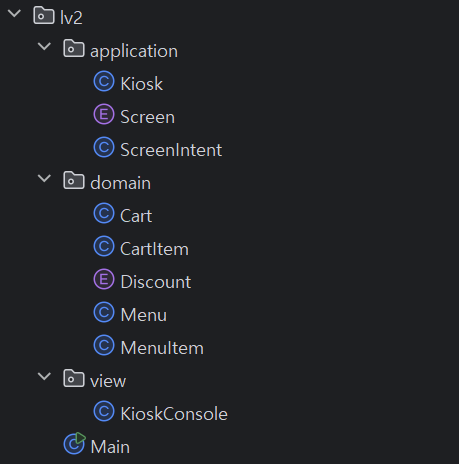

오늘은 키오스크 프로젝트의 도전 과제 Level 2를 진행하며 겪었던 고민과 해결 과정을 공유합니다. 이번 과제의 핵심은 Enum, 람다, 스트림 같은 Java의 기능을 활용하여 코드의 효율성과 가독성을 개선하면서 새로운 기능을 추가하는 것이었습니다. 이 과정에서 점진적으로 구조와 설계를 어떻게 리팩토링 해야할지 고민해볼 수 있었습니다.

## **과제 내용**

### 도전 기능 Lv 2. Enum, 람다 & 스트림을 활용한 주문 및 장바구니 관리

**요구사항이 가지는 의도**

**의도** : 고급 자바 기능을 활용해 프로그램의 효율성과 코드의 가독성을 개선하는 것을 목표로 합니다.

**목적**

Enum을 통해 상수를 안전하게 관리하고, 프로그램 구조를 간결하게

제네릭을 활용하여 데이터 유연성을 높이고, 재사용 가능한 코드를 설계

스트림 API를 사용하여 데이터를 필터링하고, 간결한 코드로 동작을 구현

---

- [ ]  **Enum을 활용한 사용자 유형별 할인율 관리하기**
    - [ ]  사용자 유형의 Enum 정의 및 각 사용자 유형에 따른 할인율 적용
        - [ ]  예시 : 군인, 학생, 일반인
    - [ ]  주문 시, 사용자 유형에 맞는 할인율 적용해 총 금액 계산
- [ ]  **람다 & 스트림을 활용한 장바구니 조회 기능**
    - [ ]  기존에 생성한 Menu의 MenuItem을 조회 할 때 스트림을 사용하여 출력하도록 수정
    - [ ]  기존 장바구니에서 특정 메뉴 빼기 기능을 통한 스트림 활용
        - [ ]  예시 : 장바구니에 SmokeShack 가 들어 있다면, stream.filter를 활용하여 특정 메뉴 이름을 가진 메뉴 장바구니에서 제거

## **고민한 내용**

### **1. 복잡한 UI 흐름과 중첩된 `while`: `Enum`과 `Intent`객체로 Kiosk 제어 개선하기**

- **고민 내용**:
    
    도전 기능 Level 2를 개발하면서 어쩌면 기능적인 부분보다도 가장 크게 고민했던 부분입니다. 
    
    도전 기능을 수행하면서 메뉴 선택 과정에서는 **장바구니** 그리고 주문 과정에서는 **할인** 마지막으로 **장바구니 업데이트**를 단독으로 할 수 있는 기능을 추가했습니다. 그리고 각 기능마다 메인 `handler` 역할을 하는 메소드를 구성하여 사용자 선택마다 처리하는 화면이 출력되고 기능이 수행될 수 있도록 구현했습니다.
    
    | 기능 | 메인 Handler 메소드 이름 |
    | --- | --- |
    | 카테고리별 메뉴 선택+장바구니 담기 | `handleSelectMenu` |
    | 주문+할인 적용 | `handleCheckoutOrder` |
    | 장바구니 수정 기능 | `handleUpdateCart` |
    
    그런데 각 `handler` 메소드마다도 추가적인 화면과 뒤로 가기 버튼이 필요하게 되면서 `kiosk.start()`에서 사용하고 있는 `while`외에 각 메소드도 모두 `while`문을 보유하게 되었습니다. 이로 인해 메서드 호출 구조가 깊어졌고, 화면 간의 화면 전환 로직을 파악하고 관리하기가 기능이 추가될수록 어려워졌습니다. 
    
    또한 현재는 메뉴마다 사용자에게 출력해주는 숫자의 인덱스만으로 화면을 분기하고 있는데, 분기하는 `if` 문에서 메뉴가 추가될 수록 계속 숫자에 대한 입력을 처리하도록 `else-if`가 생기는 구조였습니다. 그래서 더욱 복잡해지기 전에 이 구조를 개선을 해보면 좋겠다고 생각을 했습니다.
    
- **해결 방향**:
저는 `Android App`을 개발할 때 `Intent`를 통해서 `Activity` 간에 다음에 이동할 `Activty`와 `Data`를 전달했던 것에서 영감을 받아서, 일종의 **상태 머신(State Machine)**처럼 만들어 문제를 해결하고자 했습니다. **상태 머신**이란, 하나의 시스템이 가질 수 있는 여러 상태와 그 상태들 사이의 전환을 관리하는 디자인 패턴입니다.
    1. **`Screen` Enum 정의**: 키오스크의 모든 기능을 큰 화면 단위로 나누고 화면 마다 '상태(State)'로 정의했습니다. 큰 화면 단위로 나누는 기준은 **사용자 입장에서 명확히 구분되는 별개의 화면인가?**로 삼고, 특정 화면 내에서 이루어지는 확인/취소 등은 그 화면에 종속된 작은 동작으로 생각했습니다.
        
        
        | 화면 | Screen Enum |
        | --- | --- |
        | 키오스크 메인 화면 | MAIN |
        | 카테고리별 메뉴 선택+장바구니 담기 | MENU_DETAIL |
        | 주문+할인 적용 | ORDER_CHECKOUT |
        | 장바구니 수정 | ORDER_UPDATE |
        | 종료 | EXIT |
        
        ```java
        package io.github.seonrizee.kiosk.challenge.lv2;
        
        public enum Screen {
            MAIN,            // 메인 화면
            MENU_DETAIL,     // 선택한 Menu의 MenuItem 선택 화면
            ORDER_CHECKOUT,  // 주문 확인 및 결제 화면
            ORDER_UPDATE,    // 주문 수정 화면
            EXIT             // 종료
        
        }
        ```
        
    2. `ScreenIntent` **구현**: `Screen`간의 이동을 위해서 다음에 이동할 `Screen Enum`인 `nextScreen`과 사용자 선택 등 필요한 전달할 데이터인 `idxData`를 **필드**로 가지는 `ScreentIntent`클래스를 정의했습니다. 각 화면마다 컨트롤러 역할을 하는 `handler`메소드에서는 항상 `return`값으로 `ScreenIntent`객체를 반환하도록 했습니다.
        
        ```java
        package io.github.seonrizee.kiosk.challenge.lv2;
        
        public class ScreenIntent {
        
            private final Screen nextScreen;
            private final int idxData;
        
            public ScreenIntent(Screen nextScreen, int idxData) {
                this.nextScreen = nextScreen;
                this.idxData = idxData;
            }
        
            public ScreenIntent(Screen nextScreen) {
                this(nextScreen, 0);
            }
        
            public Screen getNextScreen() {
                return nextScreen;
            }
        
            public int getIdxData() {
                return idxData;
            }
        
        }
        ```
        
        다만, 현재 `ScreenIntent`의 `data` 필드는 `int` 타입으로 고정되어 있습니다. 향후 이 부분을 제네릭이나 `Object`타입 그리고 콜렉션 등 을 이용해서 다른 타입이나 클래스도 전달할 수 있도록 확장할 수 있습니다.
        
        실제 `Android`의 `Intent`는 내부적으로`<String, Object>` 의 `Map`으로 구성된 `Bundle`이라는 클래스를 주로 사용합니다. 그리고 편의를 위해 특정타입을 주어도 내부적으로 **타입 캐스팅**이 일어나도록 구성되어 있습니다. 
        
    3. **중앙 제어 루프**: 따라서 `Kiosk`의 `start()` 메서드에 단 하나의 `while` 루프만 존재하도록 리팩토링할 수 있었습니다. `curIntent`라는 `ScreentIntent`를 담당하는 인스턴스를 만들었습니다. 그리고 초기값으로는 `MAIN`을 주었습니다. 
        
        그리고 이 `curIntent`의 `getNextScreen()` 메소드를 통해 얻을 수 있는 각 `Screen`객체마다 적절한 `Handler`가 호출되도록 `switch`문을 도입했습니다. 그리고 호출된 `handler`메소드가 반환하는 `ScreenIntent`객체를 현재 상태를 나타내는 `curIntent`인스턴스가 전달 받도록 구현했습니다. 
        
        그리고 `while`문의 조건을 `curIntent.getNextScreen() != Screen.EXIT` 로 구현하여 종료를 나타내는 `ScreenIntent` 객체가 반환되는 경우에만 종료되며, `handler`로부터 갱신되는 `intent`에 따라 화면 전환이 이루어지게 됩니다.
        
        ```java
        package io.github.seonrizee.kiosk.challenge.lv2;
        
        import java.util.List;
        import java.util.Scanner;
        
        public class Kiosk {
        
            private final List<Menu> menuList;
            private final KioskConsole console;
            private final Cart cart;
        
            public Kiosk(List<Menu> menuList) {
                this.menuList = menuList;
                this.console = new KioskConsole();
                this.cart = new Cart();
            }
        
            public void start() {
                try (Scanner sc = new Scanner(System.in)) {
                    ScreenIntent curIntent = new ScreenIntent(Screen.MAIN);
        
                    while (curIntent.getNextScreen() != Screen.EXIT) {
                        curIntent = switch (curIntent.getNextScreen()) {
                            case MAIN -> handleMainMenu(sc);
                            case MENU_DETAIL -> handleSelectMenu(sc, curIntent);
                            case ORDER_CHECKOUT -> handleCheckoutOrder(sc);
                            case ORDER_UPDATE -> handleUpdateOrder(sc);
                            case EXIT -> curIntent;
                        };
        
                    }
        
                }
        
            }
        ```
        
    4. 이렇게 개발을 하니 각 화면 처리를 담당하는 `handler`메서드는 **자체적인 while문이 필요가 없어졌으며**, 사용자 입력에 따라 **상세** **로직을 수행하는 메서들 호출하면서 할 일을 처리**하고 나서 **다음에 전환할 `Screen` 상태를 반환하는 구조로 통일**할 수 있습니다. 장바구니에 메뉴를 추가하는 경우 등 **현재 화면을 다시 호출하여 머무르는 경우**가 필요한 경우에는 **자기 자신의 상태를 다시 반환**하는 방식으로 구현했습니다.
    5. `Screen` **리팩토링**: 마지막으로 **이전 계산기 과제**에서 `Operator Enum`의 비즈니스 로직은 `Operator Enum`에서 처리하고, 호출하는 메서드는 컨트롤러의 역할만 하는 것이 좋은 설계라고 학습했던 것이 생각났습니다. 
        
        4번에서 작성한 코드의 경우에는 차후에 **새로운 기능이 추가**되어 `Enum`에서 수정이 발생하면, `Kiosk`의 `switch`에서도 분기 추가에 대한 코드 작성이 필요합니다. 따라서 각 `Screen`으로 정의한 화면에서 각각의 기능을 수행하는 `handler`를 가지도록 메서드 구현을 강제하는 **함수형 인터페이스** 정의했습니다. **추상 클래스**로 작성해도 되지만, **람다**를 연습하기 위해 함수형 인터페이스를 사용했습니다.
        
        ```java
          /**
           * 각 화면의 동작을 람다식을 활용하여 처리하기 위해 구현한 함수형 인터페이스.
           */
          @FunctionalInterface
          public interface ScreenHandler {
              /**
               * 특정 화면의 로직을 처리합니다.
               *
               * @param kiosk  애플리케이션의 메인 로직을 처리하는 {@link Kiosk} 인스턴스
               * @param sc     사용자 입력을 받기 위한 {@link Scanner} 인스턴스
               * @param intent 현재 화면으로 전환될 때 전달받은 데이터와 상태 정보를 담은 {@link ScreenIntent}
               * @return 다음으로 전환될 화면의 정보와 데이터를 담은 {@link ScreenIntent}
               */
              ScreenIntent handle(Kiosk kiosk, Scanner sc, ScreenIntent intent);
          }
        ```
        
        그리고 각 `Enum`객체들이 인터페이스에서 정의한 메서드를 구현하고, 객체가 구현한 `handler`메서드를 실행하는 `executeScreen`을 만들어 추상화했습니다. 
        
        ```java
        package io.github.seonrizee.kiosk.challenge.lv2.application;
        
        import java.util.Scanner;
        
        /**
         * 키오스크의 각 화면 상태를 정의하는 Enum.
         */
        public enum Screen {
            /**
             * 메인 메뉴 화면. 상품 카테고리 및 주문/수정 옵션을 표시합니다.
             */
            MAIN((kiosk, sc, intent) -> kiosk.handleMainMenu(sc)),
            /**
             * 특정 메뉴 카테고리의 상세 상품 목록을 표시하는 화면.
             */
            MENU_DETAIL((kiosk, sc, intent) -> kiosk.handleSelectMenu(sc, intent)),
            /**
             * 장바구니 내용을 확인하고 결제를 진행하는 화면.
             */
            ORDER_CHECKOUT((kiosk, sc, intent) -> kiosk.handleCheckoutOrder(sc)),
            /**
             * 장바구니에 담긴 상품의 수량을 조절하거나 삭제하는 화면.
             */
            ORDER_UPDATE((kiosk, sc, intent) -> kiosk.handleUpdateOrder(sc)),
            /**
             * 애플리케이션을 종료하는 상태.
             */
            EXIT((kiosk, sc, intent) -> intent);
        
            /**
             * 각 화면 상태에 대한 구체적인 동작을 정의하는 핸들러.
             */
            private final ScreenHandler screenHandler;
        
            /**
             * 새로운 Screen 상수 인스턴스를 생성합니다.
             *
             * @param screenHandler 이 화면 상태가 실행할 로직을 담고 있는 {@link ScreenHandler}
             */
            Screen(ScreenHandler screenHandler) {
                this.screenHandler = screenHandler;
            }
        
            /**
             * 현재 화면에 해당하는 로직을 실행하고, 다음으로 전환할 화면 정보를 담은 {@link ScreenIntent}를 반환합니다.
             *
             * @param kiosk  애플리케이션의 메인 로직을 처리하는 {@link Kiosk} 인스턴스
             * @param sc     사용자 입력을 받기 위한 {@link Scanner} 인스턴스
             * @param intent 현재 화면으로 전환될 때 전달받은 데이터와 상태 정보를 담은 {@link ScreenIntent}
             * @return 다음으로 전환될 화면의 정보와 데이터를 담은 {@link ScreenIntent}
             */
            public ScreenIntent executeScreen(Kiosk kiosk, Scanner sc, ScreenIntent intent) {
                return screenHandler.handle(kiosk, sc, intent);
            }
            
            // ... 중략 ...
        ```
        
        이렇게 하면 `kiosk.start()`의 `switch`분기문은 필요 없어지고 `curIntent`객체가 `executeScreen`만 호출하면 되도록 구조가 아주 간결하게 바뀝니다. 최종적으로 `Kiosk.start()`는 아래와 같은 코드를 가지게 되었습니다.
        
        ```java
        package io.github.seonrizee.kiosk.challenge.lv2.application;
        
        import io.github.seonrizee.kiosk.challenge.lv2.domain.Cart;
        import io.github.seonrizee.kiosk.challenge.lv2.domain.CartItem;
        import io.github.seonrizee.kiosk.challenge.lv2.domain.Discount;
        import io.github.seonrizee.kiosk.challenge.lv2.domain.Menu;
        import io.github.seonrizee.kiosk.challenge.lv2.domain.MenuItem;
        import io.github.seonrizee.kiosk.challenge.lv2.view.KioskConsole;
        import java.util.List;
        import java.util.Scanner;
        
        /**
         * 키오스크의 컨트롤러 역할을 하는 클래스.
         */
        public class Kiosk {
        
            // ... 중략 ...
            
            /**
             * 키오스크 상태 머신 루프를 시작하여 사용자로부터 입력을 받습니다.
             * </p>
             */
            public void start() {
                try (Scanner sc = new Scanner(System.in)) {
                    ScreenIntent curIntent = new ScreenIntent(Screen.MAIN);
        
                    while (curIntent.getNextScreen() != Screen.EXIT) {
                        curIntent = curIntent.getNextScreen()
                                .executeScreen(this, sc, curIntent);
                    }
                }
            }
            
                // ... 중략 ...
        
        ```
        
    6. `handler`메소드의 위치: 이렇게 구조를 리팩토링해도 결국 handler 메소드는 Kiosk 클래스에 작성되어 있습니다. 따라서 Kiosk와 Screen이 강하게 결합되어 있다고 느낄 수 있으며, **그러면 kiosk로 옮기는 게 나은가?** 아니면 **굳이 할 필요가 없는 리팩토링이었나?** 이런 생각이 들 수도 있습니다. 이 때 각 클래스의 역할을 다시 생각해보았습니다.
        
        
        | 객체 | 역할 | 책임 |
        | --- | --- | --- |
        | Kiosk | 컨트롤러 / 실행 | • 메인 컨트롤 루프 실행
        • 데이터 관리
        • 핵심 기능 제공 |
        | Screen Enum | 상태 | • 현재 **상태**에서 '무엇을' 해야 하는지 알고 있음
        • Kiosk의 기능을 호출하여 '실행을 위임' |
        
        돌이켜 보면 이렇게 구조를 바꾸면서 얻은 가장 큰 장점은 `Screen`의 도입과 `kiosk`의 `start()`를 메서드를 간결하게 하여 사용자가 확인하는 **UI흐름의 명확하게 파악**할 수 있다는 점입니다. 또한 handler 메서드마다 `ScreenIntent`를 반환하는 **통일된 구조**로 개발할 수 있습니다. 그리고 `Screen Enum`이 각 상태와 기능을 정의하면서도 구체적인 처리는 `kiosk`의 메서드에게 위임하여 `Screen`의 **응집도를 확보**하면서 동시에 **수정에는 열려 있도록** 구성한 것입니다.
        
        따라서 애초에 문제 원인인 이전 구조의 **과한 복잡성과 수정의 불폄함**이나, `handler` 메서드를 모두 `Screen enum`을 옮겼을 때 해당 메서드들에서 필요한 모든 필드에 접근하면서 생기는 **과한 결합도**를 생각하면 지금의 구조가 적절한 구조라고 생각이 들었습니다.
        

### **2. Discount Enum에서 어디까지 담당해야 할까?: 데이터 제공 vs. 화면 그리기**

- **고민 내용**:
`Discount Enum`에서 할인 목록을 가져오는 메서드를 만들 때, `Kiosk`가 출력할 `"1. 학생 할인: 5%"` 형태의 문자열 리스트를 반환할지, 아니면 순수한 `Discount` 객체 리스트를 반환할지 고민했습니다. 만약 객체 리스트만 반환한다면 `Discount.values()`와 차이가 없어 별도 메서드가 불필요한 것은 아닌지도 생각했습니다.
    
    
    | 방식 | 장단점 |
    | --- | --- |
    | 문자열 리스트 반환 | UI 코드에서 바로 출력 가능
    출력 관련 로직 변경 시 Enum도 수정 필요 |
    | 객체 리스트 반환 | 순수 데이터 제공, 재사용·확장성 높음
    출력 로직은 다른 클래스에 위임해야 함 |
- **해결 방향**:
`Discount Enum`과 `Kiosk`, `KioskConsole`의 역할에 대해 고민해보고, **Enum은 순수한 데이터만 제공**하고, **출력(뷰)은** `KioskConsole`, **로직처리와 출력 메서드 호출**은 `Kiosk`가 하도록 역할을 다시 생각했습니다.
    
    또한, `values()` 대신 `getAvailableDiscounts()` 라는 정적 메서드를 만드는 것이 더 낫다고 판단했습니다. `values()`는 `Discount[]`를 반환하는데 형태가 **배열입니다.** 그러나 별도로 메서드를 만들면 개발자가 상대적으로 더 다루기 쉬운 `List` 등 으로 가공하여 반환할 수 있습니다. 
    
    그리고 나중에 새로운 할인 정책 특히, 지금 같은 단순한 형태가 아니라 “**주말에는 적용 불가**” 같은 비즈니스 로직이 추가된다면 `Kiosk` 코드의 수정 없이 이 메서드 내부만 수정하면 되므로 **확장성**이 훨씬 좋아질 것이라고 생각했습니다.
    
    ```java
    // Discount.java
    public enum Discount {
        // ... 중략 ...
            /**
         * 사용 가능한 모든 할인 유형의 리스트를 반환합니다.
         *
         * @return 수정 불가능한 {@code Discount} 상수의 리스트
         */
        public static List<Discount> getAvailableDiscounts() {
    		    // 이 부분에 비즈니스 로직 추가 가능
            return List.of(values());
        }
    }
    
    // Kiosk.java
    public class Kiosk {
    		// ... 중략 ...
    	
        /**
         * 사용자에게 적용할 할인을 선택받는 로직을 처리합니다.
         *
         * @param sc 사용자 입력을 받기 위한 {@link Scanner} 객체
         * @return 사용자가 선택한 {@link Discount} 타입. 뒤로 가기를 선택하면 {@code null}을 반환.
         */
        private Discount confirmDiscount(Scanner sc) {
            console.printNewLine();
    
            List<Discount> availableDiscounts = Discount.getAvailableDiscounts();
            displayConfirmDicount(availableDiscounts);
    
            int selectedDiscountIdx = console.getUserInput(sc, EXIT_INDEX, availableDiscounts.size());
          
          // ... 중략 ...
          
    // KioskConsole.java
    public class KioskConsole {
    		// ... 중략 ...
    		
        /**
         * 할인 정책의 목룍을 화면에 표시합니다.
         *
         * @param availableDiscounts 표시할 할인 정책의 리스트
         */
        public void displayConfirmDiscount(List<Discount> availableDiscounts) {
            int idx = 1;
            for (Discount discount : availableDiscounts) {
                String formattedDiscountRate = String.format("%d. %-6s: %.0f%% 할인", idx++, discount.getDesc(),
                        discount.getDcRate() * 100);
                printInfo(formattedDiscountRate);
            }
    
            printInfo("0. 뒤로 가기");
            printInput("할인 정보를 확인하시고 번호를 입력해주세요.: ");
        }
        
        // ... 중략 ...
    ```
    

### **3. 패키지 구조 리팩토링: `domain`, `application`, `view`**

- **고민 내용**:
프로젝트의 클래스들이 점점 많아지면서, 하나의 패키지 안에서 모든 클래스가 한 눈에 들어오지 않고, 역할이 혼재되어 있어 원하는 클래스를 탐색하기가 조금씩 어려워진다는 생각이 들었습니다. 비슷한 역할을 하는 것끼리 모아두면 관리하기가 편리하겠다는 생각을 했습니다.
- **해결 방향**:
    
    
    
    - **`domain`**: `Cart`, `Menu`, `Discount`처럼 애플리케이션의 데이터와 비즈니스 로직을 담는 객체들을 모았습니다.
    - **`application`**: `Kiosk`, `Screen`처럼 프로그램의 전체적인 흐름을 제어하고 각 도메인 객체들을 조율하는 책임을 가진 클래스들을 모았습니다.
    - **`view`**: `KioskConsole`처럼 사용자에게 정보를 보여주거나 입력을 받는, UI를 책임지는 클래스들을 모았습니다.
    - 이 리팩토링을 통해 각 클래스의 역할이 패키지 구조 수준에서 클래스들의 책임 범위도 명확해지고, 이에 따라 원하는 파일을 찾는 것도 수월해졌다고 생각합니다. 차후에 이런 패키지 구조에 대한 베스트 프렉티스를 학습하면 좋겠다고 생각했습니다.

# **느낀점 및 다음 계획**

도전 기능 Level 2는 상대적으로 구현해야 할 기능의 어려움보다는 이미 Level 1 까지 구현하면서 복잡하고 많아진 기능과 코드를 개선할 수 있는 전체적인 구조와 객체지향 설계에 대해 고민을 했습니다. 

1. 글에는 따로 작성하지 않았지만, 기능 구현을 마무리 하고 가장 먼저 한 일은 `KioskConsole`을 만들어서 출력과 관련된 부분을 `Kiosk`에서 모두 분리한 일입니다. 
2. 1번 항목에서 기술한 것처럼 `Screen`과 `ScreenIntent`를 도입하여 화면 단위로 상태를 도입하여 중첩된 `while`문 구조와 복잡한 화면 이동 로직을 해소하고자 했습니다. 
3. 3번 항목에서 기술했듯이 클래스들을 패키지 수준에서 분리하고자 노력했습니다.

이런 과정에서 자연스럽게 클래스의 역할에 대해 고민해보고, 어떤 메소드를 가져야 하는지 그리고 데이터는 어디서 가져야 하는지 등 객체지향 설계에 대해 고민할 수 있었습니다. 

구현 상의 고민이나, 현재 과제의 요구 범위를 넘는다고 생각하여 다음으로 남겨둔 항목들도 있습니다.

### 향후 개선 과제

1. `Order` (주문) 개념을 도입하여 `Cart`와 분리
    - 장바구니에 담겨있는 상태와 할인까지 가격이 반영되어 계산이 이루어지는 상태는 엄연히 다르다고 생각합니다.
    - 주문 및 할인 정책을 반영한 가격 계산 기능을 `Order`로 이전하는 것이 좋다고 생각합니다.
    - 가격이 반영되어 계산이 실제로 이루어진 데이터 관리를 대비하기 위한 `Order` 클래스 설계가 필요합니다.
2. `MenuItem`을 상속한 다양한 상품 카테고리 타입 사용
    - 메뉴의 카테고리 범주인 BURGERS, DRINKS, FRIES 모두 `MenuItem`으로 처리하고 있습니다.
    - 과제에서 개별 상품에 따른 별도의 기능이 없었지만, 확장성을 고려하면 `MenuItem`을 추상클래스로 만들고, 상속하여 각각의 클래스로 구현할 수 있습니다.
    - 이렇게 하면 BURGERS의 특정 재료 포함 여부나 DRINKS나 FRIES의 사이즈 등 메뉴마다 필요한 특성을 고유한 `field`로 규정하면서도, 공통적인 특성이나 기능은 상속받은 `field`나 `method`를 활용하면서 객체지향의 특성을 살릴 수 있습니다.
3. `ScreentIntent`이 본래 `Android`의 인텐트처럼 다양한 타입의 값 전달
    - 본문에서도 언급되어 있는 내용입니다.
    - 현재는 사용자가 선택한 기능의 `int`형 `index`만 전달합니다.
    - 차후 확장을 고려하여 여러 타입의 데이터를 활용할 수 있도록 확장이 필요합니다.
4. `view.KioskConsole` 클래스의 출력 관련 메소드들 정리
    - 현재 `printxxx()`, `displayxxx()`등 메소드명으로 구별이 되어 있지만 공통적인 부분이 여전히 존재합니다.
    - Kiosk에서 완전히 분리하지 못한 출력 청크들도 아직 존재하기에 추상화 및 모듈화를 진행할 수 있습니다.
    - `Generic`을 이용하면 담긴 아이템이 다른 List가 인자로 들어오더라도 비슷한 형식으로 출력하는 메소드들은 하나의 메소드로 처리할 수 있다고 생각합니다.
    - 사용 시 모듈화된 메소드를 조립하여 사용하도록 하여 재사용성을 높일 수 있습니다.
5. `View` 인터페이스 도입을 통해 `Kiosk`와의 결합도를 낮추기
    - 위에서 이어지는 것으로 콘솔 관련 메소드가 `view.KioskConsole`로 모두 옮겨졌지만, 여전히 결합도가 높습니다.
    - 따라서 클라이언트의 개발 방법이 변경될 경우 `Kiosk`의 관련 코드를 모두 수정해야 하는데, 인터페이스를 도입하고 필수 구현 메소드를 정의하여 변경에 열려있도록 개선할 수 있다고 생각합니다.

### 다짐

프로젝트를 하면서 항상 기본기를 쌓고, 좋은 습관과 지식을 늘리면서 의식적으로 그것을 바로바로 활용하려고 노력해야 한다는 생각이 들었습니다. 이번에는 계속 출력과 관련된 부분을 리팩토링 해야겠다고 생각하고 있었지만, 미루다보니 마지막에서야 도입하게 된 것이 아쉬움이 남습니다. 

애초에 리팩토링을 하겠다고, 남겨두는 것이 아니라 처음 개발을 할 때도 원하는 수준의 코드를 작성할 수 있도록 의식적으로 계속 노력해야겠습니다. 개인적인 학습과 더불어서 반복되는 과제나 프로젝트들을 통해 연습하도록 하겠습니다.

같은 프로그램이라도 간단하다면 간단하고, 한 없이 학습하기 위해 노력한다면 또 정말 많은 것을 얻을 수 있다고 생각합니다. 나날이 새로운 것을 배울 수 있도록 노력하겠습니다.