<!-- TOC -->

- [1. 과제 해결](#1-과제-해결)
  - [Lv 0. 프로젝트 세팅 - 에러 분석](#lv-0-프로젝트-세팅---에러-분석)
  - [Lv 1. ArgumentResolver](#lv-1-argumentresolver)
  - [Lv 2. 코드 개선](#lv-2-코드-개선)
    - [**1. 코드 개선 퀴즈 -** Early Return](#1-코드-개선-퀴즈---early-return)
    - [**2. 리팩토링 퀴즈 - 불필요한 `if-else` 피하기**](#2-리팩토링-퀴즈---불필요한-if-else-피하기)
    - [**3. 코드 개선 퀴즈 - Validation**](#3-코드-개선-퀴즈---validation)
  - [Lv 3. N+1 문제](#lv-3-n1-문제)
  - [Lv 4. 테스트코드 연습](#lv-4-테스트코드-연습)
    - [**1. 테스트 코드 연습 - 1 (예상대로 성공하는지에 대한 케이스입니다.)**](#1-테스트-코드-연습---1-예상대로-성공하는지에-대한-케이스입니다)
    - [**2. 테스트 코드 연습 - 2 (예상대로 예외처리 하는지에 대한 케이스입니다.)**](#2-테스트-코드-연습---2-예상대로-예외처리-하는지에-대한-케이스입니다)
  - [Lv 5. API 로깅](#lv-5-api-로깅)
    - [1. 설계](#1-설계)
    - [2.1. Interceptor 구현 (인가 처리)](#21-interceptor-구현-인가-처리)
    - [2.2. AOP 구현 (상세 로깅)](#22-aop-구현-상세-로깅)
    - [3. 결과](#3-결과)
  - [Lv 6. ‘내’가 정의한 문제와 해결 과정](#lv-6-내가-정의한-문제와-해결-과정)
    - [1. Controller 메소드들의 반환 타입을 ResponseEntity로 명시적으로 통일](#1-controller-메소드들의-반환-타입을-responseentity로-명시적으로-통일)
    - [2. DTO Validation 강화](#2-dto-validation-강화)
    - [3. ManagerController의 deleteManager 메소드에서 @Auth 사용하도록 개선](#3-managercontroller의-deletemanager-메소드에서-auth-사용하도록-개선)
    - [4. 비밀번호 변경 시 변경 로직 순서 개선](#4-비밀번호-변경-시-변경-로직-순서-개선)
    - [5. deleteComent method에서 comment 존재 여부에 대한 확인 로직 추가](#5-deletecoment-method에서-comment-존재-여부에-대한-확인-로직-추가)
  - [Lv 7. 테스트 커버리지](#lv-7-테스트-커버리지)
- [2. 느낀점 및 다음 계획](#2-느낀점-및-다음-계획)

<!-- /TOC -->

이번 과제는, 이미 작성되어 있는 코드를 문제 요구사항에 따라 주로 개선하는 과제였습니다. 따라서, 개선하는데 필요한 내용들인 테스트 코드나 `interceptor`, `aop`등 을 학습하면서 개발했습니다.

# 1. 과제 해결

## Lv 0. 프로젝트 세팅 - 에러 분석

- **해결 과정**
    1. `application-dev.yml`을 생성 후 `datasource` 관련 설정을 저장했습니다.
    2. 아래와 같은 메시지 확인 후 `application-dev.yml`에 `jwt.secret.key`를 요건에 맞게 작성했습니다.
        
        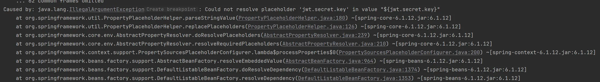
        
    
    3. `secret.key` 보안과 `applicatin.yml` 업로드에 대한 튜터님 피드백을 반영하여 `application-dev.yml` 자체를 `.gitignore`에 등록 후 intellij에서  프로필을 활성화하여 실행했습니다. 정상적으로 애플리케이션이 실행되었습니다.
    

## Lv 1. ArgumentResolver

- **해결 과정**
    
    ```java
    package org.example.expert.config;
    
    import java.util.List;
    import org.springframework.context.annotation.Configuration;
    import org.springframework.web.method.support.HandlerMethodArgumentResolver;
    import org.springframework.web.servlet.config.annotation.WebMvcConfigurer;
    
    @Configuration
    public class WebConfig implements WebMvcConfigurer {
    
        @Override
        public void addArgumentResolvers(List<HandlerMethodArgumentResolver> resolvers) {
            resolvers.add(new AuthUserArgumentResolver());
        }
    }
    ```
    
    `ArgumentResolver`만 작성이 되어 있고, 등록은 되어 있지 않아서 등록이 필요한 상황이었습니다.
    
    따라서, `WebMvcConfigurer`를 구현하는 `WebConfig`를 만들고 `addArgumentResolvers`를 통해 등록을 해주었고 문제가 해결되었습니다. `@Bean`으로 관리해야 하는 필요성이 존재하지 않아, `new` 키워드를 통해 직접 객체를 생성했습니다.
    

## Lv 2. 코드 개선

### **1. 코드 개선 퀴즈 -** Early Return

- **해결 과정**
    
    ```java
      if (userRepository.existsByEmail(signupRequest.getEmail())) {
          throw new InvalidRequestException("이미 존재하는 이메일입니다.");
      }
    
      String encodedPassword = passwordEncoder.encode(signupRequest.getPassword());
    
      UserRole userRole = UserRole.of(signupRequest.getUserRole());
    
    ```
    
    - 에러가 발생하는지 먼저 확인하고, 그 다음에 `encode()` 가 일어나도록 코드의 순서를 변경했습니다.

### **2. 리팩토링 퀴즈 - 불필요한 `if-else` 피하기**

- **해결 과정**
    
    ```java
    if (!HttpStatus.OK.equals(responseEntity.getStatusCode())) {
        throw new ServerException("날씨 데이터를 가져오는데 실패했습니다. 상태 코드: " + responseEntity.getStatusCode());
    }
    
    WeatherDto[] weatherArray = responseEntity.getBody();
    if (weatherArray == null || weatherArray.length == 0) {
        throw new ServerException("날씨 데이터가 없습니다.");
    }
    
    ```
    
    - `else` 안의 `if`문을 별도로 분리했습니다. 그리고 `responseEntity.getBody()`의 경우 첫 `if`문에서 오류가 발생하지 않아야 접근이 가능하므로 첫 번째 `if`문 다음으로 순서를 변경했습니다.

### **3. 코드 개선 퀴즈 - Validation**

- **해결 과정**
    1. `service`에 존재하는 조건을 `DTO`에 `Annotation`이용하여 `Validation`조건을 설정했습니다.
        
        ```java
        @Getter
        @NoArgsConstructor
        @AllArgsConstructor
        public class UserChangePasswordRequest {
        
            @NotBlank
            private String oldPassword;
        
            @NotBlank
            @Length(min = 8, message = "새 비밀번호는 8자 이상이어야 합니다.")
            @Pattern(regexp = "^(?=.*\\d)(?=.*[A-Z]).*$", message = "새 비밀번호는 숫자와 대문자를 포함해야 합니다.")
            private String newPassword;
        }
        
        ```
        
        2. `Cotroller`의 메소드 시그니처에서 `dto` 앞에 `@Valid`를 이용하여 1에서 설정한 조건을 적용했습니다.
        
        ```java
        @PutMapping("/users")
        public void changePassword(@Auth AuthUser authUser,
                                   @Valid @RequestBody UserChangePasswordRequest userChangePasswordRequest) {
            userService.changePassword(authUser.getId(), userChangePasswordRequest);
        }
        ```
        
        1. 기존 `changePassword`메소드 에서 `validation`관련 코드를 제거했습니다.

## Lv 3. N+1 문제

- 해결 과정
    - 기존 코드
    
    ```java
    package org.example.expert.domain.todo.repository;
    
    import org.example.expert.domain.todo.entity.Todo;
    import org.springframework.data.domain.Page;
    import org.springframework.data.domain.Pageable;
    import org.springframework.data.jpa.repository.JpaRepository;
    import org.springframework.data.jpa.repository.Query;
    import org.springframework.data.repository.query.Param;
    
    import java.util.Optional;
    
    public interface TodoRepository extends JpaRepository<Todo, Long> {
    
        @Query("SELECT t FROM Todo t LEFT JOIN FETCH t.user u ORDER BY t.modifiedAt DESC")
        Page<Todo> findAllByOrderByModifiedAtDesc(Pageable pageable);
    
        @Query("SELECT t FROM Todo t " +
                "LEFT JOIN FETCH t.user " +
                "WHERE t.id = :todoId")
        Optional<Todo> findByIdWithUser(@Param("todoId") Long todoId);
    
        int countById(Long todoId);
    }
    
    ```
    
    - 개선한 코드
    
    ```java
    package org.example.expert.domain.todo.repository;
    
    import java.util.Optional;
    import org.example.expert.domain.todo.entity.Todo;
    import org.springframework.data.domain.Page;
    import org.springframework.data.domain.Pageable;
    import org.springframework.data.jpa.repository.EntityGraph;
    import org.springframework.data.jpa.repository.JpaRepository;
    import org.springframework.data.jpa.repository.Query;
    import org.springframework.data.repository.query.Param;
    
    public interface TodoRepository extends JpaRepository<Todo, Long> {
    
        @EntityGraph(attributePaths = {"user"})
        Page<Todo> findAllByOrderByModifiedAtDesc(Pageable pageable);
    
        @EntityGraph(attributePaths = {"user"})
        @Query("select t from Todo t where t.id = :todoId")
        Optional<Todo> findByIdWithUser(@Param("todoId") Long todoId);
    }
    
    ```
    
    - `fetch join` 대신 `@EntityGraph` 어노테이션을 이용하여 n+1 문제를 해결하도록 코드를 작성했습니다.

## Lv 4. 테스트코드 연습

### **1. 테스트 코드 연습 - 1 (예상대로 성공하는지에 대한 케이스입니다.)**

- **해결 과정**
    
    ```java
    // when
    boolean matches = passwordEncoder.matches(rawPassword, encodedPassword);
    ```
    
    - 서비스의 메서드를 확인하니 테스트 코드는 인자의 순서가 잘 못 입력되어 있었습니다. `matches`의 인자로 순서를 바꿔 `rawPassword`를 첫 번째, `encodedPassword`를 두 번째 인자로 입력되도록 수정했습니다.

### **2. 테스트 코드 연습 - 2 (예상대로 예외처리 하는지에 대한 케이스입니다.)**

1. 

```java
    // when & then
    InvalidRequestException exception = assertThrows(InvalidRequestException.class,
            () -> managerService.getManagers(todoId));
    assertEquals("Todo not found", exception.getMessage());
}
```

- `exception` 발생 시 나타나는 메시지가 “`Manager not found`”로 잘못 작성되어 있어, 서비스의 메서드르리 확인 한 후 “`Todo not found`”로 수정했습니다.

2. 

```java
// when
  InvalidRequestException exception = assertThrows(InvalidRequestException.class, () -> {
      commentService.saveComment(authUser, todoId, request);
  });
```

- 서비스의 메서드와 다르게 `Exception` 클래스가 `ServerException`로 되어 있어, `InvalidRequestException`으로 수정했습니다.

3. 

```java
if (todo.getUser() == null || !ObjectUtils.nullSafeEquals(user.getId(), todo.getUser().getId())) {
    throw new InvalidRequestException("일정을 생성한 유저만 담당자를 지정할 수 있습니다.");
}
```

- `nullSafeEquals`는 둘 다 `null`인경우도 `true`로 판단합니다. 따라서, `null`자체에 대한 판단은 하지 않으므로 `todo.getUser()`가 `null`인지 판단하는 로직을 추가했습니다.

## Lv 5. API 로깅

### 1. 설계

아래와 같이 2개의 메소드의 url에 /admin이 포함되어 있었습니다.

- `CommentAdminController`의 `deleteComment()`
- `UserAdminController`의 `changeUserRole()`

저는 AOP와 Interceptor가 담당하는 역할의 차이가 존재한다고 생각했으며, 둘 다 사용하기로 결정했습니다.

1. **인가 (Authorization)**: 어드민 권한을 확인하여, 권한이 없으면 API 실행을 **사전에 차단**한다.
    - **인가 처리 → `Interceptor`**: HTTP 요청이 컨트롤러에 닿기 전에 미리 인가를 통해서  사전 차단하는 것이 적합하다고 생각했습니다.
    - 코드를 확인해보니 사실 `jwt`를 통한 **인증**을 담당하는 filter에도 인가 로직이 이미 작성되어 있기는 했습니다. 하지만, 학습을 위해 Interceptor를 사용해보기로 했습니다.
        
        ```java
        // JwtFilter.java
        
        if (url.startsWith("/admin") && !UserRole.ADMIN.equals(userRole)) {
            log.warn("권한 부족: userId={}, role={}, URI={}", claims.getSubject(), userRole, url);
            sendErrorResponse(httpResponse, HttpStatus.FORBIDDEN, "접근 권한이 없습니다.");
            return;
        }
        ```
        
2. **로깅 (Logging)**: 인가된 사용자의 API 실행 **과정을 상세히 기록**한다. (**요청/응답 본문 포함**)
    - **상세 로깅 → `AOP`**: 메서드 실행의 전후를 감싸서 활용할 수 있기 때문에 파라미터와 요청, 응답을 작성하는 것이 적절하다고 생각했습니다.

### 2.1. Interceptor 구현 (인가 처리)

먼저 어드민 권한을 확인하고 접근을 제어하는 `Interceptor`를 구현했습니다. 역할이 '**인가**'임을 명확히 하기 위해 클래스명은 `AdminAuthorizationInterceptor`로 결정했습니다.

```java
package org.example.expert.config.web;

import jakarta.servlet.http.HttpServletRequest;
import jakarta.servlet.http.HttpServletResponse;
import lombok.extern.slf4j.Slf4j;
import org.example.expert.domain.common.exception.AuthorizationException;
import org.example.expert.domain.user.enums.UserRole;
import org.springframework.web.servlet.HandlerInterceptor;

@Slf4j
public class AdminAuthorizationInterceptor implements HandlerInterceptor {

    @Override
    public boolean preHandle(HttpServletRequest request, HttpServletResponse response, Object handler)
            throws Exception {

        validateAdminRole(request);

        Long userId = (Long) request.getAttribute("userId");
        log.info("[ADMIN_API_인가] Method={}, URI={}, UserID={}",
                request.getMethod(),
                request.getRequestURI(),
                userId);

        return true;
    }

    private void validateAdminRole(HttpServletRequest request) {

        String userRoleString = request.getAttribute("userRole").toString();
        if (userRoleString == null) {
            throw new AuthorizationException("권한 정보가 없는 요청입니다.");
        }

        UserRole userRole = UserRole.of(userRoleString);
        if (!UserRole.ADMIN.equals(userRole)) {
            throw new AuthorizationException("접근 권한이 없습니다.");
        }
    }
}

```

`Interceptor`는 아래와 같이 동작합니다. 

1. `preHandle` 메서드에서 `request`를 가져옵니다.
2. `validateAdminRole()`는 필터에서 `request.setAttribute`로 저장해 둔 `userRole`을 꺼내 어드민인지 확인합니다. `null` 인 경우도 확인합니다.
3. `userRole` 속성이 없거나 `ADMIN`이 아닐 경우, `AuthorizationException`을 발생시켜 요청을 차단합니다.
4. 성공 시, 간단한 접근 성공 로그를 남기고 `true`를 반환하여 요청을 컨트롤러로 전달합니다.

따라서 별도의 `AuthorizationException`을 정의했습니다.

```java
package org.example.expert.domain.common.exception;

public class AuthorizationException extends RuntimeException {
    public AuthorizationException(String message) {
        super(message);
    }
}

```

그리고 `Interceptor` 역시 별도의 등록 과정이 필요했기 때문에, `argumentResolver`를 등록하면서 만든 `WebConfig`를 이용하여 작성했습니다. 이때 `addPathPatterns("/admin/**")`를 사용하여 `/admin/`으로 시작하는 모든 URL에 인터셉터가 적용되도록 규칙을 중앙에서 관리했습니다.

```java
package org.example.expert.config.web;

import java.util.List;
import org.springframework.context.annotation.Configuration;
import org.springframework.web.method.support.HandlerMethodArgumentResolver;
import org.springframework.web.servlet.config.annotation.InterceptorRegistry;
import org.springframework.web.servlet.config.annotation.WebMvcConfigurer;

@Configuration
public class WebConfig implements WebMvcConfigurer {

    @Override
    public void addArgumentResolvers(List<HandlerMethodArgumentResolver> resolvers) {
        resolvers.add(new AuthUserArgumentResolver());
    }

    @Override
    public void addInterceptors(InterceptorRegistry registry) {
        registry.addInterceptor(new AdminAuthorizationInterceptor())
                .addPathPatterns("/admin/**");
    }
}
```

### 2.2. AOP 구현 (상세 로깅)

다음으로, 인가를 통과한 API 요청 과정을 기록하는 로깅 기능을 AOP를 통해 구현했습니다.

먼저 필요한 의존성을 추가했습니다.

```java
implementation 'org.springframework.boot:spring-boot-starter-aop'
```

다음으로 AOP 코드를 작성했습니다.

`pointcut`을 지정할 때 `execution` 표현식은 특정 코드 경로를 입력해야 하는데, admin은이 포함된 경로는 산발적으로 존재하고 있고, 개발자 입장에서 사용할 때도 명시적으로 애노테이션을 이용하는 편이 확인하기 쉽다고 생각했습니다. 따라서, **`@AdminLog`라는 커스텀 어노테이션**을 만들어 적용 대상을 지정하는 방식을 선택했습니다.

따라서 `AdminLog`라는 어노테이션을 만들었습니다.

```java
package org.example.expert.domain.common.annotation;

import java.lang.annotation.ElementType;
import java.lang.annotation.Retention;
import java.lang.annotation.RetentionPolicy;
import java.lang.annotation.Target;

@Target(ElementType.METHOD)
@Retention(RetentionPolicy.RUNTIME)
public @interface AdminLog {
}

```

요청 본문과 응답 본문 모두를 기록해야 했기 대문에 `advice`는 `@around`를 사용했습니다.

```java
package org.example.expert.config.aop;

...

@Slf4j
@Aspect
@Component
@RequiredArgsConstructor
public class AdminApiLoggingAspect {

    private final ObjectMapper objectMapper;

    @Around("@annotation(org.example.expert.domain.common.annotation.AdminLog)")
    public Object logAdminApiExecution(ProceedingJoinPoint pjp) throws Throwable {
        String traceId = UUID.randomUUID().toString();
        HttpServletRequest request = ((ServletRequestAttributes) RequestContextHolder.currentRequestAttributes()).getRequest();

        try {
            Map<String, Object> requestMap = buildLogInfo(request, getRequestBody(pjp), traceId);
            log.info("[ADMIN_API_요청][{}] {}", traceId, serializeLogData(requestMap));

            Object result = pjp.proceed();

            Map<String, Object> responseMap = buildLogInfo(request, result, traceId);
            log.info("[ADMIN_API_응답][{}] {}", traceId, serializeLogData(responseMap));

            return result;
        } catch (Exception e) {
            log.error("[ADMIN_API_AOP_오류][{}] URL: {}, Error: {}",
                    traceId, request.getRequestURL(), e.getMessage());
            throw e;
        }
    }

    private Map<String, Object> buildLogInfo(HttpServletRequest request, Object body, String traceId) {
        Map<String, Object> map = new HashMap<>();
        map.put("timestamp", LocalDateTime.now());
        map.put("traceId", traceId);
        map.put("method", request.getMethod());
        map.put("URL", String.valueOf(request.getRequestURL()));
        map.put("userId", request.getAttribute("userId"));
        map.put("requestBody", body);

        return map;
    }

    private Object getRequestBody(ProceedingJoinPoint joinPoint) {

        MethodSignature signature = (MethodSignature) joinPoint.getSignature();
        Method method = signature.getMethod();
        Parameter[] parameters = method.getParameters();
        Object[] args = joinPoint.getArgs();
        for (int i = 0; i < parameters.length; i++) {
            Parameter parameter = parameters[i];
            if (parameter.isAnnotationPresent(RequestBody.class)) {
                return args[i];
            }
        }

        return null;
    }

    private String serializeLogData(Map<String, Object> logData) {
        try {
            return objectMapper.writeValueAsString(logData);
        } catch (JsonProcessingException e) {
            log.error("[ADMIN_API_AOP_오류]: JSON 직렬화 중 오류가 발생했습니다.", e);
            return "JSON 직렬화 중 오류가 발생했습니다.";
        }
    }
}

```

1. **파악하기 쉬운 하나의 로그** : 필드마다 로그를 남기는 경우, 요청이 동시에 조금만 함께 들어와도 어떤 필드가 어떤 API 요청의 로그인지 파악하기가 매우 어렵습니다. 따라서, 요청과 응답이라는 2개의 큰 로그로 분류하고 발생하는 모든 정보를 **하나의 구조화된 JSON 로그**로 기록하도록 `map`을 이용했고 `buildLogInfo()`를 통해 구현했습니다. 그리고 `traceId`를 `uuid`를 이용하여 요청과 응답 자체도 어떤 `API`의 요청으로 생긴 건지 검색하기 쉽도록 구성했습니다. 
    
    Json으로 만드는 과정에서는 `ObjectMapper`의 `writeValueAsString()`메소드를 사용했습니다.
    
2. 로깅 로직 내부에 `try-catch-finally` 구조를 사용하여, 로깅 실패가 실제 API 동작에 영향을 주지 않도록 개발했습니다.
3. Admin 요청에 사용되는 dto가 종류가 많아질수록, 판단해야 하는 dto를 명시적으로 모두 관리하는 것은 불편하다고 생각했습니다. 따라서, `Method.getParameters()` 와 `isAnnotationPresent()`API를 활용하여, 여러 종류의 DTO를 처리할 수 있도록 `@RequestBody`가 붙은 모든 파라미터를 동적으로 찾아내는 로직을 `getRequestBody()`에구현했습니다.
4. **데이터 추출**: `RequestContextHolder`를 통해 `HttpServletRequest`에 안전하게 접근하여 사용자 ID, URL 등의 웹 컨텍스트 정보를 추출했습니다.

이제 마지막으로, 요구사항에서 정의했던 로깅이 필요한 메서드에 `@AdminLog` 어노테이션을 붙였습니다.

```java
    @AdminLog
    @PatchMapping("/admin/users/{userId}")
    public void changeUserRole(@PathVariable long userId, @RequestBody UserRoleChangeRequest userRoleChangeRequest) {
        userAdminService.changeUserRole(userId, userRoleChangeRequest);
    }
    
    @AdminLog
    @DeleteMapping("/admin/comments/{commentId}")
    public void deleteComment(@PathVariable long commentId) {
        commentAdminService.deleteComment(commentId);
    }
```

### 3. 결과

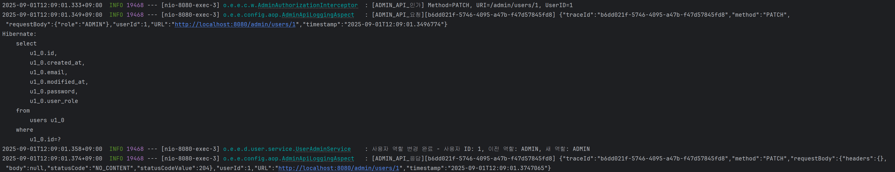

Interceptor와 AOP 개발을 통해 위처럼 로그를 확인할 수 있게 되었습니다. 새로운 어드민 API가 추가되면, 인터셉터는 URL 규칙( `/admin/**`)에 따라 자동으로 적용됩니다. 그리고 상세 로깅이 필요하면 `@AdminLog` 어노테이션 하나만 붙이면 되므로, 코드 수정이 최소화 할 수 있습니다.

## Lv 6. ‘내’가 정의한 문제와 해결 과정

### 1. Controller 메소드들의 반환 타입을 ResponseEntity로 명시적으로 통일

- **문제 인식**
    
    일부 컨트롤러의 메서드는 DTO를 직접 반환하고 있었고, 다른 메서드는 `ResponseEntity`를 사용하는 등 반환 타입이 일관되지 않았습니다. 이로 인해 HTTP 상태 코드를 일관성있게 사용하기 어렵고, 클라이언트에서 파싱하기에 불편할 것이라고 생각했습니다.
    
- **해결 과정**
    
    반환에 사용되는 `DTO`가 존재하는 경우에는 `ResponseEntity`을 제네릭으로 감싸서 반환했습니다. 그리고 204 등 반환 타입이 `void` 인 경우에도 `ResponseEntity<Void>`로 일관성있게 작성했습니다. 그리고 감싸는 과정에서 `ResponseEntity`의 정적 메서드를 사용할 수 있는 경우에는 정적 메서드를 사용했습니다. 
    
    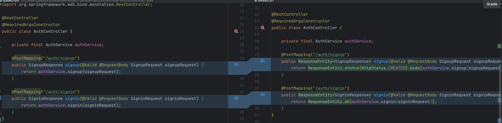
    
    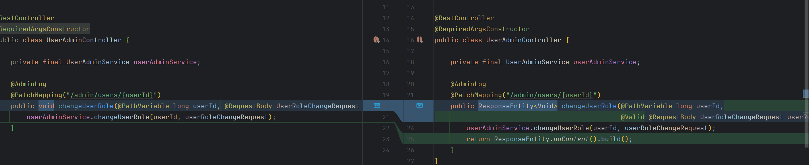
    
    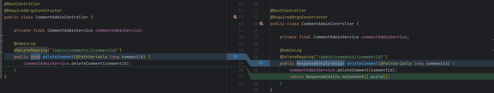
    

### 2. DTO Validation 강화

- **문제 인식**
    
    과제 요구사항에서도 `request`에 사용되는 `DTO`에 `validation`을 추가하라는 과제가 있었습니다. 다른 `request DTO`에도 추가를 하면 일관성과 안정성을 같이 확보할 수 있다고 생각했습니다. 다른 도메인은 비즈니스 요구사항이 명확하지 않다고 하더라도, 인증, 사용자와 관련된 부분은 반드시 있어야 한다고 생각했습니다.
    
- **해결 과정**
    
    그래서,  `User` 도메인의 `request DTO`에도 `validation`을 적용했습니다. `userRole` 같은 경우 다른 제약조건이 없어서, 제약조건을 추가했습니다. `Auth`도메인은 과제를 통해 이미 완성이 되어 있어서, 위반 시 발생시킬 메시지를 설정했습니다.
    
    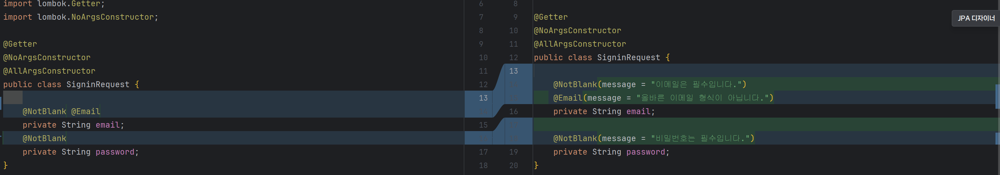
    
    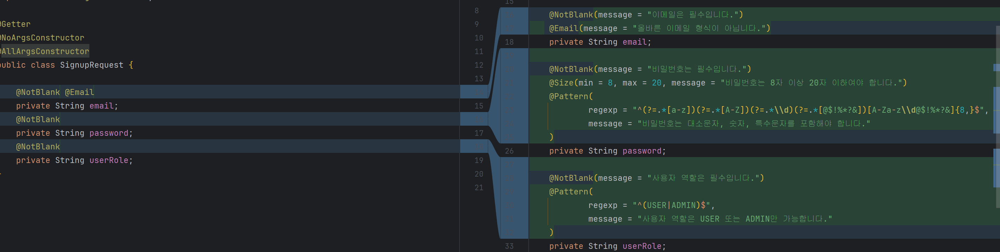
    
    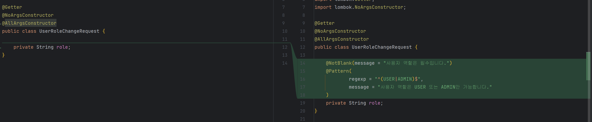
    
    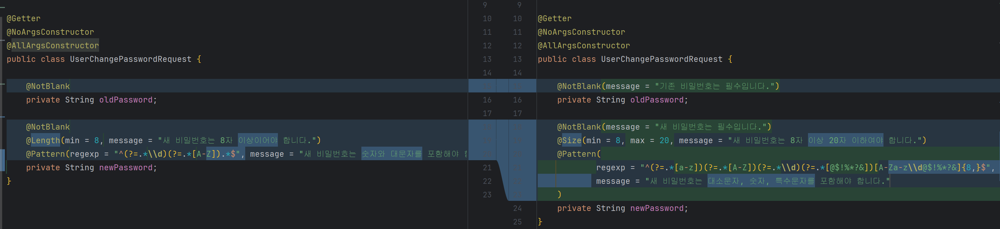
    

### 3. ManagerController의 deleteManager 메소드에서 @Auth 사용하도록 개선

- **문제 인식**
    
    담당자를 삭제하는 `deleteManager` 메서드는 삭제 권한이 있는지 확인하기 위해 인증된 사용자 정보가 필요했지만, 파라미터로 어노테이션이 존재하는 `AuthUser`를 받지 않고 있었습니다. 헤더에 직접 접근한 뒤에 `jwtutil`까지 불러와서 직접 인증 과정을 수행하고 있었습니다.
    
- **해결 과정**
    
    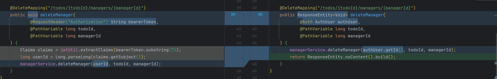
    
    `@Auth`를 이용하는 `AuthUser` 타입의 객체를 파라미터로 받아오고, 해당 객체를 활용하여 id 값을 넘겨주었습니다.
    

### 4. 비밀번호 변경 시 변경 로직 순서 개선

- **문제 인식**
    
    ```java
    @Transactional
    public void changePassword(long userId, UserChangePasswordRequest userChangePasswordRequest) {
    
        User user = userRepository.findById(userId)
                .orElseThrow(() -> new InvalidRequestException("User not found"));
    
        if (passwordEncoder.matches(userChangePasswordRequest.getNewPassword(), user.getPassword())) {
            throw new InvalidRequestException("새 비밀번호는 기존 비밀번호와 같을 수 없습니다.");
        }
    
        if (!passwordEncoder.matches(userChangePasswordRequest.getOldPassword(), user.getPassword())) {
            throw new InvalidRequestException("잘못된 비밀번호입니다.");
        }
    
        user.changePassword(passwordEncoder.encode(userChangePasswordRequest.getNewPassword()));
    }
    ```
    
    비밀번호 변경을 담당하는 changePassword는 새로운 비밀번호의 유효성을 먼저 검증한 뒤에 현재 비밀번호에 대한 검증을 하는 순서로 이루어져 있었습니다. 저는 논리적으로, 현재 비밀번호에 대한 검증이 먼저 이루어져야 한다고 생각했습니다.
    
- **해결 과정**
    
    ```java
    @Transactional
    public void changePassword(long userId, UserChangePasswordRequest userChangePasswordRequest) {
    
        User user = userRepository.findById(userId)
                .orElseThrow(() -> new InvalidRequestException("사용자를 찾을 수 없습니다."));
    
        // 기존 비밀번호 확인 로직 추가
        if (!passwordEncoder.matches(userChangePasswordRequest.getOldPassword(), user.getPassword())) {
            log.warn("비밀번호 변경 실패 - 잘못된 기존 비밀번호, 사용자 ID: {}", userId);
            throw new InvalidRequestException("잘못된 비밀번호입니다.");
        }
    
        // 새 비밀번호가 기존 비밀번호와 같은지 확인
        if (passwordEncoder.matches(userChangePasswordRequest.getNewPassword(), user.getPassword())) {
            throw new InvalidRequestException("새 비밀번호는 기존 비밀번호와 같을 수 없습니다.");
        }
    
        user.changePassword(passwordEncoder.encode(userChangePasswordRequest.getNewPassword()));
        log.info("비밀번호 변경 완료 - 사용자 ID: {}", userId);
    }
    ```
    
    사용자 존재 여부는 제일 처음에 하는 것이 맞다고 생각해서 그대로 놔두었습니다. 순서를 바꿔서, 기존 비밀번호에 대한 검증을 먼저 하고 나서 새로운 비밀번호에 대한 검증 로직이 이루어지도록 했습니다. 그리고 비밀번호 변경에 대한 로깅도 추가했습니다.
    

### 5. deleteComent method에서 comment 존재 여부에 대한 확인 로직 추가

- **문제 인식**
    
    ```java
    @Transactional
    public void deleteComment(long commentId) {
        commentRepository.deleteById(commentId);
    }
    ```
    
    `deleteComment`가 전달받은 `commentId`를 이용하여 별다른 존재 여부 확인 없이, 바로 Spring data JPA가 제공하는 엔티티 삭제 메서드를 바로 수행하고 있었습니다. 댓글이 존재하지 않을 경우에 대한 명확한 예외 처리가 필요하다고 생각했습니다.
    
- **해결 과정**
    
    ```java
    @Transactional
    public void deleteComment(long commentId) {
        Comment savedComment = commentRepository.findById(commentId)
                .orElseThrow(() -> new InvalidRequestException("Comment not found"));
    
        commentRepository.delete(savedComment);
    }
    ```
    
    `commentRepository.findById(commentId).orElseThrow(...)`를 추가하여, 댓글이 존재하지 않을 경우 예외가 발생하도록 수정했습니다. 그리고 존재하는 경우 `findById()`를 통해 받아온 객체를 이용하여 `delete` 메소드를 작성했습니다.
    

## Lv 7. 테스트 커버리지

기본적으로 도메인 특히, `Auth`와 `User`도메인 위주로 테스트 코드를 작성했습니다. 먼저 `Service`레이어에 대해 테스트 코드를 작성했습니다. 그리고 `Controller`레이어에 대한 테스트 코드를 작성했습니다. E2E 보다는 컨트롤러 레이어에 대한 테스트를 구성했습니다.

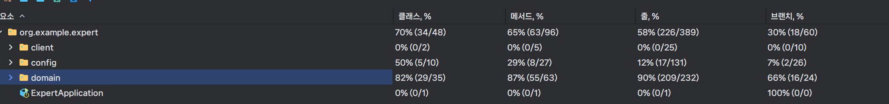

이렇게 하니 라인 커버리지 **58%**를 달성했습니다. `config`관련 파일들이 많았는데 `config`에 대한 테스트 코드를 작성하지 못한 것이 아쉬운 것 같습니다.

# 2. 느낀점 및 다음 계획

항상 어려워하고, 미루기 바빴던 테스트 코드 작성에 대해 조금이라도 연습할 수 있어서 좋았습니다. 다만, 테스트 구현에도 시간이 꽤 소모되기도 하고, 구현 로직이 아예 변경되는 경우 테스트 코드도 수정이 필요합니다. 따라서 효율적으로 필요한 테스트 코드를 작성하기 위해서는 어느 정도 경험이 쌓여야할 것 같습니다.

그리고 filter와 interceptor, aop 까지 모두 사용해볼 수도 있어서 좋았습니다. 구현해야하는 기능에 맞게 적절하게 선택할 수 있도록 노력해야겠습니다.

Level 6과 Level 7인 경우 좀 더 코드를 전체적으로 연구했더라면, 많은 것을 할 수 있었을텐데 개인적으로 이번 주에 다른 학습을 병행하느라 과제만 몰입하지는 못 해서 조금 아쉬움이 남습니다.

특히 AOP의 경우 프록시로 인해 생기는 문제들도 있는 것으로 알고 있습니다. 그 부분에 대한 학습이 조금 더 필요할 것 같습니다.