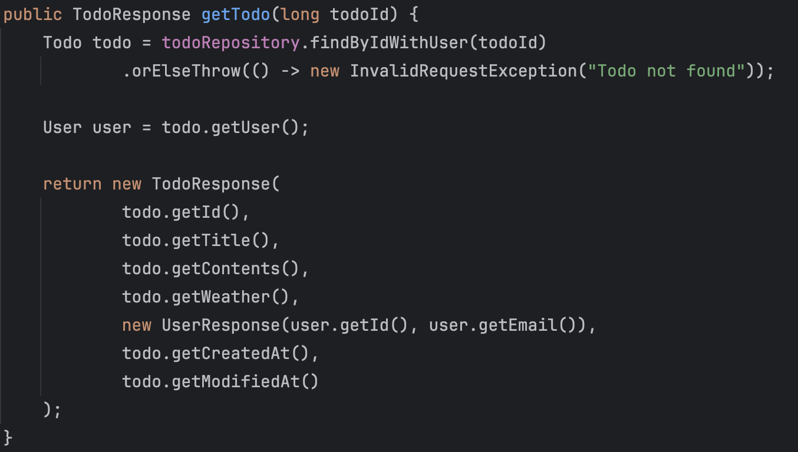
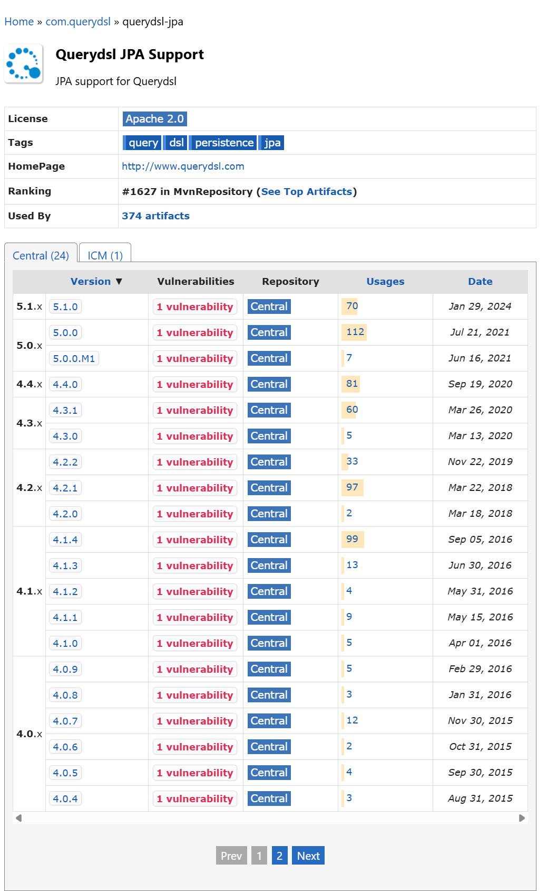
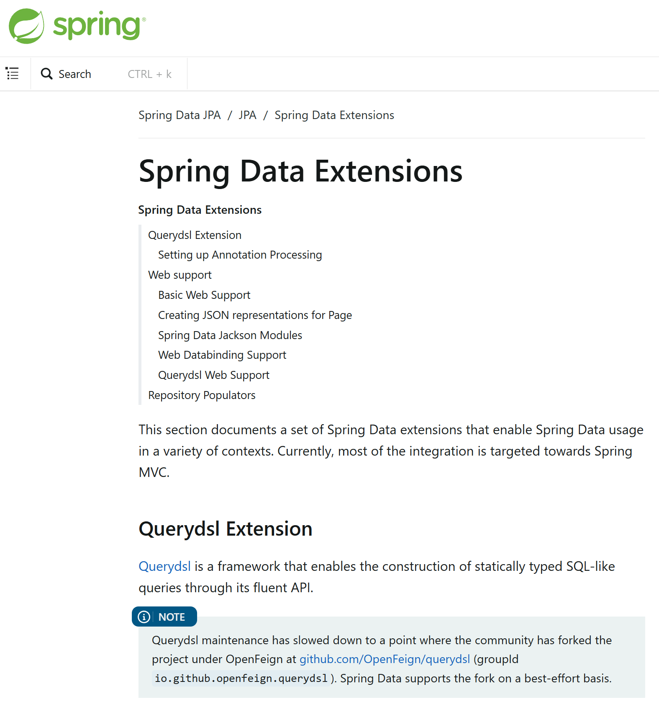
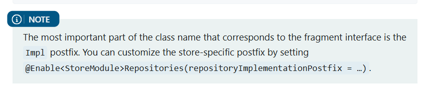
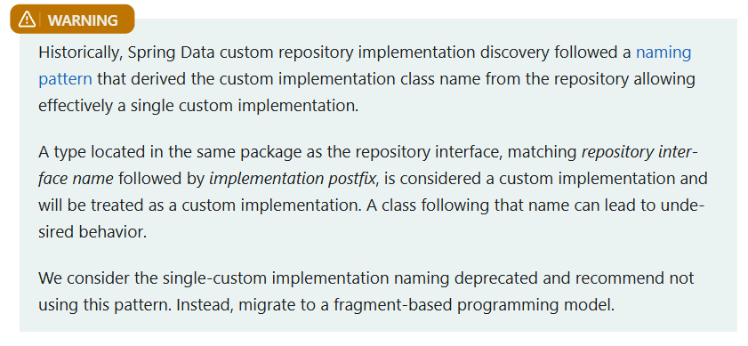

<!-- TOC -->

- [1. 과제 해결](#1-과제-해결)
  - [1. **코드 개선 퀴즈 - @Transactional의 이해**](#1-코드-개선-퀴즈---transactional의-이해)
  - [2. **코드 추가 퀴즈 - JWT의 이해**](#2-코드-추가-퀴즈---jwt의-이해)
  - [3. **코드 개선 퀴즈 -  JPA의 이해**](#3-코드-개선-퀴즈----jpa의-이해)
  - [4. **테스트 코드 퀴즈 - 컨트롤러 테스트의 이해**](#4-테스트-코드-퀴즈---컨트롤러-테스트의-이해)
  - [5. **코드 개선 퀴즈 - AOP의 이해**](#5-코드-개선-퀴즈---aop의-이해)
  - [6. **JPA Cascade**](#6-jpa-cascade)
  - [7. **N+1**](#7-n1)
  - [8. **Querydsl**](#8-querydsl)
  - [9. **Spring Security**](#9-spring-security)

<!-- /TOC -->

이번 과제는 JPA 심화라는 주제로, 동적 쿼리와 성능 최적화 그리고 배포와 대용량 처리까지 접근해볼 수 있는 과제였습니다. 도전 기능으로 갈수록 내용이 조금 많아져서, 필수 기능과 도전 기능을 분리하여 작성하겠습니다.
도전 기능에 대한 회고는 [여기](https://seonrizee.github.io/blog/2025-09-24-ch5-plus-challenge/)에 있습니다.

# 1. 과제 해결

## 1. **코드 개선 퀴즈 - @Transactional의 이해**

- 해결 과정
    
    클래스에 `@Transactional(readOnly = true)`이 존재하고 있습니다. 따라서, 읽기 전용이 아닌 `@Transactional`을 `saveTodo()` 에 적용했습니다.
    
    ```java
    package org.example.expert.domain.todo.service;
    
    ...
    
    // AS-IS
    
    @Service
    @RequiredArgsConstructor
    @Transactional(readOnly = true)
    public class TodoService {
    
        private final TodoRepository todoRepository;
        private final WeatherClient weatherClient;
    
        public TodoSaveResponse saveTodo(AuthUser authUser, TodoSaveRequest todoSaveRequest) {
            User user = User.fromAuthUser(authUser);
            
        ...
            
    // TO-BE
    
    @Service
    @RequiredArgsConstructor
    @Transactional(readOnly = true)
    public class TodoService {
    
        private final TodoRepository todoRepository;
        private final WeatherClient weatherClient;
    
        @Transactional
        public TodoSaveResponse saveTodo(AuthUser authUser, TodoSaveRequest todoSaveRequest) {
            User user = User.fromAuthUser(authUser);
        
        ...
    ```
    

## 2. **코드 추가 퀴즈 - JWT의 이해**

- 해결 과정
    
    ```java
    package org.example.expert.domain.user.entity;
    
    ...
    
    @Getter
    @Entity
    @NoArgsConstructor
    @Table(name = "users")
    public class User extends Timestamped {
    
        @Id
        @GeneratedValue(strategy = GenerationType.IDENTITY)
        private Long id;
        @Column(unique = true)
        private String email;
        private String password;
        @Enumerated(EnumType.STRING)
        private UserRole userRole;
    
        private String nickname;
        
    	  public User(String email, String password, UserRole userRole, String nickname) {
    	      this.email = email;
    	      this.password = password;
    	      this.userRole = userRole;
    	      this.nickname = nickname;
    	  }
    	  
        public static User fromAuthUser(AuthUser authUser) {
            return new User(authUser.id(), authUser.email(), authUser.userRole(), authUser.nickname());
        }
        
        ...
        
        
    ```
    
    `nickname` 이란 필드를 `User`Entity 에 추가하고, 관련 `DTO`와 생성자들에 추가했습니다.
    
    ```java
    package org.example.expert.domain.auth.dto.request;
    
    ...
    
    @Getter
    @NoArgsConstructor
    @AllArgsConstructor
    public class SignupRequest {
    
        @NotBlank
        @Email
        private String email;
        @NotBlank
        private String password;
        @NotBlank
        private String userRole;
        @NotBlank
        private String nickname;
    }
    
    ```
    
    `nickname`을 `JWT createToken`의 클레임으로 추가하여 클라이언트에서 `JWT`를 통해 `nickname`에 접근하도록 합니다.
    
    ```java
    package org.example.expert.config;
    
    ...
    
    	 public String createToken(Long userId, String email, UserRole userRole, String nickname) {
    	      Date date = new Date();
    	
    	      return BEARER_PREFIX +
    	              Jwts.builder()
    	                      .setSubject(String.valueOf(userId))
    	                      .claim("email", email)
    	                      .claim("userRole", userRole)
    	                      .claim("nickname", nickname)
    	                      .setExpiration(new Date(date.getTime() + TOKEN_TIME))
    	                      .setIssuedAt(date) // 발급일
    	                      .signWith(key, signatureAlgorithm) // 암호화 알고리즘
    	                      .compact();
    	  }
    ```
    
    `AuthUserArgumentResolver`에서도 `AuthUser`를 만들 때 `nickname`도 추가해줍니다. 이렇게 하여 정의한 어노테이션을 통해 유저 정보를 불러올 때 `nickname`을 사용할 수 있게 해줍니다.
    
    ```java
    package org.example.expert.config;
    
    ...
    
        public Object resolveArgument(
                @Nullable MethodParameter parameter,
                @Nullable ModelAndViewContainer mavContainer,
                NativeWebRequest webRequest,
                @Nullable WebDataBinderFactory binderFactory
        ) {
            HttpServletRequest request = (HttpServletRequest) webRequest.getNativeRequest();
    
            // JwtFilter 에서 set 한 userId, email, userRole 값을 가져옴
            Long userId = (Long) request.getAttribute("userId");
            String email = (String) request.getAttribute("email");
            UserRole userRole = UserRole.of((String) request.getAttribute("userRole"));
            String nickname = (String) request.getAttribute("nickname");
    
            return new AuthUser(userId, email, userRole, nickname);
        }
    }
    
    ```
    
    이를 위해, 아래처럼 `AuthUser`클래스에도 `nickname`을 추가해줍니다. 이 과정에서 `AuthUser`의 타입을 `record`로 변경했습니다.
    
    ```java
    package org.example.expert.domain.common.dto;
    
    import org.example.expert.domain.user.enums.UserRole;
    
    public record AuthUser(Long id, String email, UserRole userRole, String nickname) {
    
    }
    
    ```
    
    이렇게 하면 클라이언트에서 JWT를 통해 `nickname`값에 대해 접근할 수 있습니다.
    

## 3. **코드 개선 퀴즈 -  JPA의 이해**

- 해결 과정
    
    `TodoController` 에 날씨 및 날짜 필터링 파라미터를 추가합니다.
    
    ```java
    package org.example.expert.domain.todo.controller;
    
    ...
    
        @GetMapping("/todos")
        public ResponseEntity<Page<TodoResponse>> getTodos(
                @RequestParam(defaultValue = "1") int page,
                @RequestParam(defaultValue = "10") int size,
                @RequestParam(required = false) String weather,
                @RequestParam(required = false) @DateTimeFormat(iso = ISO.DATE) LocalDate startDate,
                @RequestParam(required = false) @DateTimeFormat(iso = ISO.DATE) LocalDate endDate
        ) {
            return ResponseEntity.ok(todoService.getTodos(page, size, weather, startDate, endDate));
        }
        
        ...
    ```
    
    `TodoService`에서 호출하는 메소드의 인자를 수정합니다.
    
    ```java
    package org.example.expert.domain.todo.service;
    
    ...
    
      public Page<TodoResponse> getTodos(int page, int size, String weather, LocalDate startDate, LocalDate endDate) {
            Pageable pageable = PageRequest.of(page - 1, size);
    
            Page<Todo> todos = todoRepository.findAllWithConditions(weather, startDate, endDate, pageable);
    
            return todos.map(todo -> new TodoResponse(
                    todo.getId(),
                    todo.getTitle(),
                    todo.getContents(),
                    todo.getWeather(),
                    new UserResponse(todo.getUser().getId(), todo.getUser().getEmail()),
                    todo.getCreatedAt(),
                    todo.getModifiedAt()
            ));
        }
        
        ...
    ```
    
    `TodoRepository`에 문제의 요구사항대로 JPQL을 활용하여 날씨와 날짜 필터링 기능에 대한 메소드를 추가합니다. 
    
    ```java
    package org.example.expert.domain.todo.repository;
    
    ...
    
    public interface TodoRepository extends JpaRepository<Todo, Long> {
    
    		...
    
        @Query("""
                        SELECT t FROM Todo t
                        LEFT JOIN FETCH t.user u
                        WHERE (:weather IS NULL OR LOWER(t.weather) LIKE LOWER(CONCAT('%', :weather, '%')))
                        AND (:startDate IS NULL OR t.modifiedAt >= :startDate)
                        AND (:endDate IS NULL OR t.modifiedAt <= :endDate)
                        ORDER BY t.modifiedAt DESC
                """)
        Page<Todo> findAllWithConditions(String weather, LocalDate startDate, LocalDate endDate, Pageable pageable);
    }
    
    ```
    

## 4. **테스트 코드 퀴즈 - 컨트롤러 테스트의 이해**

- 해결 과정
    
    아래 코드와 같이 200 OK에 관한 부분을 `Bad Request`로 변경해줍니다.
    
    ```java
    package org.example.expert.domain.todo.controller;
    
    ...
    // AS-IS
    
        @Test
        void todo_단건_조회_시_todo가_존재하지_않아_예외가_발생한다() throws Exception {
            // given
            long todoId = 1L;
    
            // when
            when(todoService.getTodo(todoId))
                    .thenThrow(new InvalidRequestException("Todo not found"));
    
            // then
            mockMvc.perform(get("/todos/{todoId}", todoId))
                    .andExpect(status().isOk())
                    .andExpect(jsonPath("$.status").value(HttpStatus.OK.name()))
                    .andExpect(jsonPath("$.code").value(HttpStatus.OK.value()))
                    .andExpect(jsonPath("$.message").value("Todo not found"));
        }
        
        
    // TO-BE
    
        @Test
        void todo_단건_조회_시_todo가_존재하지_않아_예외가_발생한다() throws Exception {
            // given
            long todoId = 1L;
    
            // when
            when(todoService.getTodo(todoId))
                    .thenThrow(new InvalidRequestException("Todo not found"));
    
            // then
            mockMvc.perform(get("/todos/{todoId}", todoId))
                    .andExpect(status().isBadRequest())
                    .andExpect(jsonPath("$.status").value(HttpStatus.BAD_REQUEST.name()))
                    .andExpect(jsonPath("$.code").value(HttpStatus.BAD_REQUEST.value()))
                    .andExpect(jsonPath("$.message").value("Todo not found"));
        }
    ```
    

## 5. **코드 개선 퀴즈 - AOP의 이해**

- 해결 과정
    
    AOP 적용이 필요한 클래스와 메소드를 명확하게 입력하고, `@Before` 로 변경합니다.
    
    ```java
    package org.example.expert.aop;
    
    ...
    
    // AS-IS
    
        @After("execution(* org.example.expert.domain.user.controller.UserController.getUser(..))")
        public void logAfterChangeUserRole(JoinPoint joinPoint) {
            String userId = String.valueOf(request.getAttribute("userId"));
            String requestUrl = request.getRequestURI();
            LocalDateTime requestTime = LocalDateTime.now();
    
            log.info("Admin Access Log - User ID: {}, Request Time: {}, Request URL: {}, Method: {}",
                    userId, requestTime, requestUrl, joinPoint.getSignature().getName());
        }
    }
    
    // TO-BE
    
        @Before("execution(* org.example.expert.domain.user.controller.UserAdminController.changeUserRole(..))")
        public void logBeforeChangeUserRole(JoinPoint joinPoint) {
            String userId = String.valueOf(request.getAttribute("userId"));
            String requestUrl = request.getRequestURI();
            LocalDateTime requestTime = LocalDateTime.now();
    
            log.info("Admin Access Log - User ID: {}, Request Time: {}, Request URL: {}, Method: {}",
                    userId, requestTime, requestUrl, joinPoint.getSignature().getName());
        }
    
    ```
    

## 6. **JPA Cascade**

- 해결 과정
    
    `cascade.persist` 를 이용하여 담당자로 todo를 생성한 유저를 같이 자동 지정되도록 합니다. 지금은 요구사항에서 유저를 같이 자동 지정되도록 저장만 필요한 상황이기 때문에 `persist`를 사용했습니다.
    
    ```java
    package org.example.expert.domain.todo.entity;
    
    ...
    
    // AS-IS
    
        @OneToMany(mappedBy = "todo", cascade = CascadeType.REMOVE)
        private List<Comment> comments = new ArrayList<>();
    
        @OneToMany(mappedBy = "todo")
        private List<Manager> managers = new ArrayList<>();
        
    ...
    
    // TO-BE
    
        @OneToMany(mappedBy = "todo", cascade = CascadeType.REMOVE)
        private final List<Comment> comments = new ArrayList<>();
    
        @OneToMany(mappedBy = "todo", cascade = CascadeType.PERSIST)
        private final List<Manager> managers = new ArrayList<>();
    ```
    

## 7. **N+1**

- 해결 과정
    
    fetch join을 이용하여 N+1을 해결합니다.
    
    ```java
    package org.example.expert.domain.comment.repository;
    
    ...
    
    // AS-IS
    
    public interface CommentRepository extends JpaRepository<Comment, Long> {
    
        @Query("SELECT c FROM Comment c JOIN c.user WHERE c.todo.id = :todoId")
        List<Comment> findByTodoIdWithUser(@Param("todoId") Long todoId);
    }
    
    // TO-BE
    
    public interface CommentRepository extends JpaRepository<Comment, Long> {
    
        @Query("SELECT c FROM Comment c JOIN FETCH c.user WHERE c.todo.id = :todoId")
        List<Comment> findByTodoIdWithUser(@Param("todoId") Long todoId);
    }
    
    ```
    

## 8. **Querydsl**

- 문제
    
    
    
    TodoService.getTodo 메소드
    
    - JPQL로 작성된 `findByIdWithUser` 를 QueryDSL로 변경합니다.
    - 7번과 마찬가지로 N+1 문제가 발생하지 않도록 유의해 주세요!
    
- 해결 과정
    
    ### **1. Querydsl 의 상황과 대안**
    
    Querydsl을 사용하기 위해서는 별도의 의존성을 추가해야 합니다. 그런데 [Querydsl](https://github.com/querydsl/querydsl)은 2024년 1월 30일에 5.1.0 버전 release 이후로 **업데이트가 되지 않고 있습니다.** 사실 5.1.0 버전 이전에도 3년 가량 관리가 되지 않고 있었습니다. 지속적인 업데이트가 되지 않는 것 자체도 잠재적인 문제를 일으킬 수 있지만, 2024년에 **SQL Injection 관련 보안 취약점이 발견**된 것이 더 큰 문제였습니다.
    
    https://nvd.nist.gov/vuln/detail/CVE-2024-49203
    
    [https://github.com/advisories/GHSA-6q3q-6v5j-h6vg](https://github.com/advisories/GHSA-6q3q-6v5j-h6vg)
    
    
    
    그러던 중에 **OpenFeign**이 **Querydsl**을 포크해서 유지보수를 하기 시작했고, 6.10.1 버전에서 보안 취약점을 해결했습니다. 그리고 **2025년 6월 10일**에도 7.0 버전을 release한 것으로 보아 어느 정도 유지보수가 되고 있는 것으로 보입니다. 
    
    
    
    그리고 Spring 공식 문서에서도 확인할 수 있는데, **2025년 5월부터 Spring Data에서 OpenFeign의 querydsl을 지원**하기로 명시하고 있습니다. 따라서, 다른 도구로 바로 전환하기 어려운 상황이나 querydsl을 반드시 사용해야 하는 상황에서는 OpenFeign의 querydsl을 대안으로 사용해야 합니다.
    
    ### **2. Querydsl 의존성 추가**
    
    ```java
     // build.gradle
     
     ...
     
        // querydsl (jakarta.annotation-api와 persistence-api는 querydsl-jpa에 포함되어 있음)
        implementation 'io.github.openfeign.querydsl:querydsl-jpa:7.0'
        annotationProcessor 'io.github.openfeign.querydsl:querydsl-apt:7.0:jpa'
        
    ...
    
    ```
    
    Querydsl은 애노테이션 프로세서(Annotation Processor)를 사용하여 아래와 같이 동작합니다.
    
    1. **Q-타입 생성**: 우리가 `@Entity` 어노테이션을 붙여 엔티티 클래스(예: `Todo.java`)를 만들면, 애노테이션 프로세서가 컴파일 시점에 이를 감지하여 해당 엔티티에 대한 쿼리용 클래스, 즉 **Q-타입**(예: `QTodo.java`) 소스 코드를 **자동으로 생성**합니다.
    2. **생성된 코드 컴파일**: 이렇게 자동으로 생성된 `QTodo.java` 파일도 우리 프로젝트의 일부이므로, 다른 코드들과 함께 컴파일되어야 합니다.
    
    Gradle은 `annotationProcessor` 'io.github.openfeign.querydsl:querydsl-apt:7.0:jpa'를 감지하고, 생성된 Q-타입 파일을 관례에 따라 `build/generated/sources/annotationProcessor/java/main` 에 저장합니다. 
    
    혹시 별도로 생성할 경로를 지정한 경우에는 clean 태스크는 build 폴더만 삭제하기 때문에, 만약 엔티티가 바뀌어서 Q-타입도 새로 만들어야 하는 경우에는 수동으로 삭제를 해주거나 삭제를 하는 스크립트를 작성해야 합니다.
    
    ### 3. QueryFactory 사용을 위한 Config 추가
    
    ```java
    package org.example.expert.config;
    
    import com.querydsl.jpa.impl.JPAQueryFactory;
    import jakarta.persistence.EntityManager;
    import jakarta.persistence.PersistenceContext;
    import org.springframework.context.annotation.Bean;
    import org.springframework.context.annotation.Configuration;
    
    @Configuration
    public class QueryDslConfig {
    
        @PersistenceContext
        private EntityManager em;
    
        @Bean
        public JPAQueryFactory queryFactory() {
            return new JPAQueryFactory(em);
        }
    }
    
    ```
    
    Spring Data JPA에서는 `QuerydslPredicateExecutor`, `QuerydslRepositorySupport` 등의 방법으로 QueryDSL을 지원하고 있습니다. 하지만, `JPAqueryFactory`를 Bean으로 등록하고 필요한 곳에서 주입 받아서 사용하면 거의 모든 기능을 동일하게 그리고 더 편하게 사용할 수 있습니다.
    
    ### 4. Custom Resository Interface 구현
    
    `QueryDSL`을 사용하는 방법은 여러가지가 있는데, 간편하게 Query를 위한 전용 `Repository`를 만드는 방법이 있습니다. 이 경우 구현은 간편하지만 `Service`에서 여러 `Repository`를 주입해야 하는 번거로움이 생깁니다. 
    
    Spring Data Jpa의 공식 문서에는 fragment interface repository를 만들고, `repository`를 조합하여 사용하는 방법을 권장하고 있습니다. 
    
    | 항목 | 커스텀 인터페이스 방식 | Query 전용 리포지토리 방식 |
    | --- | --- | --- |
    | 구조 | 인터페이스 + 구현체 (상속 구조) | 단일 클래스 (독립 구조) |
    | 서비스 계층 | Base Repository 하나만 주입 | Repository와 QueryRepository 각각 주입 |
    | 장점 | 일관된 접근 방식 | 단순함, 보일러플레이트 없음 |
    | 단점 | 다소 복잡한 구조 | 의존성이 나뉨 |
    
    base respository를 두고, custom interfaces 를 정의한 뒤에 base repository 에서 다양한 custom interfaces를 `extends`하여 조합하여 사용합니다. 선언 순서를 통해 동일한 메서드에 대해서도 우선순위를 정할 수도 있습니다.
    
    
    
    그리고 각 custom interfaces의 구현체를 구현하면 됩니다. 이 때 구현체의 이름은 인터페이스 뒤에 Impl 을 붙이도록 되어 있으며, 원하지 않는 경우 별도로 지정해야 합니다.
    
    
    
    또한 이전에는 Base Respository의 이름의 뒤에 `Impl` 을 붙여서 단일 구현체를 사용하기도 했으나, 지금은 프래그먼트 기반으로 각 custom interface마다 `Impl`이 붙은 구현체를 구현하는 것을 권장하고 있습니다.
    
    따라서 저는 `TodoRepositoryCustom`이라는 custom interface을 먼저 정의했습니다.
    
    ```java
    package org.example.expert.domain.todo.repository;
    
    import java.util.Optional;
    import org.example.expert.domain.todo.entity.Todo;
    
    public interface TodoRepositoryCustom {
    
        Optional<Todo> findByIdWithUser(Long todoId);
    }
    
    ```
    
    그리고 `TodoRepositoryCustomImpl`로 정의한 `interface`를 구현했습니다. 문제에서 `JPQL`로 작성된 `TodoRepository`의 `findByIdWithUser` 메소드를 `QueryDSL`로 전환하라고 했으므로, 해당 `JPQL`을 참조하여 동일한 기능을 하면서 fetch join을 통해 n+1을 해결하도록 작성했습니다. 
    
    이 때, 앞의 `config`에서 정의한 `JPAQueryFacotry`를 주입 받아 사용합니다.
    
    ```java
    package org.example.expert.domain.todo.repository;
    
    import com.querydsl.jpa.impl.JPAQueryFactory;
    import java.util.Optional;
    import lombok.RequiredArgsConstructor;
    import org.example.expert.domain.todo.entity.QTodo;
    import org.example.expert.domain.todo.entity.Todo;
    
    @RequiredArgsConstructor
    public class TodoRepositoryCustomImpl implements TodoRepositoryCustom {
    
        private final JPAQueryFactory queryFactory;
    
        @Override
        public Optional<Todo> findByIdWithUser(Long todoId) {
            return Optional.ofNullable(queryFactory.selectFrom(QTodo.todo)
                    .leftJoin(QTodo.todo.user).fetchJoin()
                    .where(QTodo.todo.id.eq(todoId))
                    .fetchOne());
        }
    }
    
    ```
    
    마지막으로 BaseRepository인 `TodoRepository`에서 기존의 쿼리 메소드를 삭제하고, 직접 만든 프래그먼트 인터페이스를 extends 해줍니다.
    
    ```java
    package org.example.expert.domain.todo.repository;
    
    ...
    
    // AS-IS
    
    public interface TodoRepository extends JpaRepository<Todo, Long> {
    
        @Query("SELECT t FROM Todo t " +
                "LEFT JOIN t.user " +
                "WHERE t.id = :todoId")
        Optional<Todo> findByIdWithUser(@Param("todoId") Long todoId);
    
        @Query("""
                        SELECT t FROM Todo t
                        LEFT JOIN FETCH t.user u
                        WHERE (:weather IS NULL OR LOWER(t.weather) LIKE LOWER(CONCAT('%', :weather, '%')))
                        AND (:startDate IS NULL OR t.modifiedAt >= :startDate)
                        AND (:endDate IS NULL OR t.modifiedAt <= :endDate)
                        ORDER BY t.modifiedAt DESC
                """)
        Page<Todo> findAllWithConditions(String weather, LocalDate startDate, LocalDate endDate, Pageable pageable);
    }
    
    // TO-BE
    
    ...
    
    public interface TodoRepository extends JpaRepository<Todo, Long>, TodoRepositoryCustom {
    
        @Query("""
                        SELECT t FROM Todo t
                        LEFT JOIN FETCH t.user u
                        WHERE (:weather IS NULL OR LOWER(t.weather) LIKE LOWER(CONCAT('%', :weather, '%')))
                        AND (:startDate IS NULL OR t.modifiedAt >= :startDate)
                        AND (:endDate IS NULL OR t.modifiedAt <= :endDate)
                        ORDER BY t.modifiedAt DESC
                """)
        Page<Todo> findAllWithConditions(String weather, LocalDate startDate, LocalDate endDate, Pageable pageable);
    }
    
    ```
    
    이렇게 JPQL을 `queryDSL`로 전환을 하면, Q-타입을 이용한 타입 안정성과 컴파일 시점 오류 검출 그리고 IDE 지원까지 여러 가지 장점을 얻을 수 있다고 생각했습니다. 물론 동적 쿼리 자체를 작성하는 것도 조금 더 편리하다고 생각합니다.
    

## 9. **Spring Security**

- 해결 과정
    
    ### 1. 의존성 추가
    
    ```java
    build.gradle
    
    ...
    
    dependencies {
    
    		...
    		
        implementation 'org.springframework.boot:spring-boot-starter-security'
        testImplementation 'org.springframework.security:spring-security-test'
    
    		...
    ```
    
    ### 2. JwtFilter
    
    기본적으로 `JwtFilter`를 통해 사용자에 대한 인증을 하고, 필터 체인이 존재하는 `SecurityConfig`를 통해 인가를 하도록 구성합니다. 기존에 존재하는 `ArgumentResolver`의 로직을 `Spring Security` 에서 제공하는 `Authentication` 으로 대체합니다. 
    
    ```java
    package org.example.expert.config;
    
    ...
    
    @Slf4j
    @RequiredArgsConstructor
    @Component
    public class JwtFilter extends OncePerRequestFilter {
    
        private final JwtUtil jwtUtil;
        private final ObjectMapper objectMapper;
    
        @Override
        protected void doFilterInternal(HttpServletRequest httpRequest,
                                        @NonNull HttpServletResponse httpResponse,
                                        @NonNull FilterChain chain) throws ServletException, IOException {
    
            String authorizationHeader = httpRequest.getHeader("Authorization");
    
            // 토큰이 없는 요청도 있을 수 있으므로, 토큰이 없으면 일단 다음 필터로 넘김
            if (authorizationHeader == null) {
                chain.doFilter(httpRequest, httpResponse);
                return;
            }
    
            if (!authorizationHeader.startsWith("Bearer ")) {
                log.warn("잘못된 형식의 Authorization 헤더: {}", authorizationHeader);
                sendErrorResponse(httpResponse, HttpStatus.BAD_REQUEST, "잘못된 형식의 Authorization 헤더입니다.");
                return;
            }
    
            String jwt = jwtUtil.substringToken(authorizationHeader);
    
            if (!processAuthentication(jwt, httpRequest, httpResponse)) {
                return;
            }
    
            chain.doFilter(httpRequest, httpResponse);
        }
    
        private boolean processAuthentication(String jwt, HttpServletRequest httpRequest,
                                              HttpServletResponse httpResponse) throws IOException {
            try {
                Claims claims = jwtUtil.extractClaims(jwt);
    
                if (claims == null) {
                    sendErrorResponse(httpResponse, HttpStatus.BAD_REQUEST, "잘못된 JWT 토큰입니다.");
                    return false; // 검증 실패
                }
    
                // SecurityContext에 인증 정보가 없으면 설정 (이미 인증된 경우 중복 설정 방지)
                if (SecurityContextHolder.getContext().getAuthentication() == null) {
                    setAuthentication(claims);
                }
    
                return true; // 검증 성공
            } catch (ExpiredJwtException e) {
                log.info("JWT 만료: userId={}, URI={}", e.getClaims().getSubject(), httpRequest.getRequestURI());
                sendErrorResponse(httpResponse, HttpStatus.UNAUTHORIZED, "만료된 JWT 토큰입니다.");
            } catch (SecurityException | MalformedJwtException | UnsupportedJwtException e) {
                log.error("JWT 검증 실패 [{}]: URI={}", e.getClass().getSimpleName(), httpRequest.getRequestURI(), e);
                sendErrorResponse(httpResponse, HttpStatus.UNAUTHORIZED, "유효하지 않는 JWT 서명입니다.");
            } catch (Exception e) {
                log.error("예상치 못한 오류: URI={}", httpRequest.getRequestURI(), e);
                sendErrorResponse(httpResponse, HttpStatus.INTERNAL_SERVER_ERROR, "서버에서 오류가 발생했습니다.");
            }
            return false; // 검증 실패
        }
    
        // JWT Claims에서 사용자 정보를 추출하여 Spring Security의 인증 정보 설정
        private void setAuthentication(Claims claims) {
    
            Long userId = Long.valueOf(claims.getSubject());
            String email = claims.get("email", String.class);
            UserRole userRole = UserRole.of(claims.get("userRole", String.class));
            String nickname = claims.get("nickname", String.class);
    
            AuthUser authUser = new AuthUser(userId, email, userRole, nickname);
            Authentication authenticationToken = new JwtAuthenticationToken(authUser);
            SecurityContextHolder.getContext().setAuthentication(authenticationToken);
        }
    
        private void sendErrorResponse(HttpServletResponse response, HttpStatus status, String message) throws IOException {
            response.setStatus(status.value());
            response.setContentType("application/json;charset=UTF-8");
            Map<String, Object> errorResponse = new HashMap<>();
            errorResponse.put("status", status.name());
            errorResponse.put("code", status.value());
            errorResponse.put("message", message);
            response.getWriter().write(objectMapper.writeValueAsString(errorResponse));
        }
    }
    
    ```
    
    `Authentication`은 `AbstractAutehnticationToken`을 `extends`한 클래스를 만들어 차후에 `SecurityContextHolder`에서 사용할 수 있도록 만듭니다.
    
    ```java
    package org.example.expert.config;
    
    import org.example.expert.domain.common.dto.AuthUser;
    import org.springframework.security.authentication.AbstractAuthenticationToken;
    
    public class JwtAuthenticationToken extends AbstractAuthenticationToken {
    
        private final AuthUser authUser;
    
        public JwtAuthenticationToken(AuthUser authUser) {
            super(authUser.authorities());
            this.authUser = authUser;
            setAuthenticated(true);
        }
    
        @Override
        public Object getCredentials() {
            return null;
        }
    
        @Override
        public Object getPrincipal() {
            return authUser;
        }
    }
    
    ```
    
    ### 3. Filter Chain을 활용한 SecurityConfig 추가
    
    JWT를 사용할 때는 필요 없는 기능들을 필터 체인을 통해 비활성화 합니다. 그리고 WebConfig 의 내용을 SecurityConfig의 필터 체인으로 대체하면서 인가의 역할을 하도록 합니다. hasRole을 활용하여 역할에 따라 접근 가능한 api를 구분합니다.
    
    ```java
    package org.example.expert.config;
    
    ...
    
    @Configuration
    @RequiredArgsConstructor
    @EnableWebSecurity
    public class SecurityConfig {
    
        private final JwtFilter jwtFilter;
        private final CustomAccessDeniedHandler customAccessDeniedHandler;
        private final CustomAuthenticationEntryPoint customAuthenticationEntryPoint;
    
        @Bean
        public PasswordEncoder passwordEncoder() {
            return new BCryptPasswordEncoder();
        }
    
        @Bean
        public SecurityFilterChain securityFilterChain(HttpSecurity http) throws Exception {
            return http
                    .csrf(AbstractHttpConfigurer::disable)
                    .sessionManagement(session -> session
                            .sessionCreationPolicy(SessionCreationPolicy.STATELESS)
                    )
    
                    // JWT 사용 시 불필요한 기능들 비활성화
                    .formLogin(AbstractHttpConfigurer::disable)
                    .anonymous(AbstractHttpConfigurer::disable)
                    .httpBasic(AbstractHttpConfigurer::disable)
                    .logout(AbstractHttpConfigurer::disable)
                    .rememberMe(AbstractHttpConfigurer::disable)
    
                    // 인증 & 인가 처리
                    .authorizeHttpRequests(auth -> auth
                            .requestMatchers("/auth/**").permitAll()
                            .requestMatchers("/admin/**").hasRole(UserRole.ADMIN.name())
                            .anyRequest().authenticated())
    
                    // 예외 처리
                    .exceptionHandling((exceptionHandling) ->
                            exceptionHandling
                                    .authenticationEntryPoint(customAuthenticationEntryPoint)
                                    .accessDeniedHandler(customAccessDeniedHandler))
                    .addFilterBefore(jwtFilter,
                            SecurityContextHolderAwareRequestFilter.class)
    
                    .build();
        }
    }
    
    ```
    
    이 때, `SecurityConfig`에서 발생하는 예외는 `Filter` 레벨인데,
    `@RestControllerAdvice`가 붙어 있는 `GlobalExcetpionHandler`은 `filter`레벨의 예외를 처리할 수가 없습니다. 따라서 별도로 처리를 해주어야 하기 때문에 `Spring Security`가 어떻게 `exception`을 처리하는지 살펴봤습니다.
    
    알아 보니 `JwtFilter`나 `Spring Security`는 `AuthenticationException` 혹은 `AccessDeniedException`을 던집니다. 인증에 대한 예외인 `AuthenticationException` 은 `AuthenticationEntryPoint`를, 인가에 대한 예외인 `AuthenticationException`은 **`AccessDeniedHandle`**를 `implements`하는 클래스들을 만들어 직접 처리할 수 있습니다. 
    
    저는 둘 다 정의하여 구현 후에 필터 체인에서 `exceptionHandling` 을 통해 등록했고, 각 `exception`들을 `catch`했습니다. 그리고 해당 클래스들에서 직접 response를 보내는 대신 미리 정의한 통일된 응답을 사용하도록 미리 정의한 custom Exception과 `HandlerExceptionResolver` 의 `resolveException`을 호출했습니다. 이렇게 하면 `GlobalExcetpionHandler`으로 `exception` 처리를 위임할 수 있습니다.
    
    이 과정을 통해서 `Filter`레벨의 인증/인가 예외 처리를 위한 추가적인 코드를 생성하지 않으면서도, 예외 로직을 일원화할 수 있었습니다. 지금 보니 JWTfilter에서 예외를 직접 `sendErrorResponse`를 통해 응답하고 있는데, 이것도 위임이 가능하니 불필요한 부분이라고 생각됩니다.
    
    ### 4. @AuthenticationPrincipal 사용
    
    마지막으로, 사용자 정보를 사용하기 위해 `ArgumentResolver`를 통해 유저 정보가 담긴 클래스를 정의했던 커스텀 어노테이션인 `@Auth`를 `Spring Security`에서 제공하는 `@AuthenticationPrincipal`로 대체합니다. 이렇게 하면 `Spring Security` 도입이 끝나게 됩니다.
    
    ```java
    package org.example.expert.domain.user.controller;
    
    ...
    
    @RestController
    @RequiredArgsConstructor
    public class UserController {
    
       ...
    
        @PutMapping("/users")
        public void changePassword(@AuthenticationPrincipal AuthUser authUser,
                                   @RequestBody UserChangePasswordRequest userChangePasswordRequest) {
            userService.changePassword(authUser.id(), userChangePasswordRequest);
        }
    }
    
    ```

    도전 기능에 대한 회고는 [여기](https://seonrizee.github.io/blog/2025-09-24-ch5-plus-challenge/)에 있습니다.