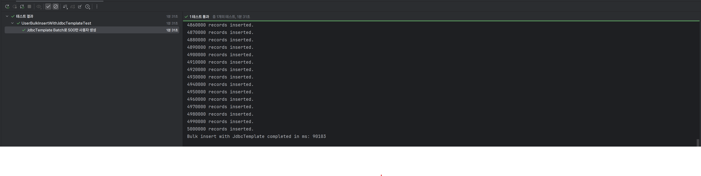
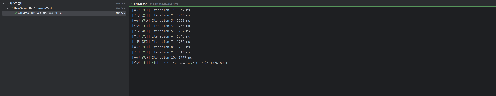
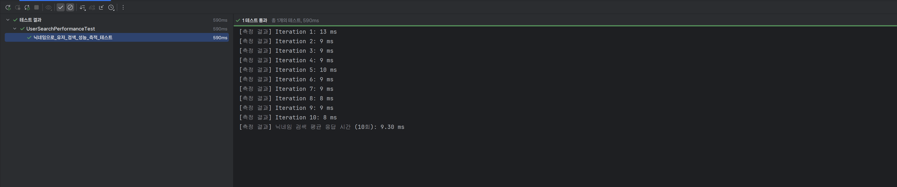
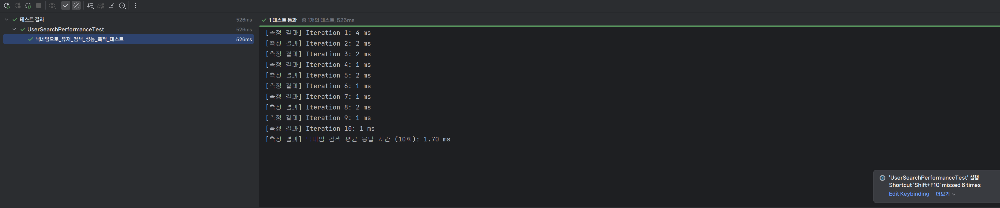

<!-- TOC -->

- [1. 과제 해결](#1-과제-해결)
  - [10. **QueryDSL 을 사용하여 검색 기능 만들기**](#10-querydsl-을-사용하여-검색-기능-만들기)
  - [11. **Transaction 심화**](#11-transaction-심화)
  - [12. **AWS 활용**](#12-aws-활용)
  - [13. **대용량 데이터 처리**](#13-대용량-데이터-처리)
- [2. 느낀점 및 다음 계획](#2-느낀점-및-다음-계획)

<!-- /TOC -->

이번 과제는 JPA 심화라는 주제로, 동적 쿼리와 성능 최적화 그리고 배포와 대용량 처리까지 접근해볼 수 있는 과제였습니다. 도전 기능 이어서 작성하겠습니다.


# 1. 과제 해결

## 10. **QueryDSL 을 사용하여 검색 기능 만들기**

- 문제
    
    ### **10. QueryDSL 을 사용하여 검색 기능 만들기**
    
    
    👉 일정을 검색하는 기능을 만들고 싶어요!
    검색 기능의 성능 및 사용성을 높이기 위해 QueryDSL을 활용한 쿼리 최적화를 해보세요.
    ❗Projections를 활용해서 필요한 필드만 반환할 수 있도록 해주세요.❗
    
    
    - 새로운 API로 만들어주세요.
    - 검색 조건은 다음과 같아요.
        - 검색 키워드로 일정의 제목을 검색할 수 있어요.
            - 제목은 부분적으로 일치해도 검색이 가능해요.
        - 일정의 생성일 범위로 검색할 수 있어요.
            - 일정을 생성일 최신순으로 정렬해주세요.
        - 담당자의 닉네임으로도 검색이 가능해요.
            - 닉네임은 부분적으로 일치해도 검색이 가능해요.
    - 다음의 내용을 포함해서 검색 결과를 반환해주세요.
        - 일정에 대한 모든 정보가 아닌, 제목만 넣어주세요.
        - 해당 일정의 담당자 수를 넣어주세요.
        - 해당 일정의 총 댓글 개수를 넣어주세요.
    - 검색 결과는 페이징 처리되어 반환되도록 합니다.
- 해결 과정
    
    ### 1. DTO 추가
    
    먼저 검색 요청과 응답에 사용될 DTO를 만들었습니다.
    
    ```java
    package org.example.expert.domain.todo.dto.request;
    
    import java.time.LocalDate;
    import org.springframework.format.annotation.DateTimeFormat;
    import org.springframework.format.annotation.DateTimeFormat.ISO;
    
    public record TodoSearchRequest(
            String title,
            @DateTimeFormat(iso = ISO.DATE) LocalDate startDate,
            @DateTimeFormat(iso = ISO.DATE) LocalDate endDate,
            String nickname
    ) {
    }
    
    ```
    
    ```java
    package org.example.expert.domain.todo.dto.response;
    
    public record TodoSearchResponse(
            String title,
            int managerCount,
            int commentCount) {
    
        public TodoSearchResponse(String title, int managerCount, int commentCount) {
            this.title = title;
            this.managerCount = managerCount;
            this.commentCount = commentCount;
        }
    }
    
    ```
    
    ### 2. Projection에 사용될 DTO 추가
    
    그리고 문제에서 `Projection`을 활용하라는 조건이 있었습니다. 리포지토리의 메서드가 반환하는 쿼리 결과를 바로 바인딩할 Projection 용도의 DTO를 만들었습니다. 
    
    사실 Projection에 사용될 DTO의 값이나, 앞에서 만든 Response 용도의 DTO나 필드의 차이가 없습니다. 그래서 Projection DTO를 Response 용도로도 사용할까 고민했습니다. 그러나, 이후에 DB 쿼리 결과가 변경이 되면 API 응답까지 영향을 미치게 되므로, 미리 분리를 해놓는 것이 좋겠다는 생각을 하여 앞에서 Response용 DTO도 만들었습니다.
    
    그리고 사실, 쿼리 결과가 API의 응답으로만 쓰이는 것은 아니고 배치나 캐시 데이터 생성 혹은 다른 내부 로직에서도 사용될 수 있기 때문에 엔티티를 Response로 그대로 전달하지 않는 것 처럼, Projection 용도의 DTO도 API 응답을 위한 DTO와는 분리하는 것이 유지보수 측면에서 더 적절하다고 생각했습니다.
    
    ```java
    package org.example.expert.domain.todo.dto;
    
    import com.querydsl.core.annotations.QueryProjection;
    
    public record TodoSearchProjection(
            String title,
            int managerCount,
            int commentCount) {
    
        @QueryProjection
        public TodoSearchProjection {
        }
    }
    
    ```
    
    그리고 잘 보면 기본 생성자에 `@QueryProjection`이라는 어노테이션이 붙어있는 것을 확인할 수 있습니다. queryDSL 에서는 DTO를 반환하는 여러가지 방법을 지원하는데, 크게 4가지 정도로 정리할 수 있습니다.
    
    | 방식 | 장점 | 단점 | 핵심 |
    | --- | --- | --- | --- |
    | 1. Projections.bean | 사용이 간단함 | DTO에 Setter와 기본 생성자가 반드시 필요 (객체 불변성 깨짐) | 가변(Mutable) DTO 필요 |
    | 2. Projections.fields | Setter가 필요 없어 외부에선 불변처럼 보임 | DTO에 기본 생성자 필요, Reflection으로 필드에 직접 주입 | 불완전한 불변성 |
    | 3. Projections.constructor | 완벽한 불변(Immutable) 객체 생성 가능. DTO가 Querydsl에 의존하지 않음. | 파라미터 순서나 타입이 다르면 런타임 시점에 에러 발생 | 아키텍처 순수성 |
    | 4. @QueryProjection | 완벽한 불변 객체 생성 가능. 파라미터 오류를 컴파일 시점에 잡을 수 있음. | DTO가 Querydsl에 의존하게 됨. Q파일 생성 필요. | 타입 안정성 |
    
    일단, 3번과 4번이 생성자를 이용하는 방식이기 때문에 객체의 불변성을 보장합니다. DTO는 한 번 데이터가 바인딩되면 바뀔 일이 없기 때문에 불변 객체로 만드는 것이 데이터를 다루기에 오히려 안전하다고 할 수 있습니다. 최근에 `record` 타입으로 DTO를 만드는 것도 같은 맥락이라고 생각합니다.
    
    그럼 3번과 4번은 무슨 차이냐면, 4번은 엔티티를 Q-타입으로 생성하여 컴파일 시점에 타입 안정성을 체크했던 것처럼 DTO에도 동일한 효과를 줄 수 있습니다. 즉, `queryDSL`로 DTO 생성자의 파라미터 타입과 순서같은 것을 컴파일 타임에 확인할 수 있습니다. 따라서, 타입안정성을 최우선으로 생각하여 런타임 에러를 컴파일 타임에 처리하고 싶다면 4번을 선택하면 됩니다. 
    
    대신 DTO도 `queryDSL`에 의존하게 됩니다. 사실 테스트 코드만으로도 파라미터 타입이나 순서 오류에 대해 방지할 수 있기 때문에, 엔티티가 아닌 DTO까지 굳이 Q-타입을 이용할 필요는 없을 것 같기도 합니다.
    
    ### 3. QueryDSL을 이용한 로직 작성
    
    이전에 8번 과제에서 QueryDSL을 사용하면서 이미 Custom Repository Interface와 구현체를 만들어두었습니다. 
    
    ```java
    package org.example.expert.domain.todo.repository;
    
    import java.time.LocalDate;
    import java.util.Optional;
    import org.example.expert.domain.todo.dto.TodoSearchProjection;
    import org.example.expert.domain.todo.entity.Todo;
    import org.springframework.data.domain.Page;
    import org.springframework.data.domain.Pageable;
    
    public interface TodoRepositoryCustom {
    
        Optional<Todo> findByIdWithUser(Long todoId);
    
        Page<TodoSearchProjection> findAllBySearch(String titleKeyword,
                                                   LocalDate startDate,
                                                   LocalDate endDate,
                                                   String nicknameKeyword,
                                                   Pageable pageable);
    }
    
    ```
    
    따라서 이번에는 `Custom Repository`에 정의를 하고, 만들어 놓은 구현체에 검색 기능에 대한 로직을 작성했습니다. 먼저 `findAllBySearch`라는 메서드를 custom interface repository에 정의했습니다. 문제의 요구사항에서 페이징도 요구했기 때문에 `Pageable` 객체도 함께 인자로 주었습니다.
    
    ```java
    package org.example.expert.domain.todo.repository;
    
    ...
    
    @RequiredArgsConstructor
    public class TodoRepositoryCustomImpl implements TodoRepositoryCustom {
    
        private final JPAQueryFactory queryFactory;
    
            ...
            
        @Override
        public Page<TodoSearchProjection> findAllBySearch(String titleKeyword,
                                                          LocalDate startDate,
                                                          LocalDate endDate,
                                                          String nicknameKeyword,
                                                          Pageable pageable) {
    
            JPAQuery<TodoSearchProjection> query = queryFactory
                    .select(new QTodoSearchProjection(
                            todo.title,
                            todo.managers.size().intValue(),
                            todo.comments.size().intValue()
                    ))
                    .from(todo);
    
            applyJoinsForNickname(query, nicknameKeyword);
    
            List<TodoSearchProjection> content = query
                    .where(
                            titleCIC(titleKeyword),
                            startDateGoe(startDate),
                            endDateLoe(endDate),
                            nicknameCic(nicknameKeyword)
                    )
                    .orderBy(todo.createdAt.desc())
                    .offset(pageable.getOffset())
                    .limit(pageable.getPageSize())
                    .fetch();
    
            JPAQuery<Long> countQuery = queryFactory
                    .select(todo.id.countDistinct())
                    .from(todo);
    
            applyJoinsForNickname(countQuery, nicknameKeyword);
    
            countQuery.where(
                    titleCIC(titleKeyword),
                    startDateGoe(startDate),
                    endDateLoe(endDate),
                    nicknameCic(nicknameKeyword));
    
            return PageableExecutionUtils.getPage(content, pageable, countQuery::fetchOne);
        }
    
        private BooleanExpression titleCIC(String title) {
            return hasText(title) ? todo.title.containsIgnoreCase(title) : null;
        }
    
        private BooleanExpression startDateGoe(LocalDate startDate) {
            return startDate != null ? todo.createdAt.goe(startDate.atStartOfDay()) : null;
        }
    
        private BooleanExpression endDateLoe(LocalDate endDate) {
            return endDate != null ? todo.createdAt.lt(endDate.plusDays(1).atStartOfDay()) : null;
        }
    
        private BooleanExpression nicknameCic(String nickname) {
            return hasText(nickname) ? todo.managers.any().user.nickname.containsIgnoreCase(nickname) : null;
        }
    
        private <T> JPAQuery<T> applyJoinsForNickname(JPAQuery<T> query, String nickname) {
            if (hasText(nickname)) {
                query.leftJoin(todo.managers, QManager.manager)
                        .leftJoin(QManager.manager.user, QUser.user);
            }
            return query;
        }
    }
    
    ```
    
    `BooleanExpression`을 반환하는 메서드들을 활용하여 제목과 nickname, 그리고 날짜 범위에 대한 필터링 조건을 작성했습니다. 그리고 `applyJoinsForNickname` 메서드를 통해서, nickname에 해당하는 검색 조건이 있을 때에만 필요한 left join을 추가하도록 일종의 동적 조인이 이뤄지도록 작성했습니다. 이렇게 하면, 본 쿼리와 카운트 쿼리에도 모두 메서드로 쉽게 재사용할 수 있었습니다.
    
    또한 `todo.managers`와 `todo.comments`는 size()로 컬렉션 크기를 간단하게 가져오고 있는데, 이게 결국 변환되는 SQL 쿼리를 확인했을 때, 아래처럼 변환되고 있었습니다.
    
    ```java
    select
         t1_0.title,
         (select
             count(1) 
         from
             managers m1_0 
         where
             t1_0.id=m1_0.todo_id),
         (select
             count(1) 
         from
             comments c1_0 
         where
             t1_0.id=c1_0.todo_id)
    ```
    
    즉, 알아서 메인 쿼리의 각 행에 대해 실행되어 단 하나의 값 (하나의 행, 하나의 열)을 반환하는 스칼라 서브쿼리로 변환되고 있었습니다. 스칼라 서브쿼리는 여러 개의 컬렉션(`managers`, `comments`)을 동시에 카운트할 때 `groupBy`를 사용할 때 발생할 수 있는 **카티전 곱 문제를 원천적으로 방지**할 수 있는데 알아서 잘 변환하고 있으므로, 굳이 `JPAExpressions`을 이용해 별도로 쿼리를 만들어주지 않았습니다.
    
    ### 4. Service 로직과 엔드포인트 구현
    
    ```java
    package org.example.expert.domain.todo.service;
    
    ...
    
    @Service
    @RequiredArgsConstructor
    @Transactional(readOnly = true)
    public class TodoService {
    
        private final TodoRepository todoRepository;
        private final WeatherClient weatherClient;
    
          ...
    
        public Page<TodoSearchResponse> getTodosBySearch(TodoSearchRequest todoSearchRequest, Pageable pageable) {
    
            return todoRepository.findAllBySearch(
                            todoSearchRequest.title(),
                            todoSearchRequest.startDate(),
                            todoSearchRequest.endDate(),
                            todoSearchRequest.nickname(), pageable)
                    .map(item -> new TodoSearchResponse(
                            item.title(),
                            item.managerCount(),
                            item.commentCount())
                    );
        }
    }
    
    ```
    
    그리고 서비스 레이어에서는 전달받은 Projction DTO 들을 Response DTO로 변환하여 반환했습니다.
    
    ```java
    package org.example.expert.domain.todo.controller;
    
    ...
    
    @RestController
    @RequiredArgsConstructor
    public class TodoController {
    
        private final TodoService todoService;
    
          ...
    
        @GetMapping("/todos/search")
        public ResponseEntity<Page<TodoSearchResponse>> getTodo(
                @ModelAttribute TodoSearchRequest todoSearchRequest,
                @PageableDefault(size = 10) Pageable pageable
        ) {
            return ResponseEntity.ok(todoService.getTodosBySearch(todoSearchRequest, pageable));
        }
    }
    
    ```
    
    마지막으로 컨트롤러에 최종적으로 엔드포인트를 구현하여 기능 개발을 완료했습니다.
    

## 11. **Transaction 심화**

- 문제
    
    ### **11. Transaction 심화**
    👉 매니저 등록 요청 시 로그를 남기고 싶어요!
    `@Transactional`의 옵션 중 하나를 활용하여 매니저 등록과 로그 기록이 각각 독립적으로 처리될 수 있도록 해봅시다.
    
    - 매니저 등록 요청을 기록하는 로그 테이블을 만들어주세요.
        - DB 테이블명: `log`
    - 매니저 등록과는 별개로 로그 테이블에는 항상 요청 로그가 남아야 해요.
        - 매니저 등록은 실패할 수 있지만, 로그는 반드시 저장되어야 합니다.
        - 로그 생성 시간은 반드시 필요합니다.
        - 그 외 로그에 들어가는 내용은 원하는 정보를 자유롭게 넣어주세요.
- 해결 과정
    
    과정을 크게 4단계로 구분했습니다. 일단 AOP에 필요한 의존성을 등록하고, Log 라는 엔티티와 필요한 repository 만듭니다. 그리고 제일 중요한 조건인 “**매니저 등록은 실패할 수 있지만, 로그는 반드시 저장되어야 합니다.”**을 고려하여 서비스 레벨의 로직을 작성합니다. 마지막으로, AOP를 통해 로그를 남깁니다. 
    
    ### 1. Log 엔티티 및 LogRepository 추가
    
    ```java
    package org.example.expert.domain.log.entity;
    
    ...
    
    @Entity
    @Table(name = "logs")
    @Getter
    @NoArgsConstructor(access = AccessLevel.PROTECTED)
    @AllArgsConstructor(access = AccessLevel.PRIVATE)
    public class Log extends Timestamped {
    
        @Id
        @GeneratedValue(strategy = GenerationType.IDENTITY)
        private Long id;
    
        @Enumerated(EnumType.STRING)
        @Column(nullable = false, length = 50)
        private OperationType operation;
    
        @Column
        private Long actorUserId;
    
        @Column(length = 500)
        private String requestUri;
    
        @Lob
        private String requestBody;
    
        @Column
        private Long targetTodoId;
    
        @Column
        private Long targetUserId;
    
        @Enumerated(EnumType.STRING)
        @Column(nullable = false, length = 20)
        private ResultType result;
    
        @Column(length = 200)
        private String failureException;
    
        public static Log create(OperationType operation,
                                 Long actorUserId,
                                 String requestUri,
                                 String requestBody,
                                 Long targetTodoId,
                                 Long targetUserId,
                                 ResultType result,
                                 String failureException) {
            return new Log(null, operation, actorUserId, requestUri, requestBody, targetTodoId, targetUserId, result,
                    failureException);
        }
    }
    ```
    
    보통 애플리케이션은 로거에 출력되는 메시지를 별도의 파일을 통해 기록을 하고, 일정 기간 동안 보관합니다. 이렇게 로그를 남기는데 불구하고 로그를 위한 테이블을 별도로 만드는 것은 재사용하거나 다른 용도로 사용을 하기 위해서라고 생각합니다. 물론 이번에는 과제이기 때문에 다른 의도도 있을 것입니다.
    
    그래도 DB에 기록하는 데이터이니 만큼, 어느 정도 확장을 고려하여 필드를 구성했습니다. 그래서 엔드포인트로 요청된 내용과 그에 따라 서버에서 실행되는 메서드를 기록하는 것이 좋겠다고 생각했습니다. 그리고 메서드가 실패해도 로그가 기록되어야 하기 때문에, 메서드의 exception 발생 여부와 exception이 발생한 경우 exception도 기록을 하도록 구성했습니다.
    
    ```java
    package org.example.expert.domain.log.repository;
    
    import org.example.expert.domain.log.entity.Log;
    import org.springframework.data.jpa.repository.JpaRepository;
    
    public interface LogRepository extends JpaRepository<Log, Long> {
    }
    ```
    
    Repository는 `JpaRepository`를 `extends`하는 인터페이스 리포지토리를 만들었습니다.
    
    ### 2. Log 로직 구현
    
    ```java
    package org.example.expert.domain.log.service;
    
    ...
    
    @Service
    @RequiredArgsConstructor
    public class LogService {
    
        private final LogRepository logRepository;
    
        @Transactional(propagation = Propagation.REQUIRES_NEW)
        public void save(OperationType operation,
                         Long actorUserId,
                         String requestUri,
                         String requestBody,
                         Long targetTodoId,
                         Long targetUserId,
                         ResultType result,
                         String failureException) {
            Log log = Log.create(
                    operation,
                    actorUserId,
                    requestUri,
                    requestBody,
                    targetTodoId,
                    targetUserId,
                    result,
                    failureException
            );
            logRepository.save(log);
        }
    }
    ```
    
    로직은 단순 `save`이기 때문에 복잡할 것이 없습니다. 중요한 것은 “**매니저 등록은 실패할 수 있지만, 로그는 반드시 저장되어야 합니다.”**라는 조건입니다. 따라서 이 조건을 만족시키기 위해 Propagation Level을 `REQUIRES_NEW`로 설정해주었습니다. 
    
    트랜잭션에서 Propagation Level은 하나의 트랜잭션이 존재하는 상황에서 또 다른 트랜잭션이 시작되었을 때 이를 어떻게 처리할지를 정의하는 것입니다.
    
    | **종류** | **기존 트랜잭션 X** | **기존 트랜잭션 O** | 적용 사례 |
    | --- | --- | --- | --- |
    | **REQUIRED** | 새 트랜잭션 생성 | 기존 트랜잭션에 참여 → 흡수 | **기본값. 대부분의 비지니스 로직** |
    | **REQUIRES_NEW** | 새 트랜잭션 생성 | 기존 트랜잭션 일시중단, 새로운 트랜잭션 생성 | **독립적인 작업 처리** |
    | **SUPPORTS** | 트랜잭션 없이 진행 | 기존 트랜잭션 참여 | 트랜잭션이 필수가 아닌 작업 |
    | **NOT_SUPPORTED** | 트랜잭션 없이 진행 | 기존 트랜잭션 일시중단, 트랜잭션 없이 진행 | 로그 저장 등 트랜잭션과 독립적인 작업 |
    | **MANDATORY** | IllegalTransactionStateException 발생 | 기존 트랜잭션 참여 | 트랜잭션 내부에서만 호출 가능한 메소드 |
    | **NEVER** | 트랜잭션 없이 진행 | IllegalTransactionStateException 발생 | 외부 시스템 호출시 |
    | **NESTED** | 새 트랜잭션 생성 | 중첩 트랜잭션 생성 | 부분적으로 롤백 가능한 작업 |
    
    로그 기록은 로깅의 대상이 되는 메소드와 독립적으로 수행이 되어야 하므로, `REQUIRES_NEW`를 사용했습니다. 만약 기본값인 `REQUIRED`로 설정을 한다면, 기존 트랜잭션에 포함되기 때문에, 메서드에서 예외가 발생하면 트랜잭션 전체가 롤백되므로, 로그 기록도 취소되게 됩니다.
    
    ## 3. AOP 구현
    
    ```java
    package org.example.expert.aop;
    
    ...
    
    @Slf4j
    @Aspect
    @Component
    @RequiredArgsConstructor
    public class ManagerRegisterLoggingAspect {
    
        private final LogService logService;
        private final ObjectMapper objectMapper;
    
        @Pointcut("execution(* org.example.expert.domain.manager.service.ManagerService.saveManager(..))")
        private void saveManagerPointcut() {
        }
    
        @Around(value = "saveManagerPointcut() && args(authUser, todoId, managerSaveRequest)",
                argNames = "pjp,authUser,todoId,managerSaveRequest")
        public Object logManagerRegister(ProceedingJoinPoint pjp,
                                         AuthUser authUser,
                                         long todoId,
                                         ManagerSaveRequest managerSaveRequest) throws Throwable {
    
            String uri = null;
            ServletRequestAttributes attrs = (ServletRequestAttributes) RequestContextHolder.getRequestAttributes();
            if (attrs != null) {
                HttpServletRequest request = attrs.getRequest();
                if (request != null && request.getRequestURI() != null) {
                    uri = request.getRequestURI();
                }
            }
    
            String bodyJson = saveJson(managerSaveRequest);
            Long actorUserId = authUser != null ? authUser.id() : null;
            Long targetUserId = managerSaveRequest != null ? managerSaveRequest.getManagerUserId() : null;
    
            try {
                Object result = pjp.proceed();
                callSaveLog(OperationType.MANAGER_REGISTER, actorUserId, uri, bodyJson, todoId, targetUserId, null);
                return result;
            } catch (Throwable t) {
                callSaveLog(OperationType.MANAGER_REGISTER, actorUserId, uri, bodyJson, todoId, targetUserId, t);
                throw t;
            }
        }
    
        private String saveJson(Object obj) {
            try {
                return objectMapper.writeValueAsString(obj);
            } catch (JsonProcessingException e) {
                return String.valueOf(obj);
            }
        }
    
        private void callSaveLog(OperationType operationType, Long actorUserId, String uri, String bodyJson, Long todoId,
                                 Long targetUserId, Throwable t) {
            try {
                log.info(
                        "Admin Access Logging start: operationType={}, actorUserId={}, uri={}, body={}, todoId={}, targetUserId={}, result={}, error={}",
                        operationType,
                        actorUserId,
                        uri,
                        bodyJson,
                        todoId,
                        targetUserId,
                        t == null ? ResultType.SUCCESS : ResultType.FAILURE,
                        t != null ? t.getClass().getSimpleName() : null
                );
                logService.save(
                        operationType,
                        actorUserId,
                        uri,
                        bodyJson,
                        todoId,
                        targetUserId,
                        t == null ? ResultType.SUCCESS : ResultType.FAILURE,
                        t != null ? t.getClass().getSimpleName() : null
                );
            } catch (Exception e) {
                log.warn("Admin Access Logging failed: {}", e.getMessage());
            }
        }
    }
    
    ```
    
    다음으로 AOP를 구현했습니다. 로그 기록을 확장성을 고려하여 범용적인 컬럼들로 구성했습니다. 그래서 AOP도 어노테이션으로 구성할까 고민했는데, 이번에는 일단 과제에서 요구하는 매니저 등록에만 적용되도록 `Pointcut`을 메소드로 지정했습니다.
    
    또한, `request`에 대한 데이터도 필요하며, 메서드의 성공 여부도 확인해야 되기 때문에 `@Around`로 구현했습니다.
    
    내부에서 활용해야 하는 `argument`의 순서나 타입이 바뀔 수도 있으므로, 인덱스를 통해 접근하기 보다는 명시적으로 `args()`와 `argNames`을 사용하여 메서드 파라미터를 직접 바인딩했습니다. 그리고 `HttpServletRequest`를 직접 주입받기 보다는, `RequestContextHolder`를 활용했습니다.
    
    데이터는 `Request Body`도 기록을 하도록 구성했으므로 `saveJson`이라는 유틸성 함수를 만들어서 String으로 변환하는 처리를 했습니다. 
    
    이렇게 하면, `pointcut`으로 지정한 매니저 등록 메서드가 실행될 때마다, 메서드의 실행 결과와는 독립적으로 log 테이블에 로깅 데이터가 저장됩니다.
    

## 12. **AWS 활용**

- 문제
    
    👉 EC2, RDS, S3를 사용해서 프로젝트를 관리하고 배포합니다.
    각 AWS 서비스 간 보안 그룹을 적절히 구성하여 보안에 신경써주세요!
    
    
    **공통사항**
    
    - 각 AWS 서비스의 콘솔에서 내가 만든 서비스들의 설정 화면을 캡쳐하여 `README.md`에 첨부하세요.
    
    **12-1. EC2**
    
    - EC2 인스턴스에서 어플리케이션을 실행하세요.
    - 탄력적 IP를 설정해서 외부에서도 접속할 수 있도록 해주세요.
    - 서버 접속 및 Live 상태를 확인할 수 있는 health check API를 만들고 `README.md` 에 기재하세요.
        - health check API는 누구나 접속 가능해야 해요.
        - API path는 편하게 정해도 괜찮습니다.
    
    **12-2. RDS**
    
    - RDS에 데이터베이스를 구축하고, EC2에서 실행되는 어플리케이션에 연결하세요.
    
    **12-3. S3**
    
    - S3 버킷을 생성하여 유저의 프로필 이미지 업로드 및 관리 API를 구현하세요.
        - `선택` Presigned URL 적용
        
- 해결 과정
    
    내용이 너무 길어져 별도로 분리하여 작성하겠습니다.
    

## 13. **대용량 데이터 처리**

- 문제
    
    💬RDS를 사용할 경우 과금이 될 수 있어요. 개인 환경에서 테스트해보시는 것을 추천해요.
    
    
    - 여러가지 아이디어로 유저 검색 속도를 줄여주세요.
        - 조회 속도를 개선할 수 있는 여러 방법을 고민하고, 각각의 방법들을 실행해보세요.
        - `README.md` 에 각 방법별 실행 결과를 비교할 수 있도록 최초 조회 속도와 개선 과정 별 조회 속도를 확인할 수 있는 표 혹은 이미지를 첨부해주세요.
    - 닉네임을 조건으로 유저 목록을 검색하는 API를 만들어주세요.
        - 닉네임은 정확히 일치해야 검색이 가능해요.
    - 대용량 데이터 처리 실습을 위해, *테스트 코드*로 유저 데이터를 500만 건 생성해주세요.
        - **JDBC를 활용하여 Bulk Insert를 진행해주세요.**
        - 데이터 생성 시 닉네임은 랜덤으로 지정해주세요.
        - 가급적 동일한 닉네임이 들어가지 않도록 방법을 생각해보세요.
        
- 해결 과정
    
    이번에도 여러 단계로 나눠서 해결을 했습니다. 먼저 검색 API를 구현하고, Bulk Insert를 위한 테스트 코드를 작성합니다. 그리고 속도 측정을 위한 테스트 코드도 작성합니다. 이렇게 준비 과정을 거치고 나서, 검색 속도를 높이기 위한 방안들을 적용해보는 과정을 거쳤습니다.
    
    ### 1. 검색 API 구현
    
    검색은 정확히 일치해야 검색이 가능하다는 조건이 있기 때문에, 특별히 쿼리를 만들지는 않고 Spring Data JPA가 제공하는 Query Methods를 이용해서 개발했습니다.
    
    ```java
    package org.example.expert.domain.user.service;
    
    ...
    
    @Service
    @RequiredArgsConstructor
    @Transactional(readOnly = true)
    public class UserService {
    
        private final UserRepository userRepository;
        private final PasswordEncoder passwordEncoder;
    
            ...
    
        public UserSearchResponse searchByNickname(String nickname) {
    
            User byNickname = userRepository.findByNickname(nickname)
                    .orElseThrow(() -> new InvalidRequestException("User not found"));
    
            return new UserSearchResponse(byNickname.getId(), byNickname.getEmail(), byNickname.getNickname());
        }
    }
    
    ```
    
    ### 2. Bulk Insert 테스트 코드 구현
    
    Bulk Insert를 위한 일회성 테스트 코드를 구현해야 합니다. JDBC를 활용하는 방법은 RAW JDBC를 그대로 이용하거나, JdbcTemplate을 이용하여 그래도 조금 간편하게 작성하는 방법이 있습니다. 크게 차이는 안 나기 때문에 2가지 방법 모두 사용해보았고, JdbcTemplate을 이용한 코드를 공유해보겠습니다. 또한 일회성으로 사용되는 테스트 코드이기 때문에 굳이 Testcontainers를 사용하지는 않았습니다.
    
    ```java
    package org.example.expert.domain.user;
    
    ...
    
    @SpringBootTest
    class UserBulkInsertWithJdbcTemplateTest {
    
        @Autowired
        private JdbcTemplate jdbcTemplate;
    
        @Autowired
        private PasswordEncoder passwordEncoder;
    
        private static final int TOTAL = 5_000_000;
        private static final int BATCH_SIZE = 10_000; // 배치 크기
    
        @Test
    //    @Disabled("bulkInsert 테스트는 필요시에 로컬 DB에서 수동 실행하기")
        @DisplayName("JdbcTemplate Batch로 500만 사용자 생성")
        void JDBC로_500만_유저_데이터를_생성한다() {
    
            long start = System.currentTimeMillis();
    
            String encodedPassword = passwordEncoder.encode("password123");
    
            final String sql = "INSERT INTO users (created_at, email, modified_at, nickname, password, user_role) VALUES (?, ?, ?, ?, ?, ?)";
    
            List<Object[]> batchArgs = new ArrayList<>();
            for (int i = 1; i <= TOTAL; i++) {
                LocalDateTime now = LocalDateTime.now();
                String email = "user" + i + "@example.com";
                String nickname = randomNickname(i);
                String role = "USER";
    
                batchArgs.add(new Object[]{now, email, now, nickname, encodedPassword, role});
    
                if (i % BATCH_SIZE == 0) {
                    jdbcTemplate.batchUpdate(sql, batchArgs);
                    batchArgs.clear(); // 리스트 초기화
                }
            }
    
            // 남은 데이터 처리
            if (!batchArgs.isEmpty()) {
                jdbcTemplate.batchUpdate(sql, batchArgs);
            }
    
            long end = System.currentTimeMillis();
            System.out.println("Bulk insert with JdbcTemplate completed in ms: " + (end - start));
        }
    
        private static String randomNickname(int idx) {
            return "nick_" + idx + "_" + UUID.randomUUID().toString().substring(0, 8);
        }
    }
    ```
    
    핵심은 batch를 이용하여 설정한 batch size 만큼 메모리에 쿼리를 쌓고, 지정한 batch size만큼 INSERT 쿼리가 모두 차면 한 번의 통신으로 처리합니다. 따라서 insert마다 발생하는 DB와의 통신 횟수를 batch size만큼에서 **한 번**으로 줄일 수 있습니다.
    
    Raw JDBC에서는 addBatch()와 executeBatch() 를 활용하고, JdbcTemplate에서는 batchUpdate()를 사용하면 됩니다. 그리고 코드로 직접 작성하거나, datasource 설정 부분에서 `rewriteBatchedStatements=true` 옵션을 주면 DBMS마다 다를 수 있지만 MySQL에서는 insert 문을 묶어서, multi-value로 재작성하여 DB에 보내게 됩니다. 따라서 쿼리 분석에 드는 시간을 줄여줍니다.
    
    ```java
    // rewriteBatchedStatements=false
    INSERT ...; INSERT ...; INSERT ...; (10,000번 반복)
    
    // rewriteBatchedStatements=true
    INSERT INTO users (col1, col2) VALUES (val1, val2), (val3, val4), (val5, val6), ...;
    ```
    
    
    
    이렇게 해서 500만 건의 사용자 데이터를 DB에 넣을 수 있었습니다. 대략 1분 30초 (90초) 정도 걸렸습니다.
    
    ### 3. 검색 속도 측정 테스트 코드 구현
    
    ```java
    package org.example.expert.domain.user;
    
    ...
    
    @SpringBootTest
    @AutoConfigureMockMvc
    class UserSearchPerformanceTest {
    
        @Autowired
        private MockMvc mockMvc;
    
        @Test
    //    @Disabled("성능 측정은 테스트는 필요시에 로컬 DB에서 수동 실행하기")
        @WithMockUser
        void 닉네임으로_유저_검색_성능_측적_테스트() throws Exception {
    
            // 500만 건 데이터 중 존재하는 닉네임으로 검색
            String existingNickname = "nick_2600000_02f209d5";
    
            int iterations = 10; // 정확한 측정을 위해 10번 반복하여 평균값 사용
            List<Long> durations = new ArrayList<>();
    
            // 워밍업
            mockMvc.perform(get("/users").param("nickname", existingNickname));
    
            // 실제 측정
            for (int i = 0; i < iterations; i++) {
                long start = System.currentTimeMillis();
    
                mockMvc.perform(get("/users")
                                .param("nickname", existingNickname))
                        .andExpect(status().isOk());
    
                long end = System.currentTimeMillis();
                durations.add(end - start);
                System.out.printf("[측정 결과] Iteration %d: %d ms%n", i + 1, (end - start));
            }
    
            double average = durations.stream().mapToLong(Long::longValue).average().orElse(0.0);
            System.out.printf("[측정 결과] 닉네임 검색 평균 응답 시간 (10회): %.2f ms%n", average);
        }
    }
    ```
    
    다음은 성능을 측정하는 테스트 코드 입니다. 요구사항에 맞춰서, 실제 존재하는 데이터의 닉네임 하나를 이용하여 API 호출을 합니다. 대략 500만 개 중에서 중간 쯤에 위치하는 데이터입니다. 그리고 결과를 반환받는데 걸리는 시간을 측정했습니다. 10번을 시도하여, 평균값을 사용했습니다.
    
    ### 4. 속도 개선 1 - Index 적용
    
    
    
    아무 것도 하지 않았을 때의 결과는 위와 같았습니다. 평균 1776.80ms 로, 약 1.8초 쯤 걸렸습니다.
    
    여기서 가장 먼저 떠오른 해결책은 Index를 적용해보는 것이었습니다. 
    
    Index를 생성하면 특정 컬럼의 값과 해당 값이 저장된 행의 주소를 미리 정렬하여 일종의 key-value 구조로 저장하게 됩니다. 따라서 Index를 저장하기 위한 별도의 공간은 조금 더 필요하게 되지만, 테이블의 첫번쨰 행부터 나올 때까지 모두 살펴보는 풀스캔을 시도할 필요가 없어집니다.
    
    그 대신에 미리 정렬된 nickname 들의 자료구조인 index를 이용하여 이분 탐색과 유사하게 매우 빠르게 key에 해당하는 nickname을 찾을 수 있고, value에 있는 위치를 사용하여 바로 이동하게 됩니다. 실제로 RDBMS에서는 index는 이분 탐색을 발전시킨 B-Tree (Balanced Tree) 구조를 주로 이용합니다. 따라서 데이터가 억 단위를 넘어가더라도, 매우 적은 횟수로 탐색을 완료 할수 있습니다. 이름 그 자체처럼 책의 맨 뒤에 있는 색인과 비슷하다고 할 수 있습니다. 
    
    ```java
    package org.example.expert.domain.user.entity;
    
    ..
    
    @Getter
    @Entity
    @NoArgsConstructor
    @Table(name = "users", indexes = {
            @Index(name = "idx_user_nickname", columnList = "nickname")
    })
    public class User extends Timestamped {
    ```
    
    적용하는 방법은 간단합니다. 직접 SQL을 통해 적용할 수도 있는데, JPA를 통해서도 위와 같이 적용할 수 있습니다. 검색의 keyword가 nickname 이기 때문에 nickname에 idx_user_nickname이라는 인덱스를 적용했습니다.
    
    
    
    그 결과는 위와 같이 9.30 ms로 최초 상태에 비해 비약적인 향상을 보여주었습니다. 약 191배 빨라져 0.0093초의 속도가 되었습니다. 말로만 듣던 Index의 위력을 체감할 수 있었습니다.
    
    ### 5. 속도 개선 2 - 캐시 적용
    
    Index를 적용해보면 자연스럽게 다음 생각으로 확장하게 됩니다. 
    
    💬**값이 존재하는 위치를 별도로 저장하는 게 아니라, 아예 값 자체를 별도로 더 가까운 곳에 저장하면 어떨까?**
    
    그래서 바로 캐시를 사용해보기로 했습니다. 캐시는 한 번 조회된 데이터를 더 빠른 곳에 임시로 저장하고, 여러 정책들을 통해 캐시의 데이터를 교체해가면서 저장하는 기술들의 총칭(?) 혹은 방법론입니다. CPU에도 캐시가 있고, JPA의 영속성 컨텍스트에서도 1차 캐시라는 말이 나왔던 것 처럼 다양한 곳에서 활용되고 있습니다. 하드디스크로 구성된 데이터베이스보다는 메모리가 훨씬 빠르기 때문에, 메모리를 캐시로 사용하면 접근 속도가 매우 빨라질 수 있습니다.
    
    Redis와 같이 메모리로 구성된 저장소를 사용하는 방법도 있지만, 요구사항에 따라서 이번에는 서버의 로컬 메모리를 활용하는 방식으로 간단히 구현해 보았습니다.
    
    Spring에서는 3.1 버전부터 캐시 추상화를 제공하여 Cache 기능을 편리하고 투명하게 추가할 수 있도록 제공하고 있습니다. 그리고 @Transactional 처럼 @Cacheable 이라는 어노테이션으로 간단히 사용할 수 있습니다. 물론 다른 다양한 도구와 어노테이션도 제공하고 있습니다. 그리고 다양한 캐시 저장소 구현체들을 지원합니다. 저는 그 중에서 Caffeine 이라는 로컬 인 메모리 캐시 저장소를 사용해보기로 했습니다.
    
    JPA의 EntityManager처럼, 캐시도 캐시 저장소를 관리하는 CacheManager가 필요한데 Caffeine의 경우는 Spring의 지원으로 전용 CacheManager인 [`CaffeineCacheManager`](https://docs.spring.io/spring-framework/docs/6.2.x/javadoc-api/org/springframework/cache/caffeine/CaffeineCacheManager.html)가 존재합니다. 따라서 사실, 아무런 별도의 설정 필요 없이 바로 사용을 해도 되지만 학습을 위해 별도로 Config를 정의해보았습니다.
    
    ```java
        // Cache
        implementation 'org.springframework.boot:spring-boot-starter-cache'
        implementation 'com.github.ben-manes.caffeine:caffeine:3.2.2'
    ```
    
    그 전에 먼저 의존성부터 추가해야 합니다. 
    
    ```java
    package org.example.expert.config;
    
    import lombok.Getter;
    
    @Getter
    public enum CacheType {
    
        USER_BY_NICKNAME("userByNickname", 900, 10000); // 15분, 10,000개
    
        public static final String USER_BY_NICKNAME_CACHE_NAME = "userByNickname";
    
        private final String cacheName;
        private final int expiredAfterAccess;
        private final int maximumSize;
    
        CacheType(String cacheName, int expiredAfterAccess, int maximumSize) {
            this.cacheName = cacheName;
            this.expiredAfterAccess = expiredAfterAccess;
            this.maximumSize = maximumSize;
        }
    }
    
    ```
    
    그리고 필수적인 과정은 아니지만, 안정성을 높이기 위해 @Cacheable 어노테이션과 Config에서 String이 아니라 미리 정의된 값으로 사용할 수 있도록 enum을 통해 캐시 유형을 정의해주었습니다. expiredAfterAccess는 최초 접근 이후 특정한 시간 동안 캐시에 데이터를 유지하는 전략입니다.
    
    ```java
    package org.example.expert.config;
    
    ...
    
    @Configuration
    @EnableCaching
    public class CacheConfig {
    
        @Bean
        public CacheManager cacheManager() {
            List<CaffeineCache> caches = Arrays.stream(CacheType.values())
                    .map(cacheType -> new CaffeineCache(
                                    cacheType.getCacheName(),
                                    Caffeine.newBuilder()
                                            .recordStats() // 캐시 사용 통계 기록
                                            .expireAfterAccess(cacheType.getExpiredAfterAccess(), TimeUnit.SECONDS)
                                            .maximumSize(cacheType.getMaximumSize())
                                            .build()
                            )
                    )
                    .collect(Collectors.toList());
    
            SimpleCacheManager cacheManager = new SimpleCacheManager();
            cacheManager.setCaches(caches);
            return cacheManager;
        }
    }
    
    ```
    
    그리고 CacheManager를 @Bean으로 등록하여 편하게 사용하도록 구성했습니다. 이 때, Caffeine의 빌더를 이용하여 미리 정의한 CacheType과 더불어 다양한 값을 활용하여 Cache를 만든 뒤에 CacheManager에게 전달해줍니다. 
    
    코드에서 사용된 SimpleCacheManager는 별도의 캐시 저장소 구현체가 없을 때, Spring이 기본적으로 제공하는 ConcurrentHashMap으로 구현된 캐시 저장소를 관리하는 CacheManager 구현체입니다. 
    
    ```java
    package org.example.expert.config;
    
    ...
    
    @Configuration
    @EnableCaching
    public class CacheConfig {
    
        @Bean
        public CacheManager cacheManager() {
    
            // 학습을 위해 사용했던 기본 SimpleCacheManager 대신 CaffeineCacheManager 사용
            CaffeineCacheManager cacheManager = new CaffeineCacheManager();
    
            for (CacheType cacheType : CacheType.values()) {
                cacheManager.registerCustomCache(cacheType.getCacheName(),
                        Caffeine.newBuilder()
                                .recordStats()
                                .expireAfterAccess(cacheType.getExpiredAfterAccess(), TimeUnit.SECONDS)
                                .maximumSize(cacheType.getMaximumSize())
                                .build());
            }
    
            return cacheManager;
        }
    }
    
    ```
    
    따라서, 최종적으로는 Caffeine 전용 `CacheManager`인 `CaffeineCacheManager`를 사용하여 캐시 설정을 더 명확하게 구성했습니다. 그래서 아래와 같이 수정했습니다.
    
    ```java
    package org.example.expert.domain.user.service;
    
    ...
    
    @Service
    @RequiredArgsConstructor
    @Transactional(readOnly = true)
    public class UserService {
    
        private final UserRepository userRepository;
        private final PasswordEncoder passwordEncoder;
    
            ...
    
        @Cacheable(key = "#nickname", value = CacheType.USER_BY_NICKNAME_CACHE_NAME)
        public UserSearchResponse searchByNickname(String nickname) {
    
            User byNickname = userRepository.findByNickname(nickname)
                    .orElseThrow(() -> new InvalidRequestException("User not found"));
    
            return new UserSearchResponse(byNickname.getId(), byNickname.getEmail(), byNickname.getNickname());
        }
    }
    
    ```
    
    그리고 최종적으로 nickname을 조건으로 유저 목록을 검색하는 Service 레이어의 메소드에 @Cacheable 어노테이션을 사용하면 됩니다. key에 사용된 #은 SpEL 문법으로 메서드의 파라미터를 의미하는 해시 기호이고, nickname은 참조하는 파라미터가 됩니다. 
    
    따라서 API가 호출되어, keywork가 “Spring” 이라면, 메서드의 파라미터인 nickname을 확인하고 실제 값인 “Spring”을 가져옵니다. 그리고 이 “Spring”이라는 String을 캐시의 key로 사용하여 데이터를 조회하거나 저장하게 됩니다.
    
    이렇게 캐시를 적용한 뒤에 최종 결과를 확인해 보면, 다음과 같은 결과를 얻을 수 있습니다.
    
    
    
    테스트 코드에 워밍업을 별도로 넣었음에도 최초에 캐시 데이터를 채우기 위해 시간이 조금 튀었지만, 1ms ~ 2ms 라는 엄청난 평균 속도를 보여주었습니다. 물론 이건 로컬 환경에서, 단건 요청 기준이라 트래픽 환경과 캐시 전략, 네트워크 비용 등 다양한 요소에 따라 결과가 달라질 수도 있습니다. 그래도 캐시 전략을 잘 고려하여 캐시를 사용하면, 캐시를 통해 검색에 대한 조회 성능을 폭발적으로 높일 수 있는 방법이라는 생각이 들었습니다.
    
    ### 6. 최종 결과 요약
    
    | **개선 단계** | **적용 기술** | **API 응답 속도 (평균)** | **최초 상태 대비 성능 향상** |
    | --- | --- | --- | --- |
    | **최초 상태** | 없음 | **1776.80 ms** | - |
    | **1차 개선** | `인덱스(Index)` 적용 | **9.30 ms** | 약 191배 |
    | **2차 개선** | `인덱스(Index)` +`캐시(Cache)` 적용 | **1.70 ms** | 약 1045배 |
    
    최종적으로 지금까지의 결과를 정리하면 아래와 같습니다. 따라서, 조회 속도를 개선하기 위해서는 Index와 캐시 모두 상황과 비용을 적절히 고려하여 사용하면 큰 효과를 얻을 수 있음을 비록 테스트지만 체감할 수 있었습니다. 마지막으로, 테스트를 할 때 특정한 nickname으로만 하는 게 아니라 랜덤으로 nickname이 주어지도록 했으면 더 실제 상황과 가까운 테스트가 되었겠다는 아쉬움이 조금 남습니다.
    

# 2. 느낀점 및 다음 계획

정말 재밌는 과제였습니다. 복잡한 비즈니스 도메인을 구현하는 것 만큼이나 중요한 성능에 관한 부분을 얕게 나마 경험해볼 수 있었습니다. 그리고 만든 애플리케이션을 실제로 사용자에게 전달하기 위해 필요한 배포도 간소하지만 해볼 수 있어서 좋았습니다. 이런 내용들과 더불어, 기본적인 구현도 놓치지 않고 특히 데이터베이스와 관련된 내용을 꼼꼼하게 이해하고 상황에 적절하게 적용해보는 것이 중요하다는 생각이 들었습니다.