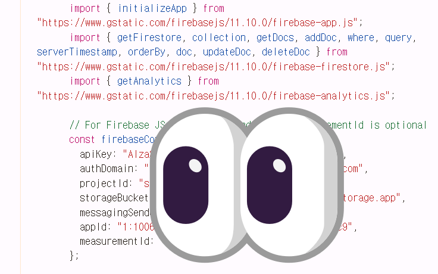

## GitHub Actions Secrets로 알아보는 환경 변수 관리

이 글에서는 Firebase Firestore를 사용하는 정적 페이지를 GitHub Pages에 배포하는 상황을 통해서, API 키와 같은 Config 정보를 **Git 저장소에서 안전하게 관리하는 방법**에 대해 알아보려고 합니다. 

---

### 문제 상황: 정적 페이지에 Config 정보 은닉하기

저는 부트캠프를 하고 있는 저를 비롯한 팀원들의 팀 및 자기소개 페이지를 개발했습니다. 그리고 이는 html, css, js로만 이루어져 있습니다. 그리고 이를 Github Pages에 배포하고자 했습니다.

이 때 Firebase Config 정보(API 키, 프로젝트 ID 등)는 클라이언트 즉, 저의 경우에는 Javascript 코드에 포함되어 브라우저에서 직접 Firebase 서비스와 통신해야 합니다. 따라서 이 정보는 사용하는 **Git 저장소의 코드를 통해서 Config 정보가 직접 노출**되게 됩니다. 이와 더불어 배포된 웹페이지의 소스 코드를 통해서도 노출될 수 있습니다.



개발자 도구에서 확인할 수 있는 config 정보

다만 Firebase는 이러한 노출을 염두에 두고 설계되었으며, **실제 보안은 Firestore 보안 규칙(Security Rules)으로 통제된다는 점을 굉장히 강조**하고 있습니다.  하지만 Git 저장소에서의 직접 노출을 피하고, 향후 다른 프론트엔드 혹은 배포 환경이나 다른 API 키를 다룰 때를 대비하여 이를 은닉하는 방법을 학습하고자 했습니다.


Firebase docs

방법을 찾던 중, **GitHub Actions의 Secrets 기능과 번들러를 활용하는 방법**을 찾게 되었습니다.

### 해결책: GitHub Actions Secrets와 Actions를 이용한 빌드 타임 환경 변수 주입

방법은 Firebase Config 정보를 GitHub 저장소의 `Secrets`에 저장하고, 번들러를 이용한 빌드 과정에서 이 `Secrets` 값을 환경 변수를 이용하여 코드에 주입하는 것입니다. 이렇게 하면 소스 코드 저장소에는 API 키가 직접 포함되지 않으면서도, 배포된 애플리케이션은 정상적으로 동작하게 됩니다.

### 1. GitHub Secrets에 Firebase Config 정보 저장하기

먼저 할 일은 Firebase 프로젝트의 설정 값들을 GitHub 저장소의 Secrets에 등록하는 것입니다.

1. **GitHub 저장소**로 이동합니다.
2. 상단 메뉴에서 **`Settings`** 탭을 클릭합니다.
3. 좌측 사이드바에서 **`Secrets and variables` > `Actions`*를 선택합니다.
4. **`New repository secret`** 버튼을 클릭합니다.
5. 다음과 같이 각 Firebase 설정 값을 별도의 Secret으로 추가합니다. (예시)
    - `FIREBASE_API_KEY` = `your_api_key_here`
    - `FIREBASE_AUTH_DOMAIN` = `your_auth_domain_here`
    - `FIREBASE_PROJECT_ID` = `your_project_id_here`
    - ...(필요한 모든 Firebase 설정 값들을 추가)
    
    > 팁: 또는 Firebase config 객체 전체를 JSON 문자열 형태로 하나의 Secret(FIREBASE_CONFIG_JSON 등)으로 저장할 수도 있습니다.
    > 

### 2. GitHub Actions 워크플로우 파일(`deploy.yml`) 작성

이제 GitHub Actions 워크플로우를 설정하여, 저장된 Secrets 값을 빌드 과정에 주입하도록 합니다. 프로젝트 루트의 `.github/workflows/` 디렉토리에 `.yml` 파일을 생성합니다. (예: `deploy.yml`)

```yaml
name: Deploy to GitHub Pages

on:
  push:
    branches:
      - main # main

jobs:
  build-and-deploy:
    runs-on: ubuntu-latest

    steps:
    - name: Checkout repository
      uses: actions/checkout@v4

    - name: Set up Node.js
      uses: actions/setup-node@v4
      with:
        node-version: '18'

    - name: Install dependencies
      run: npm install # 사용하는 패키지 매니저에 따라 변경

    - name: Create .env file (for build process) # 빌드 도구가 환경 변수를 읽도록 .env 파일 생성
      run: |
        echo "VITE_FIREBASE_API_KEY=${{ secrets.FIREBASE_API_KEY }}" >> .env
        echo "VITE_FIREBASE_AUTH_DOMAIN=${{ secrets.FIREBASE_AUTH_DOMAIN }}" >> .env
        echo "VITE_FIREBASE_PROJECT_ID=${{ secrets.FIREBASE_PROJECT_ID }}" >> .env
        # 다른 환경 변수들도 여기에 추가
        # 참고: 사용하는 도구(Vite, Create-React-App 등)에 따라 환경 변수 접두사가 다를 수 있습니다.
        # (예: Vite는 VITE_, CRA는 REACT_APP_ 등)
      env: # GitHub Secrets를 환경 변수로 매핑
        FIREBASE_API_KEY: ${{ secrets.FIREBASE_API_KEY }}
        FIREBASE_AUTH_DOMAIN: ${{ secrets.FIREBASE_AUTH_DOMAIN }}
        FIREBASE_PROJECT_ID: ${{ secrets.FIREBASE_PROJECT_ID }}
        # 필요한 모든 Firebase Secret을 여기에 매핑합니다.

    - name: Build project
      run: npm run build # 빌드 스크립트에 맞게 변경 가능

    - name: Deploy to GitHub Pages 
      uses: peaceiris/actions-gh-pages@v4
      with:
        github_token: ${{ secrets.GITHUB_TOKEN }}
        publish_dir: ./build
```

- `env:` 섹션에서는 GitHub Secrets에 저장된 값(`secrets.FIREBASE_API_KEY` 등)을 워크플로우의 환경 변수로 설정합니다.
- `Create .env file` 단계는 번들러가 빌드 시 `.env` 파일에서 환경 변수를 읽는 방식에 맞춰 `.env` 파일을 생성하는 예시입니다. 만약 프로젝트가 번들러의 환경 변수 기능을 직접 사용한다면 이 단계는 필요 없을 수 있습니다.
- 최종적으로, Webpack, Rollup, Vite 등과 같은 번들러가 빌드 과정에서 이 환경 변수들을 읽어들여 최종 번들된 JavaScript 코드에 삽입하게 됩니다.

### 장점과 단점

Firebase Config 정보가 **Git 저장소(소스 코드)에 직접 노출되지 않습니다.** 그리고 GitHub Actions 워크플로우가 자동으로 빌드 및 배포를 처리하며, 이때 환경 변수를 주입하는 과정도 자동화됩니다. 또한 개발 환경과 프로덕션 환경의 Firebase Config를 다르게 관리하여 **환경별 설정**을 유연하게 적용할 수 있습니다.

이 방법의 단점으로는, 번들러가 코드를 축소(minify)하고 이에 더하여 난독화(uglify)하더라도 결국 **배포된 JavaScript 파일에는 config 정보가 포함되어 브라우저 개발자 도구 등을 통해 간접적으로 노출될 수 있다**는 점입니다. 하지만 이는 클라이언트 측 코드에 config 정보를 포함하는 모든 방법에서 발생하기 때문에 이 방법 자체의 단점은 아니라고 생각합니다.

---

### HTML, CSS, JS만 사용할 때 번들러 사용의 이점

다만 앞에서 설명드린 방법은 Github Actions의 워크플로우에서 번들러를 통해 빌드하도록 설정하는 만큼 `번들러`라는 별도의 도구가 필요합니다. 저는 아주 작은 규모의 정적 페이지 개발을 하고 있었으므로, 번들러 없이 HTML, CSS, JS로만 개발하고 있었습니다. 따라서 firestore config 정보를 감추기 위해 번들러를 추가로 도입했을 때의 장단점이 궁금해졌습니다.

순수 HTML, CSS, JS 프로젝트에서 번들러를 사용하면, 파일 크기 최적화(코드 축소 및 압축), 파일 수 감소(모듈 번들링), 외부 라이브러리 의존성 관리 등의 이점을 그대로 얻을 수 있습니다. 이는 웹 성능 향상과 개발 생산성 증대로 이어집니다.

반대로 단점도 있습니다. 번들러를 도입할 때 초기 설정의 어려움을 겪을 수 있습니다. 특히,  모던 프론트엔드 환경에 익숙하지 않은 경우에는 번들러에 대한 이해가 먼저 필요합니다.

그리고 제가 개발한 자기 소개 사이트처럼 아주 작은 규모의 프로젝트인 경우에는 조금 과장하면 개발하는 시간보다 번들러 설정 시간이 더 길 수도 있고, 번들러로 인해 생성되는 소스의 크기가 기존보다 더 클 수도 있으니 트레이드오프를 잘 따져봐야 할 것 같습니다.

그리고 마지막으로 다시 한번 강조하지만 **Firebase를 사용하는 경우**에는 보안을 위해서라면 Security Rules, Authentication, App check 등 **Firebase의 자체의 보안 관련 기능을 활용하는 것이 가장 중요**합니다!