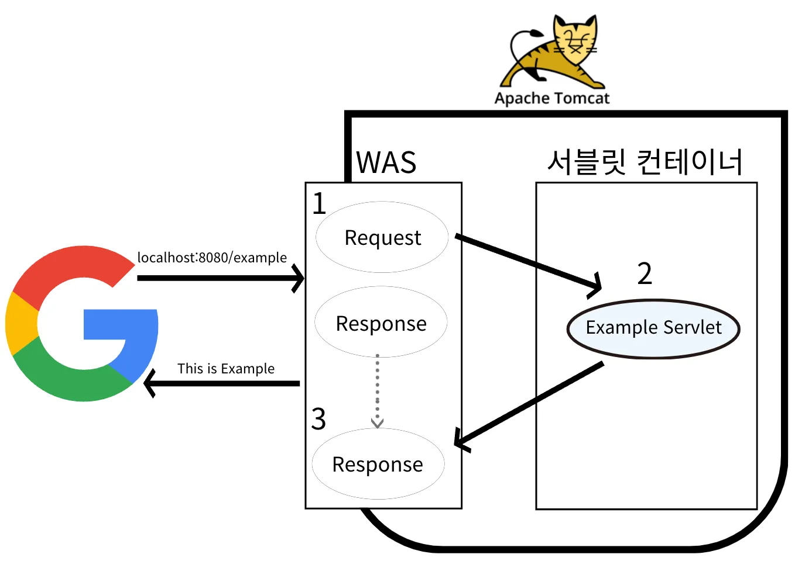

## SQL

*  [식품분류별 가장 비싼 식품의 정보 조회하기](https://school.programmers.co.kr/learn/courses/30/lessons/131116)

- [5월 식품들의 총매출 조회하기](https://school.programmers.co.kr/learn/courses/30/lessons/131117)

## 알고리즘

- [소수 만들기](https://school.programmers.co.kr/learn/courses/30/lessons/12977)
  - **static 변수**를 사용하지 않고 **Combination**릏 구현해봄

    

## 오늘 학습한 것

### Network(네트워크)와 Web(웹) 기초

- `Transport Layer`의 `TCP`와 `UDP`
    
    
    | **구분** | **TCP (Transmission Control Protocol)** | **UDP (User Datagram Protocol)** |
    | --- | --- | --- |
    | 연결 방식 | 연결형 (3-Way Handshake로 연결) | 비연결형 (연결 과정 없음) |
    | 신뢰성 | 높음 (데이터 수신 응답(ACK) 확인) | 낮음 (응답을 확인하지 않음) |
    | 전송 순서 | 보장함 (패킷 순서를 맞춤) | 보장하지 않음 (순서 없이 도착) |
    | 속도 | 느림 (신뢰성 보장 장치들로 인한 오버헤드) | 빠름 (단순한 전송에 집중) |
    | 주요 특징 | 흐름/혼잡 제어, 오류 제어 등 복잡한 기능 | PORT, 체크섬(데이터 무결성 검사) 외 기능 거의 없음 |
    | 주요 사용처 | 신뢰성이 중요한 서비스 (웹, 파일 전송, 이메일) | 속도가 중요한 실시간 서비스 (스트리밍, 온라인 게임, DNS) |
- `Port`: 같은 IP 내에서 프로세스 구분을 하기 위해 사용하며 각 프로토콜의 데이터가 통하는 논리적 통로
- **DNS (Domain Name System)**
사람이 사용하는 **도메인 주소**(`google.com`)를 컴퓨터가 통신할 때 사용하는 **IP 주소로 변환**하는 시스템
- **URI, URL, URN의 관계**
    - **URI**는 인터넷 자원을 식별하는 가장 큰 개념
    - 특정인의 신원(URI)을 집 주소(URL)로 나타낼 수도 있고, 주민등록번호(URN)로 나타낼 수도 있는 것과 비슷
    - **URL (Locator)**: 자원의 **위치**(**주소**)를 나타냄, 우리가 브라우저에 입력하는 주소
    - **URN (Name)**: 자원의 **고유한 이름**을 나타냅니다. 현재 웹에서는 거의 사용되지 않음
      - URN의 개념은 이상적이지만, 이를 해석하여 실제 리소스 위치(URL)로 변환해주는 리졸버 시스템(Resolver System)이 대중화되지 않았기 때문
    - **결론**: 사실상 오늘날 웹에서는 **URL이 URI의 대부분을 차지**하므로, 많은 경우 둘을 같은 의미로 사용
- **URL의 구조**`https://www.google.com:443/search?q=hello#top`
    - `https`: **어떻게** 통신할지 (프로토콜/Scheme)
    - `www.google.com`: **어디로** 갈지 (호스트/Host)
    - `:443`: **몇 번 창구**로 갈지 (포트/Port, 보통 생략)
    - `/search`: **어떤 경로**의 자원인지 (경로/Path)
    - `?q=hello`: **무슨 조건**으로 보여줄지 (쿼리/Query)
    - `#top`: 페이지의 **어느 위치**로 갈지 (프래그먼트/Fragment)

- `JSON(JavaScript Object Notation)`
    - 데이터를 교환하기 위한 텍스트 기반의 형식
    
    ```json
    {
      "user": [
        {
          "first_name": "wonuk",
          "last_name": "Hwang",
          "age": 100,
          "phone_agree": false,
          "hobby": ["Java", "Spring"]
        },
        {
          "firstName": "sparta",
          "lastName": "Team",
          "age": 200,
          "phone_agree": true,
          "hobby": ["React", "Spring", "Node"]
        },
      ]
    }
    
    ```
    
    - **`snake_case, camelCase`** 모두 사용이 가능하다.
        - 우리가 만드는 Application 내에서 변환해주는 **무엇인가**가 있다.
        - Jackson, Gson과 같은 직렬화/역직렬화 라이브러리
    - **`key-value` 형태**로 구성되어 있다.
    - `null, number, string, array, object, boolean` 형태의 데이터를 사용할 수 있다.
- **Stateful vs Stateless**
    
    
    | **구분** | **Stateful (상태 유지)** | **Stateless (무상태)** |
    | --- | --- | --- |
    | **상태 저장** | 🖥️ **서버**가 클라이언트의 상태를 저장하고 기억함 | 🙅‍♂️ **서버가 상태를 저장하지 않음** (클라이언트가 상태 정보를 보냄) |
    | **서버 의존성** | **높음** (항상 같은 서버와 통신해야 함) | **없음** (아무 서버와 통신해도 됨) |
    | **확장성** | 👎 **낮음** (서버 증설(Scale-out)이 어려움) | 👍 **높음** (서버 증설이 쉬워 트래픽 급증에 유리) |
    | **데이터 전송량** | 상대적으로 **적음** | 상태 정보를 매번 보내야 하므로 **많아짐** |
    | **장점** | 서버가 대화의 맥락을 알고 있어 통신이 단순해짐 | 서버 확장성이 뛰어나고, 서버 장애에 유연하게 대처 가능 |
    | **단점** | 서버 장애 시 상태 정보가 유실될 수 있으며, 서버 부하가 큼 | 클라이언트가 매 요청마다 더 많은 데이터를 전송해야 함 |
- **Connection vs. Connectionless**
    
    
    | **구분** | **Connection (연결형)** | **Connectionless (비연결형)** |
    | --- | --- | --- |
    | **연결 유지** | ✅ **유지함** (한 번 맺은 연결을 계속 사용) | ❌ **유지하지 않음** (요청/응답 후 바로 연결 해제) |
    | **서버 자원** | 연결 유지를 위해 자원을 계속 소모하여 **낭비**될 수 있음 | 최소한의 자원만 사용하여 **효율적** |
    | **응답 속도** | 이미 연결되어 있어 다음 요청에 대한 응답이 **빠름** | 매 요청마다 연결을 새로 맺어야 해서 **느릴 수 있음** |
    | **현대의 해결책** | - | HTTP 지속 연결(Persistent Connections)로 단점을 보완함 |

### HTTP

- **HTTP 특징**
    - **무상태 (Stateless):** 서버가 클라이언트의 이전 요청 상태를 기억하지 않음.
    - **비연결성 (Connectionless):** 요청-응답 후 연결을 끊음. (HTTP/1.1의 Keep-Alive로 보완)
- **HTTP 메시지 구조**
    - **시작 라인 (Start-line):** 요청 또는 응답의 시작. 메서드, 경로, HTTP 버전 / 상태 코드, 이유 구문 포함.
    - **헤더 (Headers):** 요청/응답에 대한 부가 정보(메타데이터)를 담는 `Key:Value` 쌍.
    - **본문 (Body):** 전송하려는 실제 데이터(HTML, JSON 등)가 담기는 부분.
- **HTTP 메서드**

    | 메서드 | 주요 용도 |
    | --- | --- |
    | **GET** | 리소스 조회 |
    | **POST** | 데이터 전송 및 리소스 생성 |
    | **PUT** | 리소스 전체 교체 (없으면 생성) |
    | **PATCH** | 리소스 부분 수정 |
    | **DELETE** | 리소스 삭제 |

---

- **HTTP 메서드 속성**

    | 속성 | 설명 | 예시 메서드 |
    | --- | --- | --- |
    | **안전 (Safe)** | 호출해도 리소스가 변경되지 않음. | GET, HEAD |
    | **멱등성 (Idempotent)** | 여러 번 호출해도 결과가 한 번 호출한 것과 같음. | GET, PUT, DELETE |
    | **캐시 가능 (Cacheable)** | 응답 결과를 재사용하기 위해 캐시에 저장 가능. | GET, HEAD, POST |

- **HTTP 상태 코드**

    | 코드 | 의미 |
    | --- | --- |
    | **1xx** | 정보 응답 (요청 처리 중) |
    | **2xx** | 성공 응답 (요청 정상 처리) |
    | **3xx** | 리다이렉션 (다른 URL로 재요청 필요) |
    | **4xx** | 클라이언트 오류 (잘못된 문법 등 요청 오류) |
    | **5xx** | 서버 오류 (서버가 요청 수행 실패) |
- **HTTP API 설계**
    - API의 URI는 동사가 아닌 **명사(리소스)**를 중심으로 설계함.
    - 리소스에 대한 행위는 **HTTP 메서드**로 표현함. (예: `GET /users/123`)

---

- **HTTP 헤더**
    - 클라이언트와 서버가 요청 또는 응답으로 부가적인 정보를 전송할 수 있게 해주는 `Key:Value` 값.
    - 용도에 따라 일반(General), 요청(Request), 응답(Response) 헤더 등으로 분류됨.
- **HTTP 헤더 모음집**

    | 헤더 | 설명 |
    | --- | --- |
    | **Host** | 요청하는 서버의 도메인 이름. |
    | **Content-Type** | 본문(Body)에 포함된 데이터의 타입. |
    | **Authorization** | 사용자의 인증 정보를 담는 헤더. |
    | **Location** | 3xx 응답 시 리다이렉트할 URL. |
- **Restful API**
    - HTTP를 사용하여 자원(Resource)을 URI로 표현하고, 해당 자원에 대한 행위(CRUD)를 HTTP 메서드로 정의하는 아키텍처 스타일.
    - 무상태(Stateless), 캐시 가능(Cacheable) 등의 제약 조건을 따름.

### Web Application

- `Web Server`
    - HTTP 기반으로 동작하며 **정적 리소스**(HTML, CSS, JS, 이미지 등)를 제공
    - NGINX, Apache
- `WAS`
    - HTTP 기반으로 동작하며 웹 서버의 기능을 포함한다. 추가적으로 코드를 실행해서 Application 로직을 수행하고 DB와 상호작용하여 동적 컨텐츠를 생성
    - Tomcat, Jetty, Undertow
- `Servlet`
    - Servlet은 HTTP 프로토콜 기반 요청(Request) 및 응답(Response)을 처리하는데 사용
    - Java에서 Sevlet은 HttpServlet 클래스를 상속받아 구현
    
        
    
    1. WAS는 HTTP 요청 메세지를 기반으로 새로운 Request, Response 객체 생성
    2. WAS는 만들어진 Request, Response 객체를 서블릿 컨테이너에 넘겨주며 ExampleServlet 객체 호출
    3. ExampleServlet에서 비지니스 로직 처리
    4. 응답에 필요한 정보를 개발자가 입력
    5. WAS는 Response 객체 정보(개발자가 입력한 정보)로 HTTP 응답 메세지 생성
- **Servlet Container**
    - Servlet을 지원하는 WAS 내부에는 **Servlet Container**가 존재함
    - 서블릿 컨테이너는 서블릿을 초기화, 생성, 관리, 호출, 종료하는 역할을 수행
        - Servlet 객체를 `싱글톤`으로 관리
    - 동시 요청에 대한 처리를 위해 `Multi Thread`를 지원
- **SSR과 CSR**
    
    
    | **구분** | **SSR (서버 사이드 렌더링)** | **CSR (클라이언트 사이드 렌더링)** |
    | --- | --- | --- |
    | 렌더링 위치 | 🖥️ 서버에서 HTML을 완성하여 전달 | 🌐 클라이언트 (웹 브라우저)에서 JS로 HTML 생성 |
    | 초기 로딩 속도 | 🚀 빠름 (완성된 페이지를 바로 보여줌) | 🐢 느림 (JS 파일을 다운로드 후 렌더링 시작) |
    | 페이지 전환 속도 | 🐢 느림 (매번 서버에 새 페이지 요청) | 🚀 빠름 (필요한 데이터만 받아와 부분적으로 교체) |
    | SEO 최적화 | ✅ 유리 (검색 엔진이 완성된 HTML을 수집) | ❌ 불리할 수 있음 (JS 실행을 못 하면 내용 파악 불가) |
    | 서버 부하 | 높음 (모든 페이지 렌더링을 서버가 담당) | 낮음 (API 요청 처리만 담당) |
    | 대표 기술/영역 | JSP, Thymeleaf | React, Vue |

## 더 알아볼 것 / 다음에 할 것

- static 변수 없이 Permutation과 Subset을 Java로 구현하기
- 브라우저에 URL을 입력하면 일어나는 일
- Servlet Container와 WAS의 엄밀한 구분
- Java와 WAS에서의 Thread 및 Multi-Thread 전략