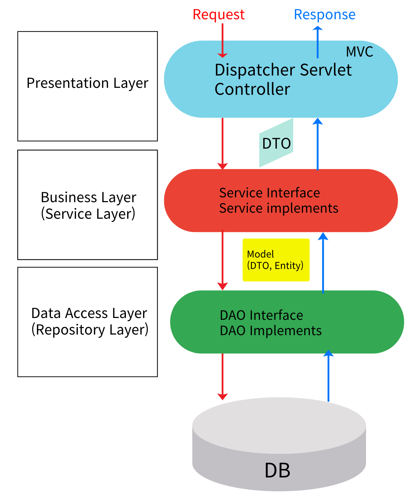
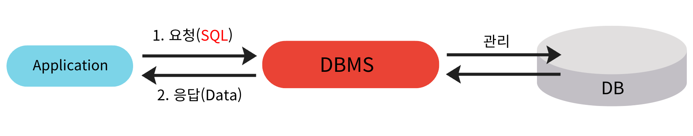
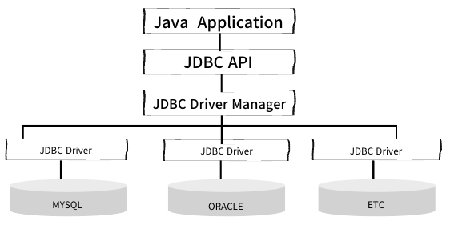

## Spring 6회차

### Layered Architecture

- 기존 MVC 패턴의 아쉬운 점 → **Fat Controller**
    - Cotroller가 너무 비대함
        1. 요청 접수
        2. 유효성 검증
        3. 비즈니스 로직 수행
        4. DB 접근
        5. View or Data 응답

- Layered Architecture 를 통해 MVC 패턴을 보완 → **Fat Model, Skinny Controller**
- 컨트롤러가 떠맡고 있던 역할들을 분리하여, 원래 모델이 담당해야 할 영역을 Service와 Data Access로 분리
- **계층별 역할**
    - **Controller (`Presentation Layer`)**: 사용자의 요청/응답 처리.
        - @Controller
        - @RestController
    - **Service (`Business Layer`)**: 비즈니스 로직 및 트랜잭션 처리.
        - @Service
    - **Repository (`Data Access Layer`)**: 데이터베이스 연동 및 데이터 관리(CRUD).
        - @Repository
- **Model**
    - **DTO (`Data Transfer Object`)**: 계층 간 데이터 전달을 위한 객체.
    - **Entity:** JPA에서 데이터베이스 테이블에 저장된 데이터에 대응되는 자바 클래스.

### Database, RDBMS 그리고 SQL

**데이터베이스(DB) 기본 개념**

- **데이터베이스(Database)**: 여러 사람이 공유하고 사용할 목적으로 관리되는 데이터의 집합.
- **DBMS(Database Management System)**: DB를 관리하고 운영하는 소프트웨어.
    - **주요 기능**: 데이터 정의, 관리, 보안, 트랜잭션 관리(ACID 속성 보장), 백업 및 복구, 동시성 제어.
    - **종류**: 관계형(RDBMS), 비관계형(NoSQL), 다중 모델.
- **트랜잭션(Transaction)**: 모두 성공하거나 모두 실패해야 하는 하나의 논리적 작업 단위.
    - **ACID** 속성 보장
        - **Atomicity**: 트랜잭션의 모든 작업이 성공적으로 완료되거나, 실패 시 모든 작업이 롤백
        - **Consistency**: 트랜잭션이 데이터베이스를 일관된 상태로 유지
        - **Isolation**: 동시에 실행되는 트랜잭션 간의 영향을 최소화
        - **Durability**: 트랜잭션이 완료된 후 데이터의 변경 사항은 영구적으로 저장

---

**관계형 데이터베이스 (RDBMS)**

- **정의**: 데이터를 **테이블(Table)** 형식으로 관리하며, 테이블 간의 **관계**를 통해 데이터를 연결.
- **구성 요소**:
    - **테이블**: 행(Row)과 열(Column)으로 구성된 데이터 구조.
    - **키(Key)**:
        - **기본 키 (Primary Key)**: 각 행을 고유하게 식별 (중복X, NULL X).
        - **외래 키 (Foreign Key)**: 다른 테이블의 기본 키를 참조하여 관계를 설정.
        - **유일 키 (Unique Key)**: 중복 값을 허용하지 않음 (NULL 허용).
- **주요 특징**:
    - **SQL**: 데이터 관리를 위한 표준 언어.
    - **데이터 무결성**: 제약 조건을 통해 데이터의 정확성, 일관성 유지.
        - **엔터티 무결성**
            - 각 테이블의 기본 키(PK)가 중복되지 않고 NULL 값이 아닌 상태를 유지한다.
        - **참조 무결성**
            - 외래 키(FK)를 통해 참조되는 데이터가 유효성을 유지하도록 보장한다.
        - **도메인 무결성**
            - 각 열이 정의된 데이터 타입과 제약 조건에 따라 유효한 값을 유지하도록 한다.
    - **정규화**: 데이터 중복을 최소화하는 구조화 과정.
    - **인덱스**: 특정 열의 검색 성능을 향상시키는 기능.

---

**SQL (Structured Query Language)**

- **정의**: RDBMS에서 데이터를 정의, 조작, 제어하기 위한 표준 언어.
- **SQL 종류**:
    - **DDL (데이터 정의어)**: `CREATE`, `ALTER`, `DROP` (구조 정의).
    - **DML (데이터 조작어)**: `INSERT`, `UPDATE`, `DELETE` (데이터 조작).
    - **DQL (데이터 질의어)**: `SELECT` (데이터 조회).
    - **DCL (데이터 제어어)**: `GRANT`, `REVOKE` (권한 관리).
    - **TCL (트랜잭션 제어어)**: `COMMIT`, `ROLLBACK` (트랜잭션 관리).

---

### **MySQL 주요 문법**

- **자료형**:
    - **숫자형**: `INT`, `BIGINT`(정수), `DECIMAL`(고정 소수점), `DOUBLE`(부동 소수점).
    - **날짜형**: `DATE`, `DATETIME`, `TIMESTAMP`.
    - **문자형**: `CHAR`(고정 길이), `VARCHAR`(가변 길이), `TEXT`(긴 문자열).
- **제약 조건 (Constraint)**: 데이터 무결성을 위한 규칙.
    - `AUTO_INCREMENT`: 1씩 자동 증가하는 고유번호 생성.
    - `NOT NULL`: `NULL` 값 입력 방지.
    - `UNIQUE`: 중복 값 입력 방지.
    - `PRIMARY KEY`: 기본 키 설정.
    - `FOREIGN KEY`: 외래 키 설정 (`CASCADE` 옵션으로 참조 데이터 동시 삭제/수정 가능).
    - `DEFAULT`: 값 미입력 시 기본값 설정.
- **JOIN**: 두 개 이상의 테이블을 연결하여 데이터 검색.
    
    ](img/2025-07-30-til-image-3.png)
    
    출처 : [https://medium.com/@aakriti.sharma18/joins-in-sql-4e2933cedde6](https://medium.com/@aakriti.sharma18/joins-in-sql-4e2933cedde6)
    
    - **INNER JOIN**: 두 테이블에 공통으로 존재하는 행만 반환 (교집합).
    - **LEFT JOIN**: 왼쪽 테이블의 모든 행을 기준으로, 오른쪽 테이블의 일치하는 행을 반환.
    - **RIGHT JOIN**: 오른쪽 테이블의 모든 행을 기준으로, 왼쪽 테이블의 일치하는 행을 반환.

### **Java와 데이터베이스 연동**

- **JDBC (Java Database Connectivity)**: Java에서 DB와 상호작용하기 위한 표준 인터페이스.
    - `Statement`보다 `PreparedStatement` 사용 권장 (?를 이용한 preCompile 을 통한 성능 우위 및 보안, SQL Injection 방지).
- **Persistence Framework**: JDBC의 복잡성을 줄이고 DB 연동을 단순화 → 개발자는 비즈니스 로직에만 집중
    - 공통적으로 **영속성(Persistence)**을 가짐
        - 데이터를 생성한 프로그램의 실행이 종료되더라도 사라지지 않는 데이터의 특성, 영구히 저장되는 특성
    - **SQL Mapper (ex. Spring `JdbcTemplate`, `MyBatis`)**: 개발자가 작성한 SQL의 결과를 객체에 자동으로 매핑.
        - 객체지향 보다는 DB에 대한 처리에 대해 집중하게 됨 → **SQL에 의존적인 데이터 중심의 개발.**
    - **ORM (ex. `JPA`)**: 객체를 중심으로 작업하여 관계형 DB를 자동으로 생성 및 매핑 (패러다임 불일치 문제 해결).
        - 객체지향 패러다임 불일치를 해결 → **객체 중심의 개발.**

# 더 알아볼 내용 / 다음에 할 내용

- **영속성 컨텍스트(Persistence Context)** 동작 방식 이해를 통한 1차 캐시, 변경 감지, 지연 로딩의 이해
- `@Transactional`의 동작 원리
- 연관관계 매핑
- 자주 사용되는 SQL에 대한 이해
- 전역 예외 처리와 DTO Validation 검증