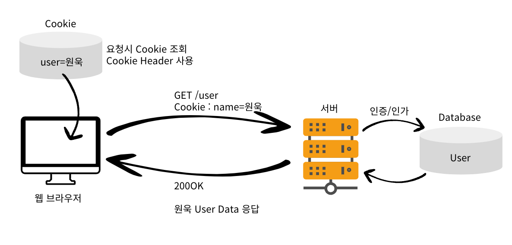

<!-- TOC -->

- [1. 오늘 학습한 내용](#1-오늘-학습한-내용)
  - [1.1. Cookie](#11-cookie)
  - [1.2. Session](#12-session)
  - [1.3. Token \& JWT](#13-token--jwt)
  - [1.4. Filter와 Servlet Filter](#14-filter와-servlet-filter)
- [2. 더 알아볼 내용 / 다음에 할 내용](#2-더-알아볼-내용--다음에-할-내용)

<!-- /TOC -->

# 1. 오늘 학습한 내용

## 1.1. Cookie

- **Cookie를 사용하는 이유**
    - HTTP는 **Stateless, Connectionless**
        
        → 이전 요청에 대한 정보를 기억하지 못함
        
    - 그러나, 로그인처럼 상태 유지가 필요한 경우가 존재 (심지어 브라우저가 종료되더라도!)
    - 가장 쉬운 방법은 **클라이언트에서 전달하는 Request에 사용자 정보를 포함**
- **Cookie 생성**
    - 서버에서 로그인 정보 확인
    - Set-Cookie를 활용해 Cookie에 사용할 값 저장
        - **쿠키에 민감 정보를 저장하고 있는 건 아닌지 항상 주의**
- **Cookie 동작**
    
    
    
    - 로그인 이후에는 **모든 요청마다 Request Header에 항상 Cookie 값을 담아서 요청**
        - 네트워크 트래픽이 추가적으로 발생 → **최소한의 정보**만 사용
    - **Cookie**에 담겨있는 값으로 인증/인가 를 진행
- **로그인, 로그아웃과 쿠키**
    - 로그인은 쿠키를 생성하는 과정이다.
    - 로그아웃은 쿠키를 만료시키는 과정이다.
- **Cookie 관련 HTTP Header**
    1. `Set-Cookie`
        - Server에서 Client로 Cookie 전달**(Response Header)**
        
        ```java
        Set-Cookie: <cookie-name>=<cookie-value>
        Set-Cookie: <cookie-name>=<cookie-value>; Domain=<domain-value>
        Set-Cookie: <cookie-name>=<cookie-value>; Expires=<date>
        Set-Cookie: <cookie-name>=<cookie-value>; HttpOnly
        Set-Cookie: <cookie-name>=<cookie-value>; Max-Age=<number>
        Set-Cookie: <cookie-name>=<cookie-value>; Partitioned
        Set-Cookie: <cookie-name>=<cookie-value>; Path=<path-value>
        Set-Cookie: <cookie-name>=<cookie-value>; Secure
        
        Set-Cookie: <cookie-name>=<cookie-value>; SameSite=Strict
        Set-Cookie: <cookie-name>=<cookie-value>; SameSite=Lax
        Set-Cookie: <cookie-name>=<cookie-value>; SameSite=None; Secure
        
        // Multiple attributes are also possible, for example:
        Set-Cookie: <cookie-name>=<cookie-value>; Domain=<domain-value>; Secure; HttpOnly
        
        ```
        
        - `Expires`, `Max-Age`
            - **세션 Cookie**: 만료 날짜를 생략하면 브라우저 완전 종료시까지만 유지 (디폴트)
            - **영속 Cookie**: 만료 날짜를 입력하면 해당 날짜까지 유지
                - `expires=Sat, 11-Dec-2024 00:00:00 GMT;`
                    - 해당 만료일이 도래하면 쿠키가 삭제된다.
                - `max-age=3600` (second, 3600초는 한시간. 60 * 60)
                    - 0이 되거나 음수를 지정하면 쿠키가 삭제된다.
        - `Domain`
            - 서브 도메인에서도 접근 가능
            - 현재 문서 기준 도메인만 적용
        - `Path`
            - 1차적으로 Domain으로 필터링 후 Path 적용
            - 일반적으로 `path=/` 루트(전체로)로 지정
        - `Secure`
            - Secure를 적용하면 HTTP는 제외하고, HTTPS인 경우에만 전송
        1. `HttpOnly`
            - **XSS(Cross-site Scripting) 공격을 방지**
                - 악성 스크립트를 웹 페이지에 삽입하여 다른 사용자의 브라우저에서 실행되도록 하는 공격
            - **자바스크립트에서 Cookie 접근을 못하도록 막는다.**
            - **HTTP 요청시 사용**
        2. `SameSite`
            - 비교적 최신 기능이라 **브라우저 지원여부를 확인** 필요
            - **CSRF**(Cross-Site Request Forgery) **공격을 방지**
                - 사용자가 의도하지 않은 상태에서 특정 요청을 서버에 전송하게 하여 사용자 계정에서 원치 않는 행동을 하게 만든다.
            - 요청 도메인과 쿠키에 설정된 도메인이 같은 경우만 쿠키 전송
    2. `Cookie`
        - Client가 식별에 필요한 정보를 저장하고 HTTP 요청시 Server로 전달**(Request Header)**
- **Cookie 단점**
    1. 임의 변경 가능
    2. 네트워크에서 탈취되기 쉬움
- **Cookie 단점 대처 방법**
    1. 민감 정보 저장 X
    2. 쿠키 자체에 일반 유저나 해커가 식별할 수 없는 값들이나 변경하기 어려운 값 사용
        - session의 sessionId나 token 등 개인을 식별하기 어려운 값
            - `JWT`는 특별한 보안수단이 아니라 표준화된 token 데이터 포맷 → **위조여부 판단**이 목적
        - 접속기기 혹은 IP 등 변경하기 어려운 값 사용
    3. 비즈니스와 보안을 고려하여 적절한 만료시간 설정

## 1.2. Session

- Client가 아니라 Server에서 유저 정보를 관리하며 로그인 연결을 유지하는 방법
- **Session 생성 순서**
    
    
    
    1. 로그인에 성공하면 Server에서 임의로 만든 Session ID를 생성
        - Session ID는 예측이 불가능해야 함
        - **UUID**와 같은 값을 활용
    2. 생성된 Session ID와 조회한 User 인스턴스를 서버의 Session 저장소에 저장
        - 서버에 유저와 관련된 중요한 정보를 저장
- **Session 동작 순서**
    1. 로그인
        - 상태유지를 위해 **Cookie를 사용**
            - 서버는 클라이언트에 `Set-Cookie: SessionId=임의생성값` 을 전달
            - 클라이언트는 **Cookie 저장소에 전달**받은 `SessionId` 값을 저장
        - Sessions을 사용하면 **유저와 관련된 정보는 클라이언트에 없음**
    2. 로그인 이후 요청
        - 클라이언트는 모든 요청에 `Cookie` 의 `SessionId`를 전달
        - 서버에서는 `Cookie`를 통해  전달된 `SessionId`로 Session 저장소를 조회
        - 로그인 시 저장하였던 **Session 정보를 서버에서 사용**
- **Session 특징**
    1. Session을 사용하여 서버에서 민간한 정보를 관리
    2. 쿠키에 저장하는 Session ID는 식별하기 어려운 UUID같은 형태 사용
        - Session ID 자체에 사용자 식별이 가능한 정보가 없음
        - 만료나 제거 등 서버에서 컨트롤할 수 있음
    3. `Servlet`에서 지원
- **Servlet에서 지원하는** `HttpSession`
    - Servlet 차원에서 지원함
    - `JSESSIONID`로 생성되며, 예측 불가능한 값으로 생성됨
    - 주요 메서드
        1. `session.getId():` jsessionId 값을 조회
        2. `session.getMaxInactiveInterval():` 세션의 유효시간, second 단위 default는 30분
        3. `session.getCreationTime():` 세션 생성시간
        4. `session.getLastAccessedTime():` **해당 세션에 마지막으로 접근한 시간**
            - **주로 Session 생명 유지에 사용**
                - `LastAccessedTime` 을 기준으로 30분이 지나면 WAS가 내부적으로 세션을 삭제
        5. `session.isNew():` 새로 생성된 세션인지 여부
- **Spring과 Session**
    - `@SessionAttribute`
        - 이미 로그인이 완료된 사용자를 찾는 경우 즉, Session이 있는 경우에 사용
- **Session의 단점**
    - HTTP는 Connectionless 특성을 가지고 있어서 **서버가 브라우저 종료 여부를 판별할 수 없음**
        - 사용자의 로그아웃에 따라 온전히 Session을 삭제하기 어려움 → 그냥 브라우저를 닫는 경우
        - Session을 언제 삭제해야 하는지 판단하기 어려움
    - 서버가 DB 혹은 **메모리**에 저장된 세션 정보를 매번 조회하여 오버헤드가 발생
    - 서버가 상태를 유지해야 하므로 **사용자 수가 많아질수록 부담이 커짐**
    - Cookie는 **웹 브라우저에만 존재하여 모바일 앱 등의 다양한 클라이언트에서 인증을 처리할 수 없음**
    - Scale Out(수평적 확장)에서 **서버간 세션 공유가 어려움**
        - 로드밸런서가 다시 로그인할 때 기존과 다른 서버를 배정하게 되면 **이전 세션 정보가 공유되어야 세션이 유지됨**

## 1.3. Token & JWT

- 사용자 또는 시스템의 신원과 권한을 증명하고 요청의 유효성을 검증하는 데 **사용되는 디지털 문자열**
    - 즉, 데이터를 표현하는 형식!
- **Token을 사용하는 이유**
    1. Token은 서버가 아닌 클라이언트에 저장되어 **서버의 부담을 덜 수 있다.**
    2. Cookie는 웹 브라우저에만 존재하여 모바일 앱 등의 다양한 클라이언트에서 인증을 처리할 수 없다.
    3. Token 방식은 Stateless를 기반으로 하여 **확장성이 뛰어나다.**
    4. 인증된 사용자임을 확인하기 위한 고유한 **서명**을 포함하여 **위조된 요청인지 확인할 수 있다.**
- **Token 동작순서**
    
    
    
    - Token 생성 시 **사용자의 고유한 정보를 포함**
    - 데이터베이스에 접근하지 않고 **Token의 유효성만 검증**
- **Token의 단점**
    1. Cookie/Session 방식보다 **Token 자체의 데이터 용량이 많음**
    2. 클라이언트에 저장하는 방식의 단점은 공유 → 쿠키의 단점과 유사
- **JWT**
    - 인증에 필요한 정보들을 **암호화시킨 JSON 형태의 규격화된 Token**
    - Header, Payload, Signature로 구성, 모든 key값은 3글자로 규정
    - base64UrlEncode를 사용하여 토큰화
    
    ```java
    XXXXXX.YYYYYY.ZZZZZZ
    (Header).(Payload).(Signature)
    ```
    
    1. **Header**
        - 토큰의 타입과 해싱 알고리즘을 정의
            
            ```json
            {
            	"alg": "HS256",
            	"typ": "JWT"
            }
            ```
            
    2. **Payload**
        - 실제로 인증과 관련된 데이터(`Claims`)를 담고 있음
        - Claims의 종류
            - **Registered Claims :** 미리 정의된 Claims
                - iss(issuer) : 발행자
                - exp(expiration time) : 만료시간
                - sub(subject) : 제목
                - iat(issued At) : 발행 시간
                - jti(JWT ID) : 토큰의 고유 식별자
            - **Public Claims :** 사용자가 정의할 수 있는 클레임, 공개용 정보 전달 목적
            - **Private Claims :** 사용자 지정 클레임, 당사자들 간에 정보를 공유하기 위한 목적
    3. **Signature**
        - **Header와 Payload를 서버의 `Secret Key`로 서명하여 암호화**
        - 암호화는 Header에서 정의한 알고리즘(alg)을 활용
        - 서명을 통해 서버는 **Token이 변조되지 않았음을 확인**할 수 있음 → **이게 목적!**
            - 특별한 암호화를 통해 보호하려는 것보다 변조여부를 확인하는 것이 핵심
    

## 1.4. Filter와 Servlet Filter

- **공통 관심사(Cross Cutting Concern)를 중앙 집중식으로 처리할 때 사용**
    - 공통 관심사를 처리할 수 있는 방법 3가지
        1. `Servlet Filter`
        2. `Spring Intercepter`
        3. `Spring AOP`
    - Web과 관련된 공통 관심사는 주로 **Servlet Filter**나 **Spring Intercepter**를 사용
        - **`HttpServletRequest` 객체를 제공하기 때문에 HTTP 정보나 URL 정보에 접근하기 쉬움**
- **위와 같은 도구가 없다면?**
    - 로그인 한 유저만 특정 API를 사용할 수 있도록 하게 하려면?
        - 인증이 필요한 모든 컨트롤러에 공통으로 로그인 여부를 체크해줘야 함
            - 코드 중복 발생
            - 심지어 변경이 필요하면 모든 곳을 변경해야 함
- **Servlet Filter**
    - 주로 보안, 로깅, 인코딩, 인증/인가 등 다양한 작업을 처리하기 위해 사용
    - 공통된 로직을 **중앙 집중적으로 구현**하여 재사용성이 높고 유지보수가 쉬움
        - 모든 요청이 **하나의 입구를 통해 처리되어 일관성을 유지**
    - **Servlet 레벨 → HTTP 요청 및 응답에 대한 필터링**
    - `Filter Chain`
        - 여러 개의 필터가 순차적으로 체이닝 가능
        - `filterChain.doFilter(request, response);` 다음 필터로 제어를 전달
    - `doFilter()`
        - 실제 필터링 작업을 수행하는 주요 메소드로 필터가 처리할 작업을 정의
        - 다음 필터로 제어를 넘길지 여부를 결정
    - Filter를 적용하면 **Servlet이 호출되기 이전에 Filter를 항상 거치게됨**
    - 공통 관심사를 필터에만 적용하면 모든 **요청** or **응답**에 적용
- **Filter Interface**
    - Filter Interface를 Implements하여 구현하고 Bean으로 등록하여 사용
    - **주요 메서드**
        1. `init()`
            - Filter를 초기화하는 메서드
            - **Servlet Container가 생성될 때 호출**
            - `default` ****method이기 때문에 implements 후 구현하지 않아도 됨
        2. `doFilter()` → **핵심!**
            - Client에서 요청이 올 때 마다 `doFilter()` 메서드가 호출
                - `doFilter()` 내부에 **필터 로직(공통 관심사 로직)을 구현**하면 됨
            - WAS에서 `doFilter()` 를 호출해주고 하나의 필터의 `doFilter()`가 통과된다면 Filter Chain에 따라서 순서대로 `doFilter()` 를 호출
            - 더이상 `doFilter()` 를 호출할 Filter가 없으면 Servlet이 호출
        3. `destroy()`
            - 필터를 종료하는 메서드
            - **Servlet Container가 종료될 때 호출**
            - `default` method이기 때문에 implements 후 구현하지 않아도 됨
    - **Filter 등록**
        - `WebMvcConfigurer`를 구현하고`FilterRegistrationBean`를 반환하는 메서드를 통해 등록하는 클래스 구현
        - `setFilter()`
            - 등록할 필터를 파라미터로 전달
        - `setOrder()`
            - 파라미터로 전달될 숫자에 따라 우선순위가 정해짐
            - 숫자가 낮을수록 우선순위가 높다.
        - `addUrlPatterns()`
            - 필터를 적용할 URL 패턴을 지정
            - 여러개 URL 패턴을 한번에 지정할 수 있음
            - 규칙은 Servlet URL Pattern과 같음 → 주로
        - `filterRegistrationBean.addUrlPatterns("/*")`
            - 모든 Request는 Custom Filter를 지나감
            - 모든 URL에 대해 통과를 시키고, `doFilter()`를 구현할 때 허용할 URL의 화이트 리스트 목록에 있는지 판단하는 로직으로 URL에 대한 인증 여부를 처리함
- **Spring Security**에서는 표준화된 방식으로 인증/인가 로직을 안전하고 관리하기 쉬운 방식으로 개발할 수 있음

# 2. 더 알아볼 내용 / 다음에 할 내용

- Spring Security의 구조와 내부적 Filter 사용
- 세션+쿠키, JWT+쿠키, JWT+웹 스토리지를 직접 구현하고 장단점 느끼기
- 여러 클라이언트 및 구현 환경에서는 어떤 형태의 조합을 유지보수 및 관리 입장에서 선호하는지

---

**참고**
- [MDN Web Docs Set-Cookie - HTTP](https://developer.mozilla.org/ko/docs/Web/HTTP/Reference/Headers/Set-Cookie)