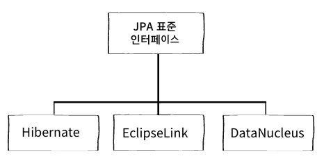
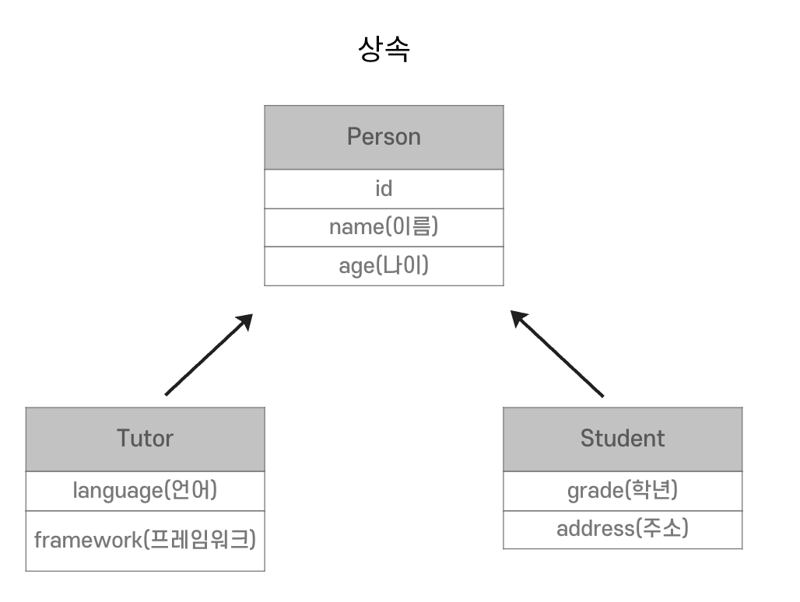
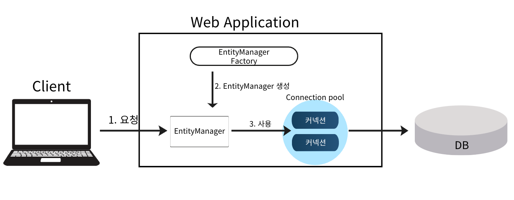
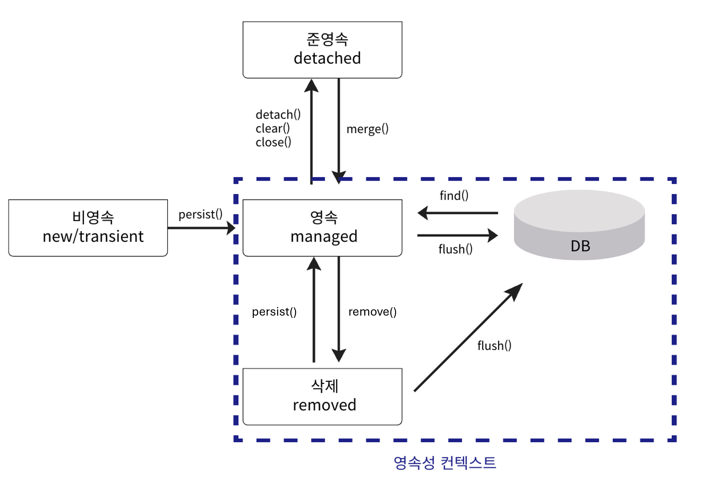
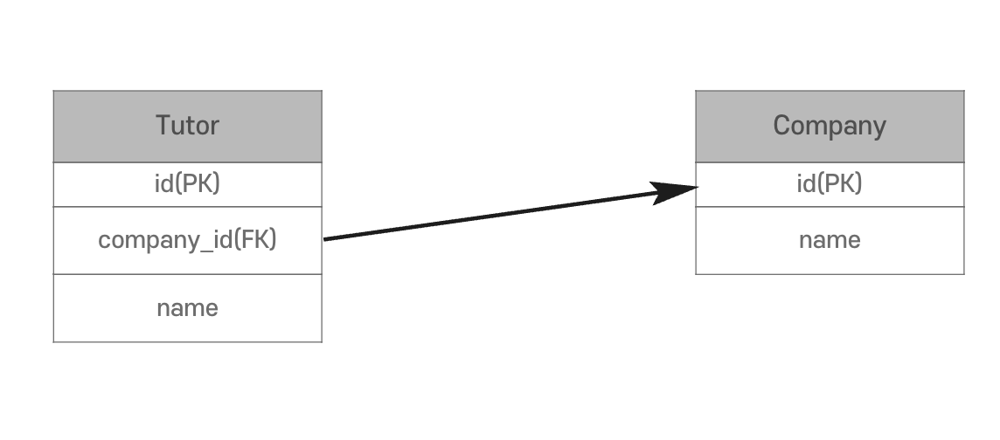
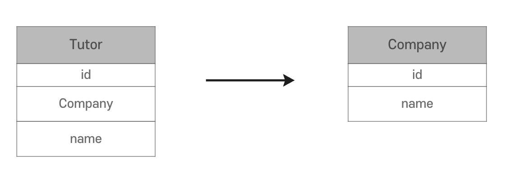
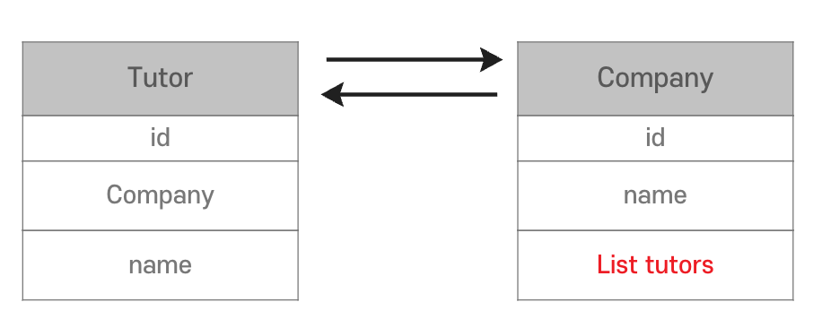
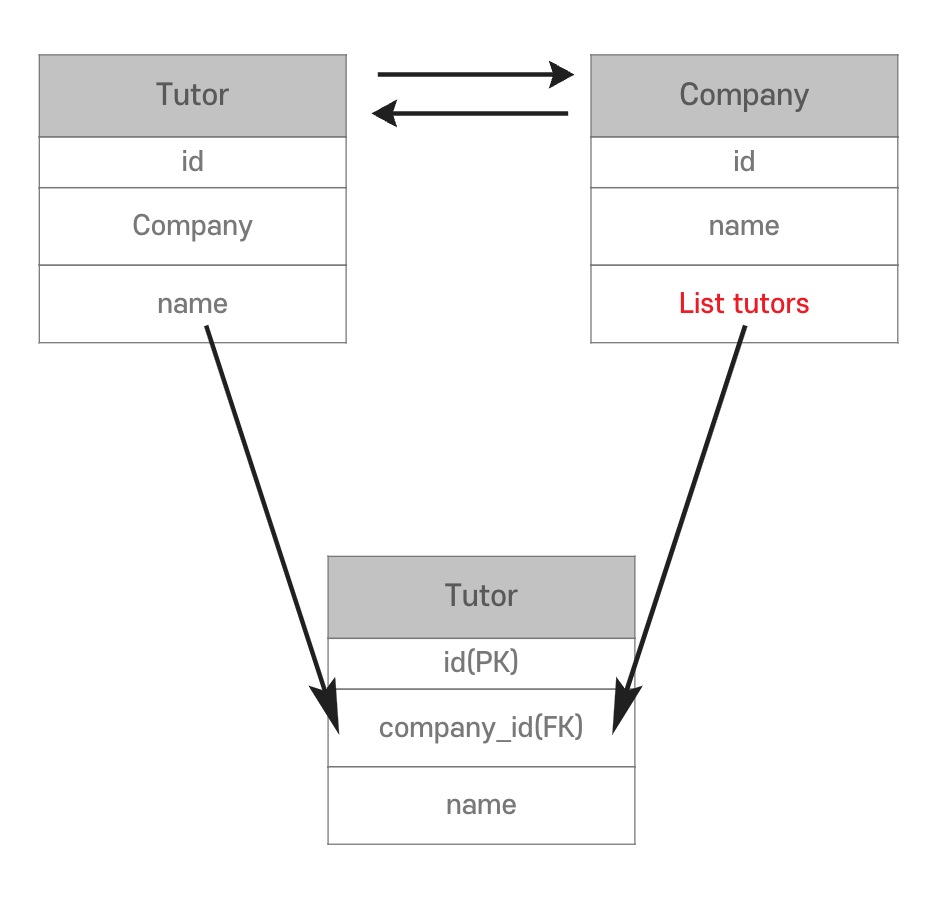
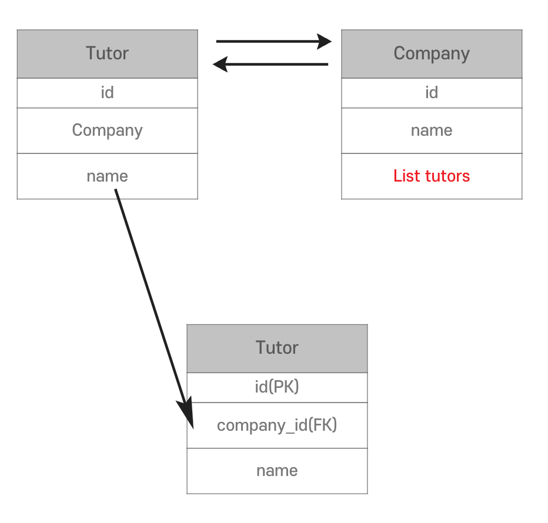

# 오늘 학습한 내용

## 객체 지향 프로그래밍과 관계형 데이터베이스의 패러다임 불일치

- RDBMS에 객체를 저장할 때 발생하는 문제점
    1. 엔티티(도메인)별 CRUD 반복 구현 필요
        - 기본적인 CRUD 메소드 및 부수적으로 필요한 DTO 등 이 반복적으로 계속 필요함
    2. 객체 수정 발생 시 SQL도 수정 필요 → 결과적으로 **SQL에 의존적인 개발**을 하게 됨
    3. **객체 지향 프로그래밍과 관계형 데이터베이스의 패러다임 불일치**
        1. RDBMS에는 상속이 존재하지 않음
        2. 연관관계 표현 방식이 다름
            1. 객체지향: 참조
            2. RDBMS: 외래 키  → Join 필요
        3. 객체 그래프
            1. 클래스와 달리, 실행된 SQL 만큼만 탐색할 수 있음 → 정작 필요 없는 데이터도 조회하게 됨
        4. 같은 데이터지만 새로운 인스턴스이기 때문에 주소값이 다름
- **JPA**(Java Persistence API) 등장
    - 패러다임 불일치 문제를 해결하고, 객체지향을 살려서 개발할 수 있도록 도와줌

## JPA

- Java의 **ORM** 기술 표준 (인터페이스)
    - **ORM** (Object-Relational Mapping)
        - 객체와 관계형 DB를 자동으로 Mapping하여 패러다임 불일치 문제를 해결
    
    
    
    - 대표적인 구현체로 **Hibernate**를 주로 사용
    - 기존에는 개발자가 JDBC를 직접 사용
    - JPA가 중간에서 개발자의 역할도 일부 대신함
- JPA를 사용하는 이유
    1. **생산성**
        
        ```java
        // 저장
        jpa.persist(tutor);
        // 조회
        Tutor tutor = jpa.find(Tutor.class, tutorId);
        // 수정
        tutor.setName("수정할 이름");
        // 삭제
        jpa.remove(tutor);
        ```
        
        - `persist`란 **영구히 저장**한다는 뜻
        - 마치 **컬렉션에 저장한듯 객체가 저장되어 조회가 간편**
    2. **유지보수성**
        
        ```java
        // 기존
        public class Tutor {
        		private String id;
        		private String name;
        }
         
        // 필드 수정
        public class Tutor {
        		private String id;
        		private String name;
        		private Integer age;
        }
        ```
        
        - 객체 **필드가 수정 되어도 SQL은 JPA가 알아서 처리 ← 더티체킹**
    3. **패러다임 불일치 문제 해결**
        
        
        
    - **상속**
        - 저장 코드
            
            ```java
            jpa.persist(tutor);
            ```
            
        - 저장 JPA
            
            ```java
            INSERT INTO person ..., INSERT INTO tutor ...  
            ```
            
            - 쿼리 실행은 동일하게 2번 필요할 수 있으나, 쓰기 지연을 통해 네트워크 I/O를 줄여줌
        - 조회 코드
            
            ```java
            Tutor tutor = jpa.find(Tutor.class, tutorId);
            ```
            
        - 조회 JPA
            
            ```java
            SELECT * FROM tutor t JOIN company c ON t.company_id = c.id
            ```
            
    - **연관관계**
        
        ```java
        tutor.setCompany(company);
        jpa.persist(company);
        ```
        
        - **Collection처럼 사용할 수 있음**
    - **객체 그래프 탐색**
        
        ```java
        Tutor tutor = jpa.find(Tutor.class, tutorId);
        Company company = tutor.getCompany();
        ```
        
        - **JPA를 사용하면 신뢰할 수 있는 엔티티, 계층이 됨**
            - JOIN or SQL Query 두번 실행은 JPA로 편하게 할 수 있음
    - **객체 비교**
        
        ```java
        Tutor tutor1 = jpa.find(Tutor.class, tutorId);
        Tutor tutor2 = jpa.find(Tutor.class, tutorId);
        
        tutor1 == tutor2; // true
        ```
        
        - 단, 전제조건으로 **동일한 트랜잭션** 필수
1. **성능**
    - **1차 캐시**
        
        ```java
        Tutor tutor1 = jpa.find(Tutor.class, tutorId); // 실행 결과 1차 캐시에 저장
        Tutor tutor2 = jpa.find(Tutor.class, tutorId); // 캐시에서 조회
        
        tutor1 == tutor2; // true
        ```
        
        - SQL Query 한번만 실행
    - **쓰기 지연**
        
        ```java
        // 트랜잭션 시작
        transaction.begin();
        
        jpa.persist(company);
        jpa.persist(tutor1);
        jpa.persist(tutor2);
        
        // 트랜잭션 제출, JDBC BATCH SQL
        transaction.commit();
        ```
        
        - ORM과 같은 중간 기술이 있으면 **한번에 모아서 요청을 보내는것이 가능**
        - **네트워크 통신이 한번만 발생하여 비용이 감소**
    - **지연 로딩, 즉시 로딩**
        
        ```java
        // 지연 로딩
        Tutor tutor = tutorRepository.find(tutorId); // SELECT * FROM tutor
        Company company = tutor.getCompany();
        String companyName = company.getName(); // SELECT * FROM company
        
        // 즉시 로딩
        // SELECT t.*, c.* FROM tutor t JOIN Company c ON
        Tutor tutor = tutorRepository.find(tutorId);
        
        Company company = tutor.getCompany();
        String companyName = company.getName();
        ```
        
        - **지연로딩**
            - **필요할 때만 조회하기 때문에 통신 비용 감소 → 대신 쿼리가 2번 실행**
        - **즉시로딩**
            - **한번만 조회하기 때문에** **네트워크 통신 비용 감소 → 대신 쿼리가 무거워짐**
- hibernate.dialect
    - JPA가 SQL 표준이 아닌 각 데이터베이스에서 지원하는 고유 기능까지 정확하게 이해하고 생성힘

## 영속성 컨텍스트

- **영속성 컨텍스트(PersistenceContext)**
    - **Entity 객체를 영속성 상태로 관리하는 일종의 캐시 역할을 하는 공간**
    - 여기에 저장된 Entity는 데이터베이스와 자동으로 동기화되며 같은 트랜잭션 내에서는 동일한 객체가 유지됨
    
    
    
    - **논리적인 개념**
        - 눈에 보이지 않는 공간
    - **Entity Manager** 를 통해서 영속성 컨텍스트에 접근
        - `EntityManager.persist(entity);`
    - Entity(객체)를 **영속성 컨텍스트에 영속**(저장)
- Entity
    - 저장할 수 있는 데이터의 집합
    - JPA에서는 **데이터베이스의 테이블을 나타내는 클래스를 의미**
- Entity 생명주기
    
    
    
    1. **비영속**(new/transient)
        - 영속성 컨텍스트가 모르는 새로운 상태
        - **데이터베이스와 전혀 연관이 없는 객체**
    2. **영속**(managed)
        - 영속성 컨텍스트에 저장되고 관리되고 있는 상태
        - **데이터베이스와 동기화되는 상태**
    3. **준영속**(detached)
        - 영속성 컨텍스트에 저장되었다가 **분리되어 더 이상 기억하지 않는 상태**
    4. **삭제**(removed)
        - 영속성 컨텍스트에 의해 삭제로 표시된 상태
        - **트랜잭션이 끝나면 데이터베이스에서 제거**
- **1차 캐시**
    - 영속성 컨텍스트에 저장할 때 생성되는 **메모리 내 캐시**
        1. 엔티티는 먼저 1차 캐시에 저장됨
        2. 이후 같은 엔티티를 요청하면 DB를 조회하지 않고 1차 캐시에서 데이터를 반환
            
            → 성능을 높일 수 있음
            
    - **동일한 트랜잭션** 안에서만 사용 가능
- **동일성 보장**
    - **동일한 트랜잭션 안에서 특정 엔티티를 여러 번 조회해도 항상 같은 객체 인스턴스를 반환**
    - 영속성 컨텍스트는 1차 캐시를 사용하여 같은 엔티티를 **중복 조회해도 동일한 객체를 참조하게 하여 일관성을 유지**
- **쓰기 지연**
    - **동일한 트랜잭션 내에서 생성된 SQL들을 Commit 시점에 한꺼번에 반영**
    - `hibernate.jdbc.batch_size`
        - 한 번에 보낼 수 있는 사이즈를 조정가능
    - Entity의 PK 필드에 `*@GeneratedValue*(strategy = GenerationType.IDENTITY)` 를 사용하면 쓰기 지연을 무시하고 SQL Query를 실행
- **더티 체킹 (변경 감지)**
    - 영속성 컨텍스트가 엔티티의 **초기 상태를 저장**하고 **트랜잭션 커밋 시점에 현재 상태와 비교해 변경 사항이 있는지 확인하는 기능**
    - flush
        - **영속성 컨텍스트의 변경 내용을 데이터베이스에 반영하는 기능**
        - 변경된 엔티티 정보를 SQL로 변환해 **데이터베이스에 동기화**
        - 트랜잭션 **커밋 시 자동으로 실행**
        - **특정 시점에 데이터베이스 반영이 필요할 때 수동으로 호출가능**

## Entity

- `@Entity`

```java
@Entity(name = "Tutor") // 기본 값, name 속성은 생략하면 된다.
@Table(name = "tutor")
public class Tutor {

    // PK
    @Id
    private Long id;

    // 필드
    private String name;

    // 기본 생성자
    public Tutor() {
    }

    // 쉽게 사용하기 위해 생성자 추가
    public Tutor(Long id, String name) {
        this.id = id;
        this.name = name;
    }
}
```

- **JPA를 사용하여 객체를 테이블과 매핑할 때 필수**
- **PK 값이 필수** (보통 `@Id` 사용)
- **기본 생성자가 필수**
- `final`, `enum`, `interface`, `inner` 클래스에는 사용할 수 없음
- 필드에 final 키워드를 사용할 수 없다.
- 속성
    - `name`
        - Entity 이름 지정
        - **기본 값은 클래스 이름**과 같음
        - 혼동을 방지하기 위해 **기본 값을 사용(생략)**가능
- **@Table**
    
    ```java
    @Entity
    @Table(name = "tutor")
    public class Tutor {
    }
    ```
    
    - 속성
        - `name`
            - Entity와 매핑할 테이블 이름을 지정
            - 기본 값은 Entity 이름(Tutor)을 사용
        - `catalog`
            - 데이터베이스 catalog 매핑
        - `schema`
            - 데이터베이스 schema 매핑
        - `uniqueConstraints`
            - DDL 생성 시 유니크 제약 조건 설정
- `hibearnate.hbm2ddl.auto`
    
    
    | 값 | 설명 |
    | --- | --- |
    | create | 기존 테이블을 삭제(DROP) 후 다시 생성(CREATE)한다. |
    | create-drop | DROP 후 CREATE 하고 **종료시점에 테이블을 삭제**(DROP)한다. **테스트 시 사용** |
    | update | 변경된 사항만 DDL에 반영한다. |
    | validate | Entity와 테이블이 정상적으로 매핑 되었는지 확인한다. 실패 시 예외 발생 |
    | none | 속성을 사용하지 않는다. |
    - 실무에서는 `validate` 혹은 `none` 을 사용하고 개발 단계에서는 상황에 맞게 사용
- DDL 자동생성 제약조건 설정
    1. **@Column**
        - `unique` : 유니크, 기본값 false
        - `nullable` : 필수 여부, 기본값 true
        - `length` : 길이
    2. **@Table**
        - `uniqueConstraints` : 유니크, 이름을 직접 설정할 수 있음
- DDL을 자동으로 생성할 때만 사용되며 **Application 로직에는 영향이 없음**
- **필드 매핑**
    
    ```java
    @Entity
    @Table(name = "board")
    public class Board {
        @Id
        private Long id;
    
        // @Column을 사용하지 않아도 자동으로 매핑된다.
        private Integer view;
    
        // 객체 필드 이름과 DB 이름을 다르게 설정할 수 있다.
        @Column(name = "title")
        private String bigTitle;
    
        // DB에는 기본적으로 enum이 없다.
        @Enumerated(EnumType.STRING)
        private BoardType boardType;
    
        // VARCHAR()를 넘어서는 큰 용량의 문자열을 저장할 수 있다.
        @Column(columnDefinition = "longtext")
        private String contents;
    
        // 날짜 타입 DATE, TIME, TIMESTAMP를 사용할 수 있다.
        @Temporal(TemporalType.TIMESTAMP)
        private Date createdDate;
    
        @Temporal(TemporalType.TIMESTAMP)
        private Date lastModifiedDate;
        
        @Transient
        private int count;
    
        public Board() {
        }
    
    }
    ```
    
    - **사용되는 Annotation**
        
        
        | 종류 | 설명 |
        | --- | --- |
        | **@Column** | DB 컬럼 매핑에 사용 |
        | @Temporal | 날짜 타입 |
        | @Enumerated | enum 타입 |
        | @Transient | DB 컬럼과 매핑하지 않을 때 사용 |
        | @Lob | tinytext |
    
    - **@Column 속성**
        
        
        | 속성 | 설명 | Default |
        | --- | --- | --- |
        | name | 객체 필드와 매핑할 테이블의 컬럼 이름 | 객체 필드 이름 |
        | nullable | DDL 생성 시 null 값의 허용 여부 설정 | true(허용) |
        | unique | DDL 생성 시 하나의 컬럼에 유니크 제약조건을 설정 |  |
        | columnDefinition | DDL 생성 시 데이터베이스 컬럼 정보를 직접 설정할 수 있다. |  |
        | length | DDL 생성 시 문자 길이 제약조건 설정 단, String만 사용 가능 | 255 |
        | insertable | 설정된 컬럼의 INSERT 가능 여부 | true |
        | updatable | 설정된 컬럼의 UPDATE 가능 여부 | true |
    
    - **@Enumerated**
        
        
        | 속성 | 값 | 설명 | Default |
        | --- | --- | --- | --- |
        | value | EnumType.ORDINAL
        EnumType.STRING | enum 순서 저장
        enum 이름 저장 | EnumType.ORDINAL |
        - 기본 설정인 ORDINAL을 사용하면 `0, 1` 과 같은 순서가 저장 → 사용 X
    - **@Temporal**
        
        
        | 속성 | 값 | 설명 | 예시 |
        | --- | --- | --- | --- |
        | value | TemporalType.DATE
        TemporalType.TIME
        TemporalType.TIMESTAMP | DATE
        TIME
        TIMESTAMP | 2025-01-01
        12:00:00
        2025-01-01 12:00:00 |
        - MySQL에서 `TIMESTAMP`는 `DATETIME` 을 사용
        - 최신 버전의 Hibernate에서 **LocalDate, LocalDateTime는 @Temporal이 생략이 가능**
- 기본 키
    - **사용되는 Annotation**
        1. **@Id**
            - 수동 생성
                
                ```java
                Tutor tutor = new Tutor(1L, "wonuk");
                ```
                
        2. **@GeneratedValue**
            - 자동 생성
                
                ```java
                @Id
                @GeneratedValue(strategy = GenerationType.IDENTITY)
                private Long id;
                ```
                
            
    - **PK 생성 전략**
        - **영속성 컨텍스트는 PK가 필수**
            - 가장 권장되는 방식은 `Long` **Type의 기본 키를 사용**하는 것
        - **strategy 속성**
            - `GenerationType`
                1. `IDENTITY` : **MySQL**, PostgreSQL에서 사용, 데이터베이스가 PK 자동 생성
                2. `SEQUENCE` : Oracle에서 사용, `@SequenceGenerator` 와 함께 사용
                3. `TABLE` : 키 생성용 테이블을 사용, `@TableGenerator` 와 함께 사용
                4. `AUTO` : dialect에 따라 자동 지정, 기본값
                    - MySQL이면 `IDENTITY`, Oracle이면 `SEQUENCE` 로 설정

## 연관관계 매핑

- 단방향
    - **단방향 연관관계**는 **객체 간의 관계가 한쪽에서만 참조될 수 있는 관계**
    - **설정이 단순하고 유지 관리가 쉬우며 불필요한 데이터 접근을 방지**
    - 데이터베이스
        
        
        
        - FK 값은 Tutor가 가지고 있음
            - Tutor만 참조할 수 있음
            - **N:1, 다대일 연관관계, 가장 많이 사용됨**
            - 여러명(N)의 Tutor가 어떤 Company(1)에 소속 되어있는지 설정할 수 있음
            - **객체 지향적인 코드를 작성할 수 없음**
            - **Java Collection을 사용하는 것처럼 `tutor.getCompany()` 를 사용하지 못함**
            - 객체지향
    - 객체
        
        
        
        - 객체는 다른 객체를 참조
        - N:1 관계는 `@ManyToOne`, `@JoinColumn`을 사용
        - **Tutor의 FK와 Company의 PK**를 `@JoinColumn`으로 매핑
        - Java Collection을 사용하는 것처럼 `tutor.getCompany()` 를 사용할 수 있음
- 양방향
    - **객체 간의 관계가 양쪽에서 서로를 참조할 수 있는 관계**를 의미
    - **양쪽에서 데이터를 쉽게 접근할 수 있지만 관계를 관리할 때 한쪽에서만 연관관계를 설정하거나 삭제하지 않도록 주의가 필요**
    - 데이터베이스
        
        
        
        - 테이블에 변화는 없음
            - Tutor 테이블의 FK로 Company 테이블에 JOIN
            - Company 테이블의 PK로 Tutor 테이블에 JOIN
        - 사실상 **테이블의 연관관계에는 방향의 개념**이 없음
    - 객체
        
        
        
        - 양방향 연관관계 설정을 위해 `mappedBy` 속성을 설정
            - Tutor의 `company` 필드와 매핑
        - **반대 방향으로 객체 그래프를 탐색**할 수 있음
- 양방향 연관관계의 주인
    - mappedBy는 JPA 양방향 연관관계 설정 시 사용되는 속성
    - 두 엔티티 간의 관계에서 **연관관계의 주인이 아닌 쪽에 선언**
        - **외래 키 관리 책임을 주인 엔티티에 두고 매핑이 중복되지 않도록 주의**
    - 데이터베이스
        
        
        
        - Tutor ↔ Company (양방향)
        - 테이블은 방향이 없음
    - 객체
        
        
        
        - Tutor → Company N:1 연관관계 (단방향)
        - Company → Tutor 1:N 연관관계 (단방향)
        - **객체 연관관계는 결국 단방향 연관관계 두개로 양방향**이 설정
    - **양방향 연관관계의 주인**
        
        
        
        1. Tutor의 Company를 수정할 때 FK가 수정
        2. Company의 Tutor를 수정할 때 FK가 수정
        - Tutor가 새로운 Company를 간다면?
            - Tutor의 참조값 Company 수정
            - Company의 참조값 List tutors 수정
            - DB 입장에서는 FK만 수정되면 됨
        - 결국, **둘 중 하나로만 외래 키를 관리**해야 함 → 주인을 정해야 하는 이유
    
    - **양방향 연관관계 규칙**
        
        
        
        1. 두개의 Entity 중 하나를 연관관계의 주인으로 설정 해야한다.
        2. 연관관계의 주인은 `mappedBy` 속성을 사용하지 않는다.
        3. 연관관계의 주인이 아니라면 `mappedBy` 속성을 사용한다.
        4. 연관관계의 주인이 아니라면 조회만 가능하다.
        5. **연관관계의 주인만 외래 키를 관리(등록, 수정**)할 수 있다.
    
    - **연관관계의 주인 선정 기준**
        - **항상 FK가 있는 곳을 연관관계의 주인으로 지정**한다.
        - Company가 주인인 경우
            - **Company를 수정할 때 Tutor를 Update하는 SQL이 실행 → 논리적으로 어색함**
            - 두번의 SQL이 실행되어야 한다. 혼동되기 쉽다.

## Spring Data JPA

- **Spring Boot 제공 기능**
    - JPA 설정을 자동으로 구성해 주어 JPA를 쉽게 사용할 수 있도록 도와줌
    - 기본적으로 필요한 **EntityManagerFactory와 TransactionManager를 자동으로 설정**
    - **데이터베이스 관련 설정을 application.properties 파일에서 간단히 지정할 수 있음**
    - Spring Boot 에서 JPA를 사용하기 위해서는 `build.gradle`에 **의존성 추가가 필요**
        - `spring-boot-starter-data-jpa`
        - **필요한 JPA 설정과 Entity 관리를 자동으로 해줌**
    - 자동으로 내부에서 `EntityManagerFactory` 를 **하나만 생성해서 관리(싱글톤)**
        - 자동으로 Bean으로 등록됨
        - 직접 만들지 않아도 됨
        - 직접 연결을 `close()` 하지 않아도 됨
        - `application.properties` 에 설정된 DB 정보로 생성
    - `@PersistenceContext`를 통해 자동으로 생성된 `EntityManager`를 주입받아 사용할 수 있음
        
        ```java
        @Repository
        public class TutorRepository {
            
            @PersistenceContext
            private EntityManager em;
        
            public void save(Tutor tutor) {
                em.persist(tutor);
            }
        
            public Tutor findById(Long id) {
                return em.find(Tutor.class, id);
            }
        
            public List<Tutor> findAll() {
                return em.createQuery("SELECT * FROM tutor", Tutor.class).getResultList();
            }
        
            public void delete(Tutor tutor) {
                em.remove(tutor);
            }
        }
        ```
        
        - `EntityManager` 는 **Spring Data JPA에서 관리하여 직접 관리하지 않아도 됨**
            - `EntityManager` 는 동시성 문제 방지를 위해 싱글톤으로 등록되지 않음
            - Spring Boot는 **프록시(가짜 객체)를 싱글톤으로 등록**해 요청마다 별도의 `EntityManager` 인스턴스를 제공하여 각 요청은 독립적으로 `EntityManager` 를 사용해 안전하게 데이터베이스 작업을 처리할 수 있게 됨
- Spring Data JPA
    - **Spring Data JPA는 Spring Framework에서 제공하는 모듈로 JPA를 쉽게 사용할 수 있도록 지원**
    - 데이터베이스와 상호작용을 **간편하게 구현할 수 있고 코드를 간소화 가능**
        1. **JPA 추상화 Repository 제공**
            - `CrudRepository`, `JpaRepository` 인터페이스를 제공
            - SQL이나 `EntityManager`를 직접 호출하지 않아도 **기본적인 CRUD 기능을 손쉽게 구현**
        2. **JPA 구현체와 통합**
            - 일반적으로 **Hibernate를 통해 자동으로 SQL이 생성**
        3. **QueryMethods**
            - **Method 이름만으로 SQL을 자동으로 생성**
            - `@Query` 를 사용하여 **JPQL 또는 Native Query를 정의**할 수 있음
                - 복잡한 SQL을 직접 구현할 때 사용
        4. **트랜잭션 관리와 LazyLoading**
            - 트랜잭션 기능을 **Spring과 통합하여 제공**
            - **연관된 Entity를 필요할 때 로딩하는 지연로딩 기능을 지원**
    - **JPA vs Spring Data JPA**
        - **JPA 사용**
            
            ```java
            public class MemberRepository {
                
                @PersistenceContext
                private EntityManager em;
            
                public void save(Member member) {
                    em.persist(member);
                }
            
                public Member findById(Long id) {
                    return em.find(Member.class, id);
                }
            
                public List<Member> findAll() {
                    return em.createQuery("SELECT * FROM member", Member.class).getResultList();
                }
            
                public void delete(Member member) {
                    em.remove(member);
                }
            }
            ```
            
            - `@PersistenceContext`를 통해 자동으로 생성된 `EntityManager`를 주입받아 사용
            - 반복적인 CRUD 작업을 간편하게 할 수 있다.
            - **하지만 Entity 개수만큼 코드가 반복**
        - **Spring Data JPA 사용**
            
            ```java
            public interface MemberRepository extends JpaRepository<Member, Long> {
            		// JPA Query Methods
            		public Member findById(Long id);
            
            }
            ```
            
            - `JpaRepository` 인터페이스와 `Query Methods` 기능으로 비약적으로 생산성이 상승
            - 반복적인 CRUD 작업들을 구현할 필요가 없음
- **SimpleJpaRepository**
    - Spring Data JPA의 기본 Repository 구현체
    - `JpaRepository` 인터페이스의 **기본 메서드들을 실제로 수행하는 클래스**
    - 내부적으로 `EntityManager`를 사용하여 **JPA Entity를 DB에 CRUD 방식으로 저장하고 관리하는 기능을 제공**
        - `save()` : 대상 Entity를 DB 테이블에 저장
        - `findAll()` : Entity에 해당하는 테이블의 모든 데이터를 조회
        - `delete()` : 대상 Entity를 데이터베이스에서 삭제
        - **이외에도 수많은 기능(Paging, Sorting 등) 존재**
- **Query Methods**
    - Spring Data JPA에서 **메서드 이름을 기반으로 SQL을 자동으로 생성하는 기능**
    - 상황에 따라 조건에 맞는 메서드가 필요할 때 사용
    - 코드예시
        
        ```java
        public interface MemberRepository extends JpaRepository<Member, Long> {
        		// Query Methods
            Member findByNameAndAddress(String name, String address);
        }
        ```
        
        ```sql
        // 자동으로 생성되어 실제로 실행되는 SQL
        SELECT * FROM member WHERE name = ? AND address = ?;
        ```
        
        - `JpaRepository`의 **제네릭에 선언된 Entity와 매핑되는 테이블의 SQL이 생성**된다.
        - 개발자가 규칙에 맞게 메서드를 선언하면 `SimpleJpaRepository`에서 구현된다.
        - 해석
            1. `find` : Entity에 매핑된 테이블(member)을 조회한다.
            2. `ByName` : 조건은 member 테이블의 name 필드이다.
            3. `AndAddress` : 또다른 조건은 member 테이블의 address 필드이다.
    - Spring Data JPA가 제공하는 기본 메서드가 아니라면 **반드시 실제로 실행되는 SQL을 확인하여 의도한 SQL Query가 실행되고 있는지 확인**
- **JPA Auditing**
    - **엔티티의 생성 및 수정 시간을 자동으로 관리**해주는 기능
    - **엔티티가 언제 생성되고 수정되었는지를 자동으로 추적**할 수 있음
    - **사용하는 Annotation**
        1. **@EnableJpaAuditing** 
            - JPA Auditing 기능을 활성화  → **일반적으로 Spring Boot를 실행하는 Application 클래스 상단에 선언**
        2. **@MappedSuperClass**
            - 해당 어노테이션이 선언된 클래스를 상속받는 Entity에 공통 매핑 정보를 제공
        3. **@EntityListeners(AuditingEntityListener.class)**
            - Entity를 DB에 적용하기 전, **커스텀 콜백**을 요청할 수 있는 어노테이션
            - `AuditingEntityListener`
                - Auditing 기능을 사용할 수 있도록 Listener를 설정
                - 내부적으로 `@PrePersist` 을 사용
        4. **@CreateDate**
            - 생성 시점의 날짜를 자동으로 기록
        5. **@LastModifiedDate**
            - 수정 시점의 날짜를 자동으로 기록
        6. **@Temporal**
            - 날짜 타입을 세부적으로 지정 (`DATE`, `TIME`, `TIMESTAMP` 등)
        7. @CreatedBy
            - Entity 생성자의 정보를 자동으로 저장
            - 생성하는 주체를 지정하기 위해서 `AuditorAware<T>` 를 지정
            - Spring Security에서 다루는 내용
        8. @LastModifiedBy
            - 마지막 수정자의 정보를 자동으로 저장
            - 생성하는 주체를 지정하기 위해서 `AuditorAware<T>` 를 지정
            - Spring Security에서 다루는 내용
    - 추상 클래스로 선언 후 필요한 클래스에서는 상속해서 사용
    - 예시
        - **BaseEntity 생성**
            
            ```java
            @Getter
            @MappedSuperclass
            @EntityListeners(AuditingEntityListener.class)
            public abstract class BaseEntity {
            
                @CreatedDate
                @Column(updatable = false)
                @Temporal(TemporalType.TIMESTAMP)
                private LocalDateTime createdAt;
            
                @LastModifiedDate
                @Temporal(TemporalType.TIMESTAMP)
                private LocalDateTime modifiedAt;
            }
            ```
            
            - `updatable = false` 설정으로 생성 시간이 수정되지 못하게 설정
        
        1. **BaseEntity 상속**
            
            ```java
            @Entity
            public class User extends BaseEntity{
                @Id
                private Long id;
                private String name;
            }
            ```
            
            - `createdAt`, `modifedAt` 필드를 가지게 됨
            - 상속받는 것만으로 생성, 수정 시간을 자동으로 생성할 수 있음

# 더 알아볼 내용 / 다음에 할 내용

- 프록시(Proxy)와 지연/즉시 로딩의 동작 원리
- '객체 그래프 탐색’ 에서 발생하는 N+1 문제의 다양한 해결책
- 영속성 전이(Cascade)와 고아 객체(Orphan Removal)
- 양방향 연관관계의 편의 메서드와 주의점
- 도메인 중심 패키지 구조

