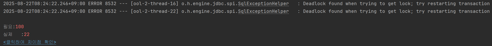
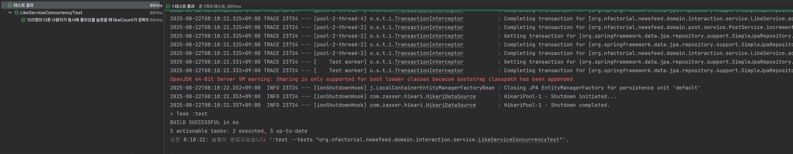
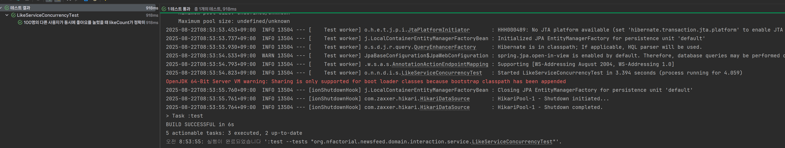
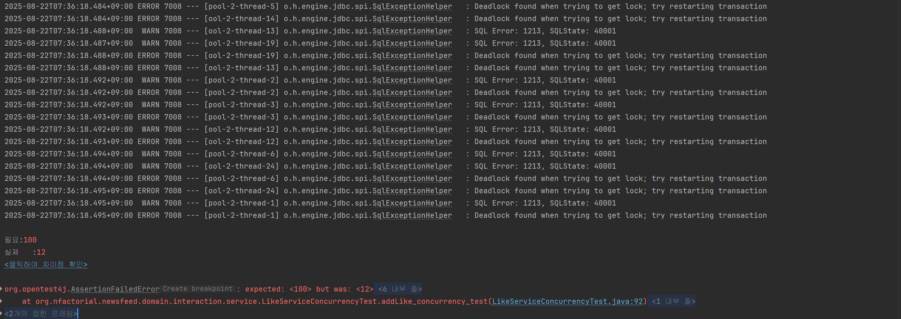

# 오늘 학습한 내용

## 1. 좋아요에 대한 동시성 테스트 수행

조금 더 정량적인 테스트 조건 설정과 테스트, 결과 정리 그리고 해결 방안 탐색은 프로젝트 종료 이후에 다시 시도하려고 합니다. 바로, 잠정 결론을 읽으시는 것도 추천드립니다.

```java
2025-08-22T07:36:18.494+09:00  WARN 7008 --- [ool-2-thread-24] o.h.engine.jdbc.spi.SqlExceptionHelper   : SQL Error: 1213, SQLState: 40001
2025-08-22T07:36:18.494+09:00 ERROR 7008 --- [pool-2-thread-6] o.h.engine.jdbc.spi.SqlExceptionHelper   : Deadlock found when trying to get lock; try restarting transaction
2025-08-22T07:36:18.495+09:00 ERROR 7008 --- [ool-2-thread-24] o.h.engine.jdbc.spi.SqlExceptionHelper   : Deadlock found when trying to get lock; try restarting transaction
2025-08-22T07:36:18.495+09:00  WARN 7008 --- [pool-2-thread-1] o.h.engine.jdbc.spi.SqlExceptionHelper   : SQL Error: 1213, SQLState: 40001
2025-08-22T07:36:18.495+09:00 ERROR 7008 --- [pool-2-thread-1] o.h.engine.jdbc.spi.SqlExceptionHelper   : Deadlock found when trying to get lock; try restarting transaction

필요:100
실제   :12
<클릭하여 차이점 확인>
```



- 100개의 스레드와 스레드를 대표하도록 프로필을 100개를 만듦
- 스레드 풀은 24개로 설정하고, 나머지는 큐에서 대기하도록 함
- 100개의 스레드 작업이 다 끝나면 결과 검증을 하도록 테스트를 구성함
- 결과는 크흠..
- 반복적으로 테스트한 결과 대략적으로 호출하는 사용자의 인원이 10명이 넘어가면 동시성 문제가 발생하기 시작함

## 2. 데드락 확인

- MySQL 데드락 로그
    
    ```java
    ------------------------
    LATEST DETECTED DEADLOCK
    ------------------------
    2025-08-22 07:36:18 0x1bec
    *** (1) TRANSACTION:
    TRANSACTION 450398, ACTIVE 0 sec starting index read
    mysql tables in use 1, locked 1
    LOCK WAIT 7 lock struct(s), heap size 1128, 3 row lock(s), undo log entries 1
    MySQL thread id 1446, OS thread handle 15540, query id 1517197 localhost 127.0.0.1 root updating
    update post set content='동시성 테스트 게시글',like_count=12,modified_at='2025-08-22 07:36:18.493407',profile_id=1,view_count=0 where id=1
    
    *** (1) HOLDS THE LOCK(S):
    RECORD LOCKS space id 2299 page no 4 n bits 72 index PRIMARY of table `news_feed_db_test`.`post` trx id 450398 lock mode S locks rec but not gap
    Record lock, heap no 2 PHYSICAL RECORD: n_fields 9; compact format; info bits 0
     0: len 8; hex 8000000000000001; asc         ;;
     1: len 6; hex 00000006df56; asc      V;;
     2: len 7; hex 02000000d7194e; asc       N;;
     3: len 4; hex 8000000b; asc     ;;
     4: len 4; hex 80000000; asc     ;;
     5: len 8; hex 99b76c7912017dc9; asc   ly  } ;;
     6: len 8; hex 99b76c79120777bf; asc   ly  w ;;
     7: len 8; hex 8000000000000001; asc         ;;
     8: len 29; hex eb8f99ec8b9cec84b120ed858cec8aa4ed8ab820eab28cec8b9ceab880; asc                              ;;
    
    *** (1) WAITING FOR THIS LOCK TO BE GRANTED:
    RECORD LOCKS space id 2299 page no 4 n bits 72 index PRIMARY of table `news_feed_db_test`.`post` trx id 450398 lock_mode X locks rec but not gap waiting
    Record lock, heap no 2 PHYSICAL RECORD: n_fields 9; compact format; info bits 0
     0: len 8; hex 8000000000000001; asc         ;;
     1: len 6; hex 00000006df56; asc      V;;
     2: len 7; hex 02000000d7194e; asc       N;;
     3: len 4; hex 8000000b; asc     ;;
     4: len 4; hex 80000000; asc     ;;
     5: len 8; hex 99b76c7912017dc9; asc   ly  } ;;
     6: len 8; hex 99b76c79120777bf; asc   ly  w ;;
     7: len 8; hex 8000000000000001; asc         ;;
     8: len 29; hex eb8f99ec8b9cec84b120ed858cec8aa4ed8ab820eab28cec8b9ceab880; asc                              ;;
    
    *** (2) TRANSACTION:
    TRANSACTION 450396, ACTIVE 0 sec starting index read
    mysql tables in use 1, locked 1
    LOCK WAIT 7 lock struct(s), heap size 1128, 3 row lock(s), undo log entries 1
    MySQL thread id 1442, OS thread handle 11444, query id 1517199 localhost 127.0.0.1 root updating
    update post set content='동시성 테스트 게시글',like_count=11,modified_at='2025-08-22 07:36:18.493407',profile_id=1,view_count=0 where id=1
    
    *** (2) HOLDS THE LOCK(S):
    RECORD LOCKS space id 2299 page no 4 n bits 72 index PRIMARY of table `news_feed_db_test`.`post` trx id 450396 lock mode S locks rec but not gap
    Record lock, heap no 2 PHYSICAL RECORD: n_fields 9; compact format; info bits 0
     0: len 8; hex 8000000000000001; asc         ;;
     1: len 6; hex 00000006df56; asc      V;;
     2: len 7; hex 02000000d7194e; asc       N;;
     3: len 4; hex 8000000b; asc     ;;
     4: len 4; hex 80000000; asc     ;;
     5: len 8; hex 99b76c7912017dc9; asc   ly  } ;;
     6: len 8; hex 99b76c79120777bf; asc   ly  w ;;
     7: len 8; hex 8000000000000001; asc         ;;
     8: len 29; hex eb8f99ec8b9cec84b120ed858cec8aa4ed8ab820eab28cec8b9ceab880; asc                              ;;
    
    *** (2) WAITING FOR THIS LOCK TO BE GRANTED:
    RECORD LOCKS space id 2299 page no 4 n bits 72 index PRIMARY of table `news_feed_db_test`.`post` trx id 450396 lock_mode X locks rec but not gap waiting
    Record lock, heap no 2 PHYSICAL RECORD: n_fields 9; compact format; info bits 0
     0: len 8; hex 8000000000000001; asc         ;;
     1: len 6; hex 00000006df56; asc      V;;
     2: len 7; hex 02000000d7194e; asc       N;;
     3: len 4; hex 8000000b; asc     ;;
     4: len 4; hex 80000000; asc     ;;
     5: len 8; hex 99b76c7912017dc9; asc   ly  } ;;
     6: len 8; hex 99b76c79120777bf; asc   ly  w ;;
     7: len 8; hex 8000000000000001; asc         ;;
     8: len 29; hex eb8f99ec8b9cec84b120ed858cec8aa4ed8ab820eab28cec8b9ceab880; asc                              ;;
    
    *** WE ROLL BACK TRANSACTION (2)
    ```
    
- 두 개의 트랜잭션이 **동일한 데이터 행**(`post` 테이블의 `id=1`인 행)에 대해 공유 잠금(`S-Lock`)을 동시에 획득한 후, 서로 likeCount 업데이트를 위해 배타적 잠금( `X-Lock`)으로 전환하려고 시도하다가 교착 상태에 빠짐
    - 읽기 행위: 공유 잠금 획득 필요
    - 쓰기 행위: 수정을 위해서는 공유 잠금보다 강력한 레벨인 배타적 잠금 필요
- 상세 과정
    - **트랜잭션 1**: update post set content='동시성 테스트 게시글',**like_count=12**,modified_at='2025-08-22 07:36:18.493407',profile_id=1,view_count=0 where id=1
    - **트랜잭션 2**: update post set content='동시성 테스트 게시글',like_count=11,modified_at='2025-08-22 07:36:18.493407',profile_id=1,view_count=0 where id=1
        - 참고로 jpa는 jdbc를 추상화한 것이기 때문에, PrepareStatement 스타일로 update 쿼리를 만들어두기 때문에 지금처럼 likeCount 하나의 필드 값을 업데이트하도록 Java 코드가 구성되어 있더라도, 실제로는 위 처럼 전체의 값을 바꾸는 쿼리가 작성됨 [참고](https://www.inflearn.com/community/questions/16697/%EC%97%85%EB%8D%B0%EC%9D%B4%ED%8A%B8-%EA%B3%A0%EA%B2%AC-%EA%B5%AC%ED%95%A9%EB%8B%88%EB%8B%A4)
    1. **공유 잠금 (S-Lock) 획득:**
        - 트랜잭션 (1)과 트랜잭션 (2)가 거의 동시에 `id=1`인 행을 업데이트하기 위해 해당 행을 읽음
        - 이 과정에서 두 트랜잭션 모두 해당 행에 대한 공유 잠금(S-Lock)을 획득
        - `S-Lock`은 다른 `S-Lock`과 호환되므로 여러 트랜잭션이 동시에 보유할 수 있음
    2. **배타적 잠금 (X-Lock) 획득 시도:**
        - 트랜잭션 (1)이 실제로 데이터를 수정하기 위해, 자신이 보유한 `S-Lock`을 배타적 잠금(X-Lock) 획득 시도
        - 하지만 트랜잭션 (2)가 여전히 `S-Lock`을 보유하고 있기 때문에, 트랜잭션 (1)은 X-Lock을 획득할 수 없어 **대기 상태**에 들어감
    3. **상호 대기 상태 발생:**
        - 비슷한 시점에 트랜잭션 (2) 역시 데이터를 수정하기 위해 자신의 `S-Lock`을 X-Lock으로 전환 시도
        - 하지만 이번에는 트랜잭션 (1)이 `S-Lock`을 보유하고 있으므로, 트랜잭션 (2)도 X-Lock을 획득하지 못하고 **대기 상태**에 빠짐
    4. **교착 상태 발생:**
        - 결과적으로, 트랜잭션 (1)은 트랜잭션 (2)가 잠금을 해제하기를 기다리고, 트랜잭션 (2)는 트랜잭션 (1)이 잠금을 해제하기를 기다리는 **순환 대기 상태**, 즉 **교착 상태**가 발생
    5. **문제 해결:**
        - MySQL InnoDB 엔진은 이 교착 상태를 자동으로 감지하고, 두 트랜잭션 중 하나(이 경우 **트랜잭션 (2)**)를 강제로 롤백(`ROLL BACK`)하여 문제를 해결
        - likeCount를 12로 설정하려던 트랜잭션 (1)이 정상적으로 작업을 완료하게 되어 최종 값이 12가 됨
    - x-lock 요청에 대한 대기가 생기면 이 대기 상태가 해당 데이터에 대한 모든 종류의 새로운 잠금 요청을 막아버림

```java
2025-08-22T07:36:18.495+09:00  WARN 7008 --- [pool-2-thread-1] o.h.engine.jdbc.spi.SqlExceptionHelper   : SQL Error: 1213, SQLState: 40001
2025-08-22T07:36:18.495+09:00 ERROR 7008 --- [pool-2-thread-1] o.h.engine.jdbc.spi.SqlExceptionHelper   : Deadlock found when trying to get lock; try restarting transaction
```

- 이런 로그가 교착상태로 인해 트랜잭션이 되돌려지면 반환되는 로그인데, 위와 같은 로그들이 매우 많이 반환됨
    - 수많은 스레드에서 거의 동시에 교착 상태에 빠졌던 것이라고 생각
    - 매우 짧은 순간에 수십 개의 요청이 동시에 하나의 데이터에 몰리면서 연쇄적으로 발생

- **동시성에 대해 낙관적 락, 비관적 락을 고려하려고 했으나 문제 원인은 데드락 발생**
    - 데드락을 해결하는 문제로 바뀜
    

## 3. 데드락을 해결하기 위해 더티 체킹에 의존하지 않고 @query를 이용한 명시적 update 수행

- 엔티티 메소드 방식 (기존 방식, 객체 지향적 접근)
    
    ```java
    @Entity
    @Getter
    @NoArgsConstructor(access = AccessLevel.PROTECTED)
    public class Post extends BaseTimeEntity {
    
      ...
     
    	public void incrementLikeCount() {
    		this.likeCount++;
    	}
    
    	public void decrementLikeCount() {
    		if (this.likeCount > 0) {
    			this.likeCount--;
    		}
    	}
    ```
    
- Repository에서 Update 쿼리를 사용하는 방식 (데이터 중심적 접근)
    
    ```java
    	@Modifying(clearAutomatically = true)
    	@Query("update Post p set p.likeCount = p.likeCount + 1 where p.id = :postId")
    	void incrementLikeCount(@Param("postId") Long postId);
    ```
    
    - 더티 체킹을 통해 애플리케이션에서 값을 읽어와서(SELECT) 계산한 후 수정하는(UPDATE) 과정이 아니라, 데이터베이스로 직접 처리

| 구분 | 엔티티 메소드 방식 (기존 방식) | Repository 쿼리 방식 (새로운 방식) |
| --- | --- | --- |
| **처리 방식** | **SELECT로 엔티티를 가져와 메모리에서 수정 후 UPDATE** | **DB에 직접 UPDATE 쿼리 실행** |
| 성능 | 상대적으로 느림 (SELECT + UPDATE) | 매우 빠름 (UPDATE only) |
| **객체지향 설계** | **우수 (비즈니스 로직이 도메인에 있음)** | **아쉬움 (로직이 외부(Repository)에 있음)** |
| 추천 사용처 | 복잡한 비즈니스 규칙, 여러 필드를 동시에 변경 | 좋아요, 조회수, 재고 관리 등 단순 카운터 증감 |

```java
2025-08-22T08:24:22.246+09:00 ERROR 8532 --- [ool-2-thread-16] o.h.engine.jdbc.spi.SqlExceptionHelper   : Deadlock found when trying to get lock; try restarting transaction
2025-08-22T08:24:22.246+09:00 ERROR 8532 --- [ool-2-thread-22] o.h.engine.jdbc.spi.SqlExceptionHelper   : Deadlock found when trying to get lock; try restarting transaction

필요:100
실제   :22
```



- 12 → 22으로 개선(?)
- 반복적으로 테스트했을 때 대략 20개 이상으로 이전보다는 수치가 조금 뛰었다.
- 잠금 순서: `Like` 테이블 → `Post` 테이블
    
    ```java
    // 1. Like 테이블에 대한 잠금 시도 (INSERT 시)
    likeRepository.save(Like.of(currentPost, currentProfile));
    
    // 2. Post 테이블에 대한 잠금 시도 (UPDATE 시)
    postService.incrementLikeCount(postId);
    ```
    
- 지금은 빠져 있는데 어제 삽질 과정에서는 이 과정에서 낙관적 락 이후 재시도 과정을 걸면 40~까지 올랐었음
    - 여기서 테스트 자체에 문제가 있나라고 생각이 들었다. 재시도 과정에 대한 파라미터도 조정하면, 이전보다 많이 높아질 것이라고 생각했는데 크게 의미가 없었다.
    - 본질적인 데드락 해결책은 아니라고 생각

## 4.  addLike()의 save와 increment 순서 변경 (비관적 락과 유사)

```java
		postService.incrementLikeCount(postId);
		likeRepository.save(Like.of(currentPost, currentProfile));
```



- **순서를 바꾸면 통과**
- 3번 방식  (`save` → `increment`)
    - 이 코드는 상대적으로 간단한 작업(`save`는 메모리 작업)을 먼저 수행
    - 트랜잭션이 모두 여유롭게 `getPostById`로 S Lock을 획득하고, 거의 **동시에** `incrementLikeCount`라는 핵심 충돌 지점에 도달할 확률이 매우 높아짐
    - 데드락 발생
- 4번 방식 (`increment` → `save`)
    - 한 트랜잭션(T1)이 다른 트랜잭션(T2)보다 아주 약간이라도 먼저 `getPostById`(S락)와 `incrementLikeCount`(X락 요청)에 도달하면, T1이 X락을 완전히 획득할 가능성이 생김
    - T1이 X락을 선점하면, T2는 `getPostById` 단계에서 S락을 얻으려 할 때부터 T1이 끝날 때까지 그냥 대기하게 됨
    - **두 트랜잭션이 S락을 동시에 보유하는 상태 자체를 피하고** 한쪽이 독점하도록 만들어 데드락 상황을 비껴가게 됨
- 결국 이 방식은 **비관적 락**과 비슷한 효과를 내게 됨
    - 비관적 락: 명시적으로 배타적 잠금을 걸고 다른 트랜잭션들을 대기하게 됨
    - 데드락은 없으나, 그만큼 락이 걸리는 동안 다른 작업을 처리하지 못하므로 부하 발생 가능성 높아짐
- 이럴거면 그냥 비관적 락을 거는 게…?
- **그리고 사실 의도를 모르는 개발자가 확인하면 논리적 순서가 맞지 않다고 여겨 이상하게 생각할 수도 있다.**

## 5. 비관적 락

```java
public interface PostRepository extends JpaRepository<Post, Long> {

    // Post를 조회하는 시점부터 쓰기 락(X Lock)을 획득하는 메소드
    @Lock(LockModeType.PESSIMISTIC_WRITE)
    @Query("select p from Post p where p.id = :id")
    Optional<Post> findByIdWithPessimisticLock(@Param("id") Long id);

}
```

```java
public class LikeService {

		...
		
    public void addLike(Long postId, Long profileId) {
        Profile currentProfile = profileService.getProfileEntityById(profileId);
				// 여기를 수정!
		    Post currentPost = postService.getPostByIdWithLock(postId); // 잠금을 걸면서 조회

        // ... 나머지 로직 동일 ...
    }
```



- 명시적으로 비관적 락을 통해 통과 확인
- **일단 소규모 트래픽에서는 데이터베이스의 부하를 확인하면서, 비관적 락을 사용하는 방법도 가능하다고 생각했다.**
- 장단점이 있으므로 우리는 어떤 것을 선택해야 할지?
    - 4번이나 5번 비관적 락은 데이터베이스를 점유하기 때문에 병목이 생길수도 있음
    - 특히, post는 좋아요 개수에만 사용되는 것이 아니기 때문에 다른 API호출의 로직 수행에도 영향을 줄 수 있다고 생각함

## 6. 잠정 결론

| 방식 | 기대값 | 실제 결과 | 장점 | 단점 |
| --- | --- | --- | --- | --- |
| Dirty Checking | 100 | ~12 | 도메인 중심 설계 | 데드락, 성능 저하 |
| @Query | 100 | ~22 | 빠름 | 여전히 데드락 |
| 순서 변경 | 100 | 100 | 데드락 없음 | 코드 의도 파악 어려움 |
| 비관적 락 | 100 | 100 | 확실한 정합성 | DB 성능 병목 가능 |
- 조금 더 정량적인 테스트 조건 설정과 테스트, 결과 정리 그리고 해결 방안 탐색은 프로젝트 종료 이후에 다시 시도하려고 함, 별도의 아티클로 작성 예정
1. 실제 쿼리와 실행 순서에서 데드락에 의해 발생했다. 그리고 단순히 어떤 락을 적용하냐의 문제는 아니다.
2. 테스트 코드부터 다시 검증하기 (사용된 어노테이션과 컨디션 등등)
3. 특히, **인터넷에 있는 많은 글들과 다르게 나는 낙관적 락을 통한 해결책이 효과가 없었는데** 이것이 테스트 코드의 차이인지, 테스트 상황의 차이인지부터 판단히 명확히 되지 않았기 때문에 테스트를 구현하는 부분부터 학습이 필요하다고 생각한다.
4. 테스트도 정확히 어떤 테스트 조건에서 몇 번을 수행하여 어느 정도의 결과가 나오는지 반복적으로 테스트한 결과를 구체적으로 뽑아보려고 한다.
5. 어떤 솔루션을 적용할 때 가장 중요한 것들 중에 비즈니스적으로 의미가 있는지 그리고 여러 가지 비용이 얼마나 소모되는지가 있는데 운영중인 시스템에 대해 고려하는 것이 아닌 만큼 여러 상황을 가정해보고 생각해보려고 함