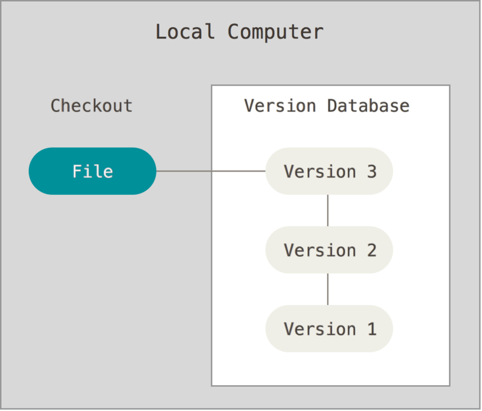

# 1. 버전관리란?

- 버전 관리 시스템 (Version Control System)
  - 파일 변화를 시간에 따라 기록했다가 나중에 특정 시점의 버전을 다시 꺼내올수 있는 시스템
  - 소스 코드말고 거의 모든 컴퓨터 파일의 버전을 관리할 수 있음

## 로컬 버전 관리

- 많은 사람은 버전을 관리하기 위해 디렉토리로 파일을 복사하는 방법을 사용함
  - 그러나 디렉토리를 지워버리거나 잘못 복사하는 등 잘못되기가 쉬움 → 로컬 VCS를 만듦



그림 1. 로컬 버전 관리.

- RCS
  - Patch Set (파일에서 변겨되는 부분)을 관리
  - Patch Set을 적용해서 모든 파일을 특정 시점으로 되돌림

## 중앙집중식 버전 관리 (Central VCS)


그림 2. 중앙집중식 버전 관리

- CVCS e.g. SVN
  - 누가 무엇을 하고 있는지 알 수 있음
  - **중앙 서버에 문제가 발생하면 치명적임**
    - 협업 불가
    - 백업 불가


그림 3. 분산 버전 관리 시스템 (DVCS)

## **분산 버전 관리 시스템 (Distributed VCS)**

- 단순히 파일의 마지막 스냅샷을 Checkout 하지 않음
  - → 저장소를 **히스토리**와 더불어 **전부 복제**함
  - → 서버에 문제가 생겨도 다시 작업을 시작할 수 있음
  - `Clone` : 모든 데이터를 가진 진정한 백업
- 리모트 저장소 존재
  - 동시에 다양한 그룹과 협업 가능, 다양한 워크플로우 사용 가능

# 2. Git이란?

- 오픈 소스인 Linux 커널 개발에 BitKeeper라는 상용 DVCS 사용, 무료 사용 제한됨
- 리누스 토르발즈의 주도로 자체 도구를 만들게 되면서 탄생
- Git의 목표
  - 빠른 속도
  - 단순한 구조
  - 비선형적인 개발(수천 개의 동시 다발적인 브랜치)
  - 완벽한 분산
  - Linux 커널 같은 대형 프로젝트에도 유용할 것(속도나 데이터 크기 면에서)

# 3. Github란?

- 코드를 저장하고 공유하고 다른 사람과 함께 코드를 작성할 수 있는 클라우드 기반 플랫폼
- 가장 큰 Git 저장소 호스트
- 주요 기능
  - 작업을 **쇼케이스 또는 공유**합니다.
  - 시간이 지남에 따라 코드의 변경 내용을 **추적 및 관리**합니다.
  - 다른 사용자가 코드를 **검토**하고 코드를 개선할 제안을 제공할 수 있습니다.
  - 통합할 준비가 되기 전에 변경 내용이 협력자의 작업에 영향을 줄 것인지 걱정하지 않고도 공유 프로젝트에서 **협업**합니다.
- 공동 작업은 **Git**으로 지원됨

## Git과 Github

- GitHub에 파일을 업로드하면 파일을 “Git 리포지토리”에 저장함
  - 즉, GitHub에서 파일을 변경하거나 “커밋”하면 Git에서 변경 내용을 자동으로 추적하고 관리하기 시작
- Git 리포지토리 생성, 분기 생성, 파일 업로드, 편집과 같이 브라우저를 통해 직접 GitHub에서 직접 완료할 수 있는 Git 관련 작업이 많음
  - 그러나 대부분은 로컬에서 작업한 다음, 로컬 변경 내용 및 이와 관련된 모든 Git 데이터를 GitHub의 중앙 “원격” 리포지토리와 지속적으로 동기화하여 사용함
  - Github Desktop 같은 GUI 도구 사용 가능
- 다른 사용자와 공동 작업을 시작한 후 모두가 동시에 동일한 리포지토리에서 작업해야 하는 경우 계속해서 다음을 수행
  - GitHub의 원격 리포지토리에서 협력자가 수행한 모든 최신 변경 내용을 **풀(pull)**
  - GitHub의 동일한 원격 리포지토리로 변경 내용을 **푸시(push)**

# 4. Git 시작하기

## Git 최초 설정

- `git config`를 통해 설정 내용을 확인하고 변경할 수 있음, 설정은 역순으로 우선시됨
  1. /etc/gitconfig: 시스템의 모든 사용자와 모든 저장소에 적용
  2. ~/.gitconfig, ~/.config/git/config: 특정 사용자의 모든 저장소에 적용되는 설정
     - `git config —global` 옵션으로 이 파일을 읽고 쓸 수 있음
  3. .git/config: Git 디렉토리에 있으며 특정 저장소에만 적용

### 사용자 정보

```bash
$ git config --global user.name "John Doe"
$ git config --global user.email johndoe@example.com
```

- `—global`이 있으므로 한 번만 하면 되며 사용자의 정보로 사용됨

## Git 저장소 만들기

1. 아직 버전관리를 하지 않는 로컬 디렉토리 하나를 선택해서 Git 저장소를 적용하는 방법
2. 다른 어딘가에서 Git 저장소를 **_Clone_** 하는 방법

### 1. **기존 디렉토리를 Git 저장소로 만들기**

```bash
$ git init
```

- `.git` 이라는 하위 디렉토리를 만듦
- `.git` 디렉토리에는 저장소에 필요한 뼈대 파일(Skeleton)이 들어 있음. 이 명령만으로는 아직 프로젝트의 어떤 파일도 관리하지 않음

### **기존 저장소를 Clone 하기**

```bash
$ git clone <url> (원하는 디렉토리명)
```

- `git clone` 을 실행하면 프로젝트 히스토리를 전부 받아옴

참조

- Pro Git 2nd Edition by g[it-scm.com](http://Git-scm.com) - [https://git-scm.com/book/ko/v2](https://git-scm.com/book/ko/v2)
- GitHub Docs - [https://docs.github.com/ko](https://docs.github.com/ko)
