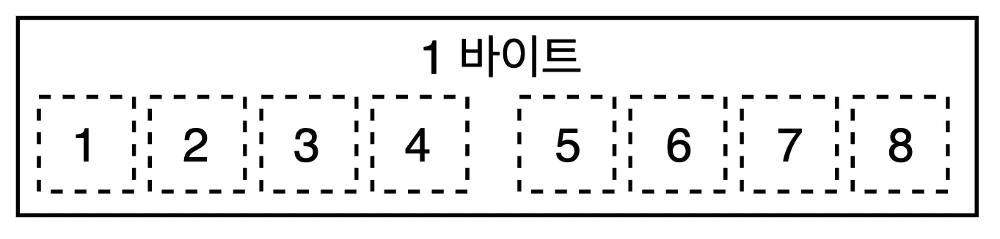
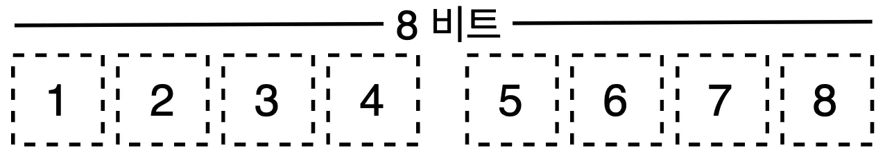
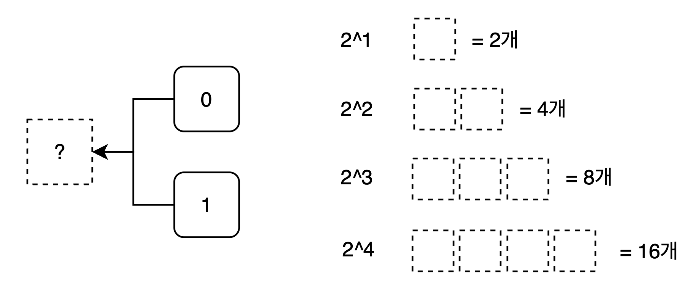

최초 작성 날짜: 2025년 7월 9일  

### **1. 기억 장치의 종류**

컴퓨터는 두 가지 종류의 기억 장치를 사용합니다.

- **주기억장치 (RAM: Random Access Memory)**
    - **역할:** 컴퓨터의 '작업대' 또는 '단기 기억'과 같습니다.
    - **특징:**
        - **빠른 속도:** 데이터를 매우 빠르게 읽고 쓸 수 있습니다.
        - **휘발성:** 전원이 꺼지면 저장된 내용이 **모두 사라집니다.**
- **보조기억장치 (HDD, SSD)**
    - **역할:** '책'이나 '노트'처럼 데이터를 영구적으로 보관합니다.
    - **특징:**
        - **영구성:** 전원이 꺼져도 데이터가 **유지됩니다.**
        - **느린 속도:** 주기억장치(RAM)보다 속도가 느립니다.

| 구분 | 종류 | 특징 |
| --- | --- | --- |
| **주기억장치** | RAM | 휘발성, 빠름 |
| **보조기억장치** | HDD/SSD | 영구저장, 느림 |
  
`Java`에서는 주기억장치를 `JVM`을 통해서 자신만의 메모리 구조를 만들어서 사용하기 때문에, `JVM`에 대해 이해하는 것이 중요합니다.

### **2. 데이터의 기본 단위**

컴퓨터는 데이터를 아래와 같은 단위로 저장하고 처리합니다.

- **비트(Bit)**
    
    
    
    - 컴퓨터가 데이터를 표현하는 **가장 작은 단위**입니다.
    - **0 또는 1**, 두 가지 값 중 하나만 저장할 수 있습니다.
- **바이트(Byte)**
    
    
    
    
    
    - **8개의 비트**(**Bit**)가 모여 1 바이트(Byte)가 됩니다. (1 Byte = 8 Bit)
    - 컴퓨터는 메모리를 **1 바이트 단위로 주소를 매겨 관리**합니다.  

`Java`를 사용할 때는 `기본자료형(Primitive Types)` 들이 각각 어느 정도의 크기를 가지는지 이해하고 목적에 맞게 사용하는 것이 필요합니다.

> 좋은 소프트웨어 엔지니어는 데이터의 크기를 고려하여 필요한 만큼의 메모리만 사용하는 습관을 갖는 것이 중요합니다.
> 

`Java`는 개발자가 메모리를 직접 다루지는 않으며, `JVM`이라는 자바 실행 환경을 통해 메모리 공간을 확보한 뒤 프로그램이 실행됩니다.  그리고 `JVM`의 `Garbage Collector`가 사용되지 않는 객체를 찾아 메모리에서 자동으로 해제하도록 맡깁니다. 따라서, `JVM`의 **메모리 구조를 이해**하고, `JVM`이 최적의 성능을 내도록 여러 옵션을 이해하고 **튜닝**하는 것이 `Java` 개발자의 중요한 역할이라고 생각합니다. `JVM`에 대해서는 자세하게 학습한 뒤에 정리해서 글을 작성해보도록 하겠습니다.